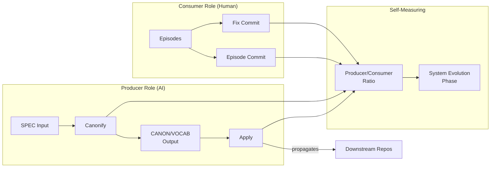

# INVENTION DISCLOSURE FORM

**IDF-004**

---

## ADMINISTRATIVE

**Title:** Producer-Consumer Bifurcated Governance Architecture for Human-AI Collaboration

**Inventor(s):** Dexter Hadley

**Disclosure Date:** 2026-01-13

**Related Disclosure:** IDF-001-canonic-governance.md

**Freeze Reference:** stack-freeze-2026-01-12

**Status:** Internal disclosure — not for publication

**Confidentiality:** PRIVILEGED AND CONFIDENTIAL — Prepared for patent counsel

---

## 1. CONTEXT

This disclosure documents an inventive governance architecture that separates content generation into two distinct roles with different commit responsibilities. The method was discovered through systematic analysis of episode evidence (ep120, ep038, ep006, ep040).

---

## 2. PROBLEM STATEMENT

In governed human-AI collaboration systems:

1. AI and human contributions are intermixed without clear role boundaries
2. Commit history does not distinguish governance-producing activity from governance-consuming activity
3. System maturity cannot be measured from commit patterns
4. No mechanism exists to automatically identify whether AI or human authored governance changes
5. Role confusion leads to governance drift where AI contributions are treated as authoritative

**The core problem:** No structural mechanism exists to separate and measure governance production (AI creating rules from specifications) from governance consumption (humans applying constraints through episodes).

---

## 3. INVENTIVE INSIGHT

The invention establishes a **bifurcated governance architecture** where:

1. **Producer role (AI):** Generates CANON/VOCAB artifacts from SPEC input
2. **Consumer role (Human):** Generates episodes and applies constraints through commits
3. Commit taxonomy reveals role: Producer commits are automatable, Consumer commits are human-driven

### 3.1 Role Separation

| Role | Actor | Input | Output | Commit Type |
|------|-------|-------|--------|-------------|
| Producer | AI Agent | SPEC | CANON, VOCAB (candidates) | Canonify, Apply |
| Consumer | Human | Episodes | Governance application | Episode, Fix |
| User | Either | — | — | Manual |

**Critical clarification (see IDF-001):** AI produces *candidate* CANON/VOCAB artifacts from SPEC. These candidates become authoritative only when committed to the ledger by human approval. The Producer role is **drafting**, not **authority**:

- AI drafts governance artifacts from specifications
- Human reviews and approves (or rejects) drafts
- Only approved drafts enter the ledger as authoritative
- AI cannot unilaterally make governance authoritative

This distinction preserves IDF-001's core claim that humans hold exclusive authority to declare governance rules while enabling efficient AI-assisted governance generation.

### 3.2 Commit Taxonomy

Commits are classified by their governance function:

- **Canonify:** AI produces CANON from SPEC (Producer)
- **Apply:** AI applies canonified patterns across repositories (Producer)
- **Episode:** Human records governance session (Consumer)
- **Fix:** Human corrects violations (Consumer)
- **Manual:** Either actor, unclassified

### 3.3 Self-Measuring Property

The system measures its own maturity through commit class distribution:

- High Producer/Consumer ratio indicates automated governance generation
- High Consumer/Producer ratio indicates human governance application
- The ratio reveals system evolution phase without external instrumentation

### 3.4 Ordered Dependency

Producer commits MUST precede Consumer commits that reference produced artifacts. This ordering constraint enables:

- Dependency graph construction from git history
- Violation detection when consumers reference non-existent producers
- Cross-repository synchronization verification

### 3.5 Agent Role Restriction (Extended 2026-01-13)

**Critical constraint discovered through violation analysis (ep111, ep112, ep120):**

Governance-layer agents (operating at CANONIC, MACHINE, OS scopes) are restricted from creating WRITING artifacts:

| Agent Layer | May Produce | May NOT Produce |
|-------------|-------------|-----------------|
| CANONIC/MACHINE/OS | CANON, VOCAB, SPEC | Episodes, prose |
| WRITING | Episodes, manuscripts | CANON (upstream) |

This restriction prevents:
- Identity confusion where governance enforcers document their own sessions
- Episodes created by agents that should only enforce, not narrate
- Structural role violations where producers consume their own outputs

Governance-layer agents may READ episodes to inform governance but MUST NOT CREATE episodes.

---

## 4. HIGH-LEVEL METHOD

### 4.1 Role Assignment

1. AI agents are assigned Producer role when generating CANON/VOCAB from SPEC
2. Humans are assigned Consumer role when creating episodes or fixing violations
3. Role is declared in commit metadata or inferred from commit patterns

### 4.2 Commit Classification

1. Examine commit message for classification markers (Canonify, Apply, Episode, Fix)
2. If no explicit marker, classify by changed file patterns:
   - CANON.md, VOCAB.md changes → Producer
   - ep*.md changes → Consumer
3. Record classification in commit metadata

### 4.3 Maturity Measurement

1. Extract all commits in governance scope
2. Classify each commit by role
3. Compute role distribution metrics:
   - Producer commit count
   - Consumer commit count
   - Producer/Consumer ratio
   - Role distribution over time

### 4.4 Cross-Repository Coordination

1. Producer commits in source repository (e.g., canonic)
2. Apply commits propagate to downstream repositories (e.g., machine, writing)
3. Ordering verification: Apply timestamp > Canonify timestamp
4. Missing Apply commits indicate synchronization failures

---

## 5. ADVANTAGES

### 5.1 Role Clarity Without Permissions

The architecture achieves separation through role clarity, not access control. AI and human operate in same repository with same permissions but distinct commit patterns.

### 5.2 Automatic Maturity Measurement

System evolution is measurable from commit history alone—no external instrumentation required.

### 5.3 Dependency Verification

Ordered dependency enables automatic detection of governance gaps where consumers reference non-existent producers.

### 5.4 Cross-Repository Synchronization

Producer-consumer pattern enables instant multi-repository coordination through commit ordering verification.

### 5.5 Human Governance Contribution Visibility

Consumer commits explicitly capture human governance activity, preventing it from being obscured by AI production volume.

---

## 6. EXPLICIT EXCLUSIONS (NOT CLAIMED)

1. **Specific commit message formats** — Classification markers are implementation detail
2. **Specific file naming conventions** — CANON.md, ep*.md are examples, not requirements
3. **Specific version control systems** — Any commit-based system suffices
4. **Access control mechanisms** — Role separation is behavioral, not permissions-based
5. **Specific automation tooling** — Canonify/Apply automation is implementation detail

---

## 7. EVIDENCE SUMMARY

### 7.1 Episode Evidence

- ep120: Producer vs Consumer Pattern documented
- ep038: Git Evolutionary Analysis demonstrating commit taxonomy
- ep006: User class abstraction enabling role inference
- ep040: Producer-Consumer Documentation establishing patterns
- ep111, ep112: Agent role restriction discovery through violation

### 7.2 Implementation Evidence

- 8 repositories with classified commit histories
- Producer commits (Canonify, Apply) identifiable across all repositories
- Consumer commits (Episode, Fix) traceable to human governance activity
- Cross-repository synchronization verified through ordering analysis

### 7.3 Maturity Metrics

Commit class distribution computed for:
- canonic (primary producer source)
- writing/episodes (primary consumer source)
- machine, os, stack (mixed producer/consumer)

---

## 8. RELATIONSHIP TO OTHER DISCLOSURES

### 8.1 Relationship to IDF-001

This disclosure extends IDF-001 by specifying:

- Role separation mechanism (IDF-001 establishes human authority but not role taxonomy)
- Commit classification approach (IDF-001 specifies ledger recording but not commit typing)
- Self-measurement methodology (IDF-001 does not specify maturity metrics)

IDF-001 establishes that humans hold exclusive authority; IDF-004 specifies how to measure and verify that authority through commit patterns.

**Consistency with IDF-001:** The Producer role (AI drafts governance) does NOT contradict IDF-001's claim that humans hold exclusive authority. AI produces *candidates*; human commits make them authoritative. The ledger entry—controlled by the human—is the moment of canonification, not the AI draft.

### 8.2 Relationship to IDF-014

IDF-014 (Bidirectional Scope Boundaries) establishes that governance applies to AI behavior, not human work. IDF-004 is consistent:

- Producer commits (AI) are subject to governance constraints
- Consumer commits (Human) record human governance activity but human choices are not governed
- The bifurcation ensures AI-produced artifacts are validated while human creative choices remain protected

---

## 9. PRIOR ART DISTINCTION

### 9.1 Software Development Roles (DevOps, SRE)

Modern software development distinguishes roles (developer, reviewer, deployer) with different responsibilities.

**Distinction:** IDF-004 applies role separation specifically to governance artifact production in human-AI collaboration:
- Roles are defined by *what* is produced (governance vs. episodes), not *who* does the work
- Commit classification enables automatic role inference
- Self-measuring maturity from commit patterns has no DevOps equivalent

### 9.2 Design Patterns (Producer-Consumer)

The producer-consumer pattern is well-established in software engineering for message queues and asynchronous processing.

**Distinction:** IDF-004 adapts the pattern specifically for governance artifact flow:
- Producers generate governance (CANON/VOCAB), not generic messages
- Consumers apply governance through episodes, not process messages
- The pattern enables governance maturity measurement, not just decoupling

### 9.3 Access Control (RBAC, ABAC)

Role-based access control assigns permissions based on user roles.

**Distinction:** IDF-004 achieves role separation through *behavior*, not permissions:
- AI and human have identical repository access
- Roles are revealed by commit patterns, not enforced by ACLs
- No permission system is required for role separation

### 9.4 Audit Trails and Commit Signing

Audit systems attribute actions to actors through signatures or logging.

**Distinction:** IDF-004 goes beyond attribution:
- Commit *classification* (not just attribution) reveals governance role
- Classification enables maturity measurement
- Cross-repository synchronization verification through commit ordering

---

## 10. INVENTOR DECLARATION

I, **Dexter Hadley**, declare that:

1. I am the sole human inventor of this architecture
2. The inventive activity is documented in ep120, ep038, ep006, ep040
3. AI systems contributed execution under my governance but are not inventors
4. This disclosure is bounded by the freeze date specified above

---

**END OF DISCLOSURE**

---
