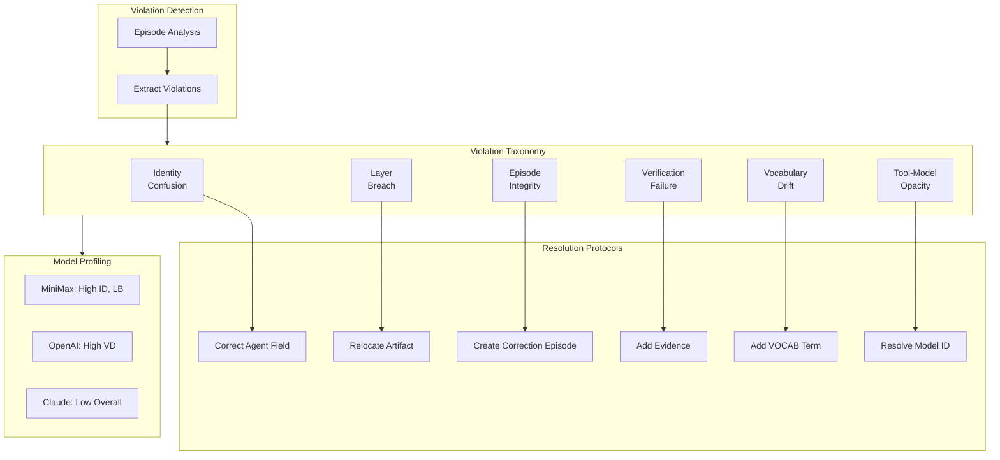

# INVENTION DISCLOSURE FORM

**IDF-010**

---

## ADMINISTRATIVE

**Title:** Violation Pattern Taxonomy for Systematic Governance Failure Classification

**Inventor(s):** Dexter Hadley

**Disclosure Date:** 2026-01-13

**Related Disclosure:** IDF-001-canonic-governance.md, IDF-002-multi-model-governance.md

**Freeze Reference:** stack-freeze-2026-01-12

**Status:** Internal disclosure — not for publication

**Confidentiality:** PRIVILEGED AND CONFIDENTIAL — Prepared for patent counsel

---

## 1. CONTEXT

This disclosure documents an inventive taxonomy and classification system for governance violations that enables systematic analysis, targeted remediation, and predictive intervention. The taxonomy was discovered through analysis of episode evidence (ep133, ep123-132).

---

## 2. PROBLEM STATEMENT

In governed AI collaboration systems:

1. Violations are detected but not systematically categorized
2. Each violation is treated as unique, missing underlying patterns
3. Remediation is ad-hoc without resolution protocols per violation type
4. No mechanism predicts violations before they cascade
5. Model-specific violation profiles cannot be constructed without taxonomy

**The core problem:** No structural mechanism exists to classify governance violations into systematic categories enabling targeted mitigation, predictive detection, and model-specific profiling.

---

## 3. INVENTIVE INSIGHT

The invention establishes a **violation taxonomy** that classifies failures into structural categories:

### 3.1 Taxonomy Categories

| Category | Description | Example |
|----------|-------------|---------|
| **Identity Confusion** | Agent claims wrong identity | MiniMax claiming to be Claude |
| **Layer Boundary Breach** | Scope produces artifacts outside its authority | OS producing PAPER artifacts |
| **Episode Integrity Failure** | AI modifies immutable episode content | Overwriting human episode |
| **Verification Failure** | False compliance claim without evidence | Claiming passing validation without proof |
| **Vocabulary Drift** | Undefined terms or inflection bloat | Using undefined terms in CANON |
| **Signal Vocabulary Drift** | Inconsistent evidence labels | Mixed signal naming conventions |
| **Tool-to-Model Opacity** | Tool name masks actual model | "Cline" hiding MiniMax identity |

### 3.2 Taxonomy Properties

Each category has:
- **Detection method:** How violations of this type are identified
- **Resolution protocol:** Standard remediation steps
- **Cascade risk:** Likelihood of triggering additional violations
- **Model affinity:** Which models commonly exhibit this pattern

### 3.3 Systematic Benefits

The taxonomy enables:
- **Targeted fixes:** Each category has specific resolution protocol
- **Predictive intervention:** High-cascade categories warrant early detection
- **Model profiling:** Per-model violation category distribution
- **Pattern evolution:** Tracking category frequency over time

### 3.4 Category Relationships

Categories have relationships:
- **Causation:** Identity confusion → Layer boundary breach
- **Correlation:** Vocabulary drift often accompanies verification failure
- **Independence:** Some categories are statistically independent

---

## 4. HIGH-LEVEL METHOD

### 4.1 Violation Detection

1. Parse episode for violation indicators:
   - Explicit violation tags
   - Correction references
   - Inconsistency markers
2. Extract violation characteristics:
   - What was violated
   - Who violated (agent identity)
   - When (episode number)

### 4.2 Category Assignment

1. Match violation characteristics to category definitions
2. Assign primary category
3. Identify secondary categories if applicable
4. Record category assignment in violation record

### 4.3 Resolution Protocol Execution

1. Look up resolution protocol for assigned category
2. Execute protocol steps:
   - Identity confusion: Verify and correct agent field
   - Layer breach: Relocate artifact to correct scope
   - Vocabulary drift: Add term to VOCAB
   - (etc.)
3. Record resolution in new episode

### 4.4 Predictive Detection

1. Analyze violation history for cascade patterns
2. When high-cascade category detected:
   - Flag for immediate attention
   - Check for related violations
   - Apply preventive measures
3. Track prediction accuracy over time

### 4.5 Model Profiling

1. Aggregate violations by model identity (from IDF-002)
2. Compute per-model category distribution
3. Identify model-specific patterns:
   - MiniMax: High identity confusion, high layer breach
   - OpenAI: High vocabulary drift
   - Claude: Low overall, mainly layer discipline
4. Use profiles for model selection guidance

---

## 5. ADVANTAGES

### 5.1 Systematic Remediation

Every violation has a known resolution protocol, eliminating ad-hoc fixes.

### 5.2 Predictive Capability

High-cascade categories trigger early intervention, preventing violation chains.

### 5.3 Model Selection Guidance

Category profiles inform model selection for governance-critical applications.

### 5.4 Governance Evolution Tracking

Category frequency over time reveals governance system evolution.

### 5.5 Training Data Generation

Classified violations provide labeled data for potential future automation.

---

## 6. EXPLICIT EXCLUSIONS (NOT CLAIMED)

1. **Specific category definitions** — Categories can be extended or modified
2. **Specific detection algorithms** — Detection method is implementation detail
3. **Specific resolution procedures** — Protocol steps are implementation detail
4. **Machine learning classifiers** — Automated classification is not claimed
5. **Specific model behavior analysis** — Why models violate is not claimed

---

## 7. EVIDENCE SUMMARY

### 7.1 Episode Evidence

- ep133: Ledger-Signal Violation Patterns establishing taxonomy
- ep123-132: Violation episodes demonstrating each category
- ep130: Agent-Model Correlation enabling per-model profiling

### 7.2 Taxonomy Evidence

All seven categories observed in episode corpus:
- Identity confusion: ep125, ep127
- Layer boundary breach: ep124, ep126
- Episode integrity failure: ep128
- Verification failure: ep129
- Vocabulary drift: ep123, ep131
- Signal vocabulary drift: ep133
- Tool-to-model opacity: ep130

### 7.3 Resolution Evidence

Resolution protocols applied:
- Corrections documented in new episodes
- No violations erased or hidden
- Protocol effectiveness measurable through recurrence rates

---

## 8. RELATIONSHIP TO IDF-001 AND IDF-002

This disclosure extends both:

**From IDF-001:**
- IDF-001 documents violations without erasure; IDF-010 classifies them systematically
- IDF-001 requires corrections; IDF-010 provides resolution protocols

**From IDF-002:**
- IDF-002 correlates violations to models; IDF-010 categorizes by violation type
- Combined: per-model category distribution profiles

---

## 9. PRIOR ART DISTINCTION

### 9.1 Bug Taxonomies (IEEE Classification, Orthogonal Defect Classification)

Software engineering uses defect taxonomies to classify bugs for analysis.

**Distinction:** IDF-010 classifies *AI governance violations*, not code defects:
- Bug taxonomies classify code errors; IDF-010 classifies constitutional violations
- IEEE classification is generic; IDF-010 categories are governance-specific
- Model-specific violation profiles have no bug taxonomy equivalent
- Cascade risk assessment for violation chains is unique

### 9.2 Security Vulnerability Classification (CWE, CVE)

Security classifications categorize vulnerabilities by type and severity.

**Distinction:** IDF-010 classifies *governance compliance failures*, not security issues:
- CWE classifies code weaknesses; IDF-010 classifies AI behavior failures
- Categories like "identity confusion" and "layer breach" are governance-specific
- Resolution protocols per violation type have no CWE equivalent

### 9.3 Error Code Systems (HTTP Status, Database Errors)

Error code systems provide standardized failure indicators.

**Distinction:** IDF-010 provides *semantic classification*, not error codes:
- Error codes indicate what failed; IDF-010 classifies why and how to fix
- Predictive detection based on cascade patterns has no error code equivalent
- Model profiling by violation distribution is unique

### 9.4 Incident Classification (ITIL, NOC)

IT service management classifies incidents by type and priority.

**Distinction:** IDF-010 classifies *AI governance incidents* with resolution protocols:
- ITIL classifies service incidents; IDF-010 classifies constitutional violations
- Per-category resolution protocols are governance-specific
- Training data generation for automation potential is unique

---

## 10. INVENTOR DECLARATION

I, **Dexter Hadley**, declare that:

1. I am the sole human inventor of this taxonomy
2. The inventive activity is documented in ep133, ep123-132
3. AI systems contributed execution under my governance but are not inventors
4. This disclosure is bounded by the freeze date specified above

---

**END OF DISCLOSURE**

---
