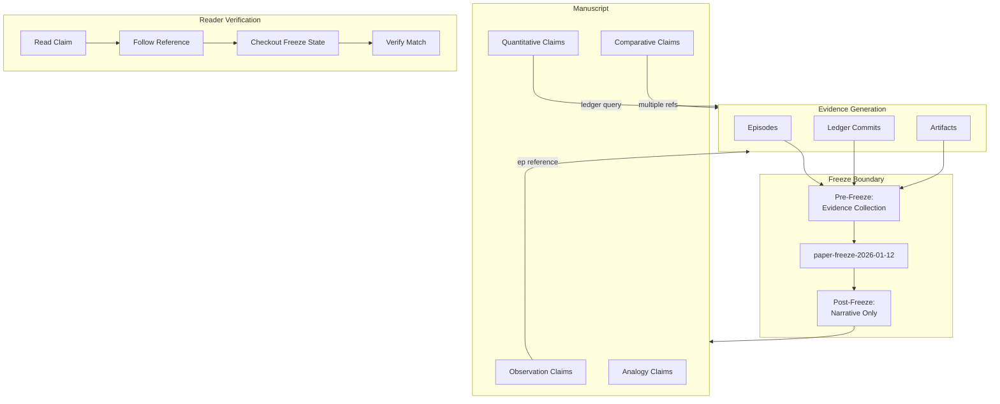

# INVENTION DISCLOSURE FORM

**IDF-011**

---

## ADMINISTRATIVE

**Title:** Evidence-Based Epistemic Writing Framework for Verifiable Scientific Claims

**Inventor(s):** Dexter Hadley

**Disclosure Date:** 2026-01-13

**Related Disclosure:** IDF-001-canonic-governance.md

**Freeze Reference:** stack-freeze-2026-01-12

**Status:** Internal disclosure — not for publication

**Confidentiality:** PRIVILEGED AND CONFIDENTIAL — Prepared for patent counsel

---

## 1. CONTEXT

This disclosure documents an inventive framework for scientific writing where every claim must be traceable to ledger evidence, bounded by explicit freeze windows. The framework is documented in paper/PAPER.md and demonstrated in manuscript.md.

---

## 2. PROBLEM STATEMENT

In scientific writing, especially AI-assisted writing:

1. Claims are asserted without traceable evidence
2. Evidence windows are implicit or undefined
3. Post-publication claims can drift from original evidence
4. No mechanism binds narrative to underlying data
5. Readers cannot independently verify claim foundations

**The core problem:** No structural mechanism exists to ensure that every claim in scientific writing is labeled by type, traceable to specific evidence, and bounded by explicit temporal constraints.

---

## 3. INVENTIVE INSIGHT



The invention establishes an **epistemic writing framework** where:

1. Every claim must be traceable to ledger evidence
2. Claims must be labeled by type (observation, quantitative, comparative, analogy)
3. Evidence windows are explicitly declared with freeze boundaries
4. Narrative reconstruction is bounded by evidence, not assertion

### 3.1 Claim Types

| Type | Definition | Evidence Requirement |
|------|------------|---------------------|
| **Observation** | Direct statement of recorded fact | Episode or commit reference |
| **Quantitative** | Numerical measurement or count | Ledger query with reproducible result |
| **Comparative** | Relation between measured values | Multiple quantitative claims |
| **Analogy** | Structural similarity to known concept | Clear mapping with limitations |

### 3.2 Evidence Windows

Each paper declares:
- **Freeze date:** Temporal boundary for evidence
- **Freeze commit:** Cryptographic anchor for evidence state
- **Evidence scope:** What repositories/artifacts are included
- **Pre-freeze/post-freeze:** Explicit distinction for material

### 3.3 Timeline Disclosure

Papers include explicit timeline:
- Ledger commits (evidence generation)
- Episode creation (governance sessions)
- Freeze declaration (evidence boundary)
- Manuscript completion (narrative reconstruction)
- Publication submission (external release)

### 3.4 Claim Verification Chain

```
Claim → Evidence Reference → Ledger Artifact → Commit Hash → Reproducible State
```

External parties can:
1. Read claim in manuscript
2. Follow evidence reference
3. Locate ledger artifact
4. Verify artifact state at freeze commit
5. Confirm claim matches evidence

---

## 4. HIGH-LEVEL METHOD

### 4.1 Claim Authoring

1. Author writes claim
2. Author assigns claim type (observation, quantitative, comparative, analogy)
3. Author identifies supporting evidence
4. Author adds evidence reference (episode number, commit hash, ledger query)

### 4.2 Evidence Binding

1. Extract claim references from manuscript
2. For each reference:
   - Verify artifact exists in ledger
   - Verify artifact state at freeze commit
   - Record binding verification
3. Flag unbound claims (references that cannot be verified)

### 4.3 Freeze Declaration

1. Human author declares freeze boundary
2. Freeze boundary is recorded:
   - Date and time
   - Commit hash (cryptographic anchor)
   - Scope (repositories included)
3. Post-freeze material clearly marked

### 4.3.1 Ledger Freeze Coupling (Extended 2026-01-13)

**Critical mechanism discovered through manuscript development (ep131, ep132):**

The freeze declaration creates a structural separation between evidence collection and narrative reconstruction:

1. **Pre-freeze phase:** Evidence collection, episodes recorded, ledger grows
2. **Freeze moment:** Human declares evidence window closed via ledger commit
3. **Post-freeze phase:** Manuscript reconstruction from frozen evidence only

**Rhetorical revision permission:**

After freeze, rhetorical revision is permitted because evidence is immutable:
- Prose style can improve without changing claims
- Evidence bindings remain stable
- Structural compliance is independent of rhetorical quality

**Freeze markers in LEDGER:**

Freeze declarations appear as commits with explicit freeze tags:
- `paper-freeze-2026-01-12`
- `stack-freeze-2026-01-12`

These tags are cryptographic anchors enabling reproducible evidence retrieval.

### 4.4 Publication Coupling

1. Record freeze timestamp
2. Record publication submission timestamp
3. Compute elapsed time (freeze → submission)
4. Include timeline in publication metadata

### 4.5 Reader Verification

1. Reader examines claim
2. Reader follows evidence reference
3. Reader retrieves artifact at freeze state:
   - `git checkout <freeze-commit>`
   - Examine referenced artifact
4. Reader compares artifact to claim
5. Verification succeeds if claim matches artifact

---

## 5. ADVANTAGES

### 5.1 Claim Drift Prevention

Evidence bindings prevent claims from exceeding supporting evidence.

### 5.2 Independent Verification

Readers can verify claims without author assistance—only ledger access required.

### 5.3 Temporal Accountability

Explicit freeze windows prevent backdating of discoveries.

### 5.4 Claim Type Discipline

Type labeling forces authors to distinguish observations from interpretations.

### 5.5 Publication Transparency

Timeline disclosure reveals paper's relationship to evidence generation.

---

## 6. EXPLICIT EXCLUSIONS (NOT CLAIMED)

1. **Specific claim type definitions** — Types can be extended or modified
2. **Specific evidence reference formats** — Reference syntax is implementation detail
3. **Specific manuscript formats** — Document structure is not claimed
4. **Peer review processes** — Review procedures are not claimed
5. **Publication venue requirements** — Venue-specific rules are not claimed

---

## 7. EVIDENCE SUMMARY

### 7.1 Specification Evidence

- paper/PAPER.md: Epistemic writing framework specification
- paper/VOCAB.md: 60+ defined terms for paper scope
- publishing/PUBLISHING.md: Publication coupling specification
- ep131, ep132: Ledger freeze coupling discovery

### 7.2 Implementation Evidence

- manuscript.md: Full paper demonstrating framework
- All claims labeled by type
- All claims reference ledger evidence
- Freeze declaration: paper-freeze-2026-01-12

### 7.3 Verification Evidence

- Evidence references resolve to ledger artifacts
- Freeze commit accessible for verification
- Timeline disclosed in manuscript

---

## 8. RELATIONSHIP TO OTHER DISCLOSURES

### 8.1 Relationship to IDF-001

This disclosure extends IDF-001 by specifying:

- The claim type taxonomy (IDF-001 requires evidence but not claim typing)
- The evidence window mechanism (IDF-001 specifies freezes but not paper-specific application)
- The publication coupling requirement (IDF-001 does not address publication)

IDF-001 establishes evidence traceability; IDF-011 specifies how to achieve and communicate traceability in scientific writing.

### 8.2 Relationship to IDF-008 (Clarification)

IDF-008 (Black-Box Validation) establishes that validator implementations are opaque. This creates an apparent tension with IDF-011's reader verification.

**Resolution:** Reader verification operates at a different layer than validator implementation:

| Verification Type | Question | Layer |
|------------------|----------|-------|
| **Claim verification (IDF-011)** | Does the claim match the ledger artifact? | Evidence |
| **Validator verification (IDF-008)** | Did the validator enforce constraints correctly? | Enforcement |

A reader performing IDF-011 verification:
1. Reads a claim in the manuscript
2. Follows the evidence reference to the ledger
3. Examines the ledger artifact (episode, commit, etc.)
4. Confirms the claim accurately describes the artifact

This process does NOT require:
- Access to validator implementation
- Understanding of enforcement logic
- Re-running validation

The reader verifies claim-to-evidence correspondence, not enforcement correctness. Validator opacity (IDF-008) and evidence transparency (IDF-011) are complementary, not contradictory.

---

## 9. PRIOR ART DISTINCTION

### 9.1 Reproducible Research

Reproducible research initiatives require code and data to be available for verification.

**Distinction:** IDF-011 focuses on claim-to-evidence traceability in narrative text, not code reproducibility. The framework:
- Requires explicit claim typing (observation, quantitative, comparative, analogy)
- Binds claims to ledger evidence, not raw datasets
- Uses freeze boundaries as temporal constraints
- Does not require computational reproducibility—only evidence verification

### 9.2 Evidence-Based Medicine

EBM grades clinical evidence by quality and requires traceable citations.

**Distinction:** IDF-011 applies to governance documentation, not clinical evidence. The framework:
- Uses ledger commits as cryptographic evidence anchors
- Requires freeze boundaries (EBM has no equivalent)
- Supports AI-assisted writing with governance constraints
- Focuses on structural verification, not clinical judgment

### 9.3 Data Provenance Systems

Provenance systems track data lineage through transformations.

**Distinction:** IDF-011 tracks claim-to-evidence correspondence, not data transformations. The framework:
- Operates on narrative claims, not data pipelines
- Uses claim typing for epistemic categorization
- Binds to ledger evidence (immutable), not evolving datasets

### 9.4 Academic Citation Standards

Academic citation requires references to support claims.

**Distinction:** IDF-011 goes beyond citation by:
- Requiring claim type labels (citations don't categorize claim types)
- Using cryptographic freeze commits (citations reference publications, not commits)
- Enabling machine-verifiable evidence binding (citations are manually checked)
- Separating pre-freeze evidence from post-freeze narrative

---

## 10. INVENTOR DECLARATION

I, **Dexter Hadley**, declare that:

1. I am the sole human inventor of this framework
2. The inventive activity is documented in paper/PAPER.md and manuscript.md
3. AI systems contributed execution under my governance but are not inventors
4. This disclosure is bounded by the freeze date specified above

---

**END OF DISCLOSURE**

---
