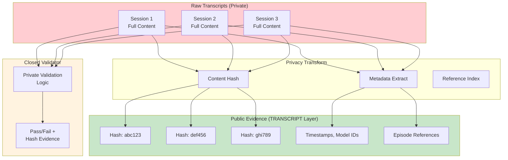

# INVENTION DISCLOSURE FORM

**IDF-024**

---

## ADMINISTRATIVE

**Title:** Privacy-Preserving Transcript Evidence Layer with Closed Validation

**Inventor(s):** Dexter Hadley

**Disclosure Date:** 2026-01-14

**Related Disclosure:** IDF-001-canonic-governance.md, IDF-003-compliance-proof-chaining.md, IDF-008-deterministic-blackbox-validation.md

**Freeze Reference:** Post stack-freeze-2026-01-12 (v0.2 scope)

**Status:** Internal disclosure — not for publication

**Confidentiality:** PRIVILEGED AND CONFIDENTIAL — Prepared for patent counsel

---

## 1. PROBLEM STATEMENT

In governed human-AI collaboration systems:

1. Session transcripts contain valuable evidence for claim reconstruction
2. Raw transcripts contain private or sensitive content
3. Publishing transcripts would expose confidential IP
4. Without transcripts, timeline reconstruction is incomplete
5. No mechanism enables transcript-based evidence without content exposure

**The core problem:** No structural mechanism exists to use session transcripts as evidence while preserving privacy—enabling timeline reconstruction and claim verification without exposing raw transcript content.

---

## 2. CORE INVENTIVE INSIGHT



The invention establishes a **transcript evidence layer** where:

1. Raw transcripts remain private (never published)
2. Hash references enable verification without exposure
3. Metadata enables timeline reconstruction
4. Closed validators verify claims against private content
5. Only validation outcomes (pass/fail) are published

### 2.1 Layer Architecture

| Component | Visibility | Content |
|-----------|-----------|---------|
| **Raw transcripts** | Private | Full session content |
| **TRANSCRIPT layer** | Public | Hashes, metadata, references |
| **Closed validator** | Private | Validation logic |
| **Validation outcomes** | Public | Pass/fail + hash evidence |

### 2.2 Privacy-Preserving Properties

The layer preserves privacy through:

- **Hash-only references:** Content hash published, content private
- **Metadata extraction:** Timestamps, model IDs extracted without content
- **Episode binding:** Transcripts linked to episodes by reference, not content
- **Closed validation:** Validator internals never exposed

### 2.3 Timeline Reconstruction

Despite privacy preservation, the layer enables:

1. **Session ordering:** Timestamps establish sequence
2. **Model identification:** Model IDs reveal which AI participated
3. **Episode correlation:** References link sessions to governance records
4. **Claim verification:** Closed validator confirms claims against content

### 2.4 Closed Validator Integration

The transcript validator (see IDF-008) operates as:

1. Input: Claim + transcript hash
2. Process: Load private transcript, verify claim
3. Output: Pass/fail + hash evidence
4. Property: Validation reproducible by anyone with transcript access

---

## 3. TECHNICAL APPROACH

### 3.1 Transcript Ingestion

1. Session transcript captured (raw content)
2. Content hash computed (SHA-256 or equivalent)
3. Metadata extracted:
   - Session start/end timestamps
   - Model identity
   - Participant identifiers
   - Episode references (if any)
4. Raw transcript stored privately
5. Hash + metadata published to TRANSCRIPT layer

### 3.2 Reference Structure

TRANSCRIPT layer records contain:

```
transcript_id: tr-YYYYMMDD-HHMMSS-NNNN
hash: SHA256(content)
timestamp_start: ISO8601
timestamp_end: ISO8601
model_identity: model-id-string
participants: [human_ids]
episode_refs: [ep001, ep002, ...]
```

### 3.3 Closed Validation Protocol

1. Claim submitted with transcript reference
2. Validator loads private transcript by hash
3. Validator verifies claim against content
4. Validator returns:
   - Pass/fail status
   - Hash of transcript verified
   - Timestamp of verification
5. Validation outcome published (not transcript content)

### 3.4 Reconstruction Protocol

Timeline reconstruction proceeds:

1. Collect all TRANSCRIPT layer records
2. Order by timestamp
3. Correlate with episode references
4. Build session→episode mapping
5. Verify claims through closed validation

---

## 4. ADVANTAGES

### 4.1 Privacy Preservation

Sensitive transcript content never published—only hashes and metadata.

### 4.2 Evidence Completeness

Timeline reconstruction possible without content exposure.

### 4.3 Claim Verifiability

Claims verifiable through closed validation with hash evidence.

### 4.4 IP Protection

Transcript content remains protectable IP while enabling verification.

### 4.5 Audit Trail Extension

Ledger evidence extended to session level without ledger bloat.

---

## 5. EXPLICIT EXCLUSIONS (NOT CLAIMED)

1. **Specific hash algorithms** — SHA-256 is example, not requirement
2. **Specific metadata fields** — Field structure is implementation detail
3. **Specific transcript formats** — Source format is not claimed
4. **Specific storage mechanisms** — Where transcripts live is not claimed
5. **Specific validation logic** — Validator internals are explicitly private

---

## 6. EVIDENCE SUMMARY

### 6.1 Episode Evidence

- ep151: Claim and disclosure coverage requirement
- ep152: Transcript layer and closed validator establishment
- ep153: Forward-first human-driven pattern (transcript-based)

### 6.2 Implementation Evidence

- TRANSCRIPT scope created with triad
- Closed transcript validator scope established
- Hash-only references demonstrated
- Episode-transcript correlation achieved

### 6.3 Privacy Evidence

- Raw transcripts stored in private location (~/.transcripts, ~/.codex/sessions)
- Public references contain hashes only
- No content exposure in public artifacts

---

## 7. RELATIONSHIP TO OTHER DISCLOSURES

### 7.1 Relationship to IDF-001

IDF-001 establishes ledger-based evidence. IDF-024 extends evidence to transcripts:

| IDF-001 | IDF-024 |
|---------|---------|
| Ledger is primary evidence | Transcripts are secondary evidence |
| Commits are public | Transcripts are private |
| Evidence in artifacts | Evidence in sessions |

### 7.2 Relationship to IDF-003

IDF-003 establishes proof chains through commits. IDF-024 adds:

- Transcript hashes as proof chain elements
- Session-to-commit correlation
- Private content with public proof

### 7.3 Relationship to IDF-008

IDF-008 establishes black-box validation. IDF-024 instantiates for transcripts:

- Transcript validator is black-box
- Input: claim + hash
- Output: pass/fail + evidence
- Internals: private

---

## 8. PRIOR ART DISTINCTION

### 8.1 Audit Logging (System Logs, Chat Logs)

Audit systems record interaction logs for compliance and forensics.

**Distinction:** IDF-024 provides **privacy-preserving evidence**, not just logging:
- Audit logs are typically internal; IDF-024 publishes hash references
- Audit logs expose content on access; IDF-024 never exposes content publicly
- Closed validation with public outcomes is unique

### 8.2 Zero-Knowledge Proofs

Zero-knowledge systems prove statements without revealing underlying data.

**Distinction:** IDF-024 uses **hash references and closed validation**, not ZK proofs:
- ZK proofs are cryptographic protocols; IDF-024 is architectural
- IDF-024 does not claim cryptographic security properties
- The layer structure (public metadata, private content) is distinct from ZK

### 8.3 Data Anonymization (PII Removal, Redaction)

Anonymization techniques remove identifying information from data.

**Distinction:** IDF-024 **never publishes content**, anonymized or not:
- Anonymization modifies content; IDF-024 publishes only hashes
- Anonymization has re-identification risks; IDF-024 content stays private
- Hash-only references eliminate content exposure entirely

### 8.4 Blockchain Hash Anchoring

Blockchain systems anchor document hashes for timestamping.

**Distinction:** IDF-024 uses hashes for **evidence correlation**, not just timestamping:
- Blockchain anchoring proves existence at time; IDF-024 enables reconstruction
- Episode-transcript correlation has no blockchain equivalent
- Closed validation against private content is unique

---

## 9. INVENTOR DECLARATION

I, **Dexter Hadley**, declare that:

1. I am the sole human inventor of this method
2. The discovery is documented in ep151, ep152, ep153
3. AI systems contributed execution under governance but are not inventors
4. This disclosure is post-freeze IP (v0.2 scope)

---

**END OF DISCLOSURE**

---
