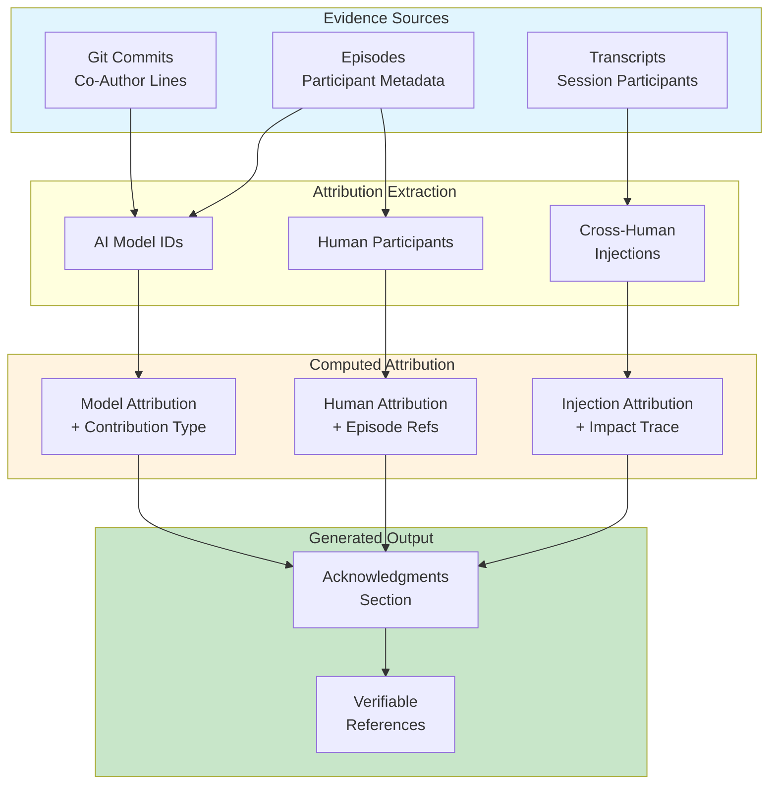

# INVENTION DISCLOSURE FORM

**IDF-025**

---

## ADMINISTRATIVE

**Title:** Computed Attribution from Ledger Evidence in Governed Human-AI Collaboration

**Inventor(s):** Dexter Hadley

**Disclosure Date:** 2026-01-14

**Related Disclosure:** IDF-001-canonic-governance.md, IDF-002-multi-model-governance.md, IDF-004-producer-consumer-governance.md

**Freeze Reference:** Post stack-freeze-2026-01-12 (v0.2 scope)

**Status:** Internal disclosure — not for publication

**Confidentiality:** PRIVILEGED AND CONFIDENTIAL — Prepared for patent counsel

---

## 1. PROBLEM STATEMENT

In research papers and governed collaboration outputs:

1. Acknowledgments sections are manually written courtesies
2. AI contributions are inconsistently credited (or not credited)
3. Human contributions beyond primary authors lack systematic attribution
4. No verifiable connection between acknowledgments and evidence
5. Cross-human injections (insights from non-authors) are invisible

**The core problem:** No structural mechanism exists to compute attribution from ledger evidence, making acknowledgments a verifiable output rather than a courtesy section.

---

## 2. CORE INVENTIVE INSIGHT



The invention establishes **computed attribution** where:

1. The ledger contains sufficient information to generate acknowledgments
2. Attribution becomes computed output, not courtesy text
3. Each attribution has verifiable evidence reference
4. Cross-human injections become traceable contributions

### 2.1 Attribution Sources

| Source | Extracts | Evidence Type |
|--------|----------|---------------|
| **Commit co-author lines** | AI model identities | Git history |
| **Episode metadata** | Human participants, model IDs | Episode files |
| **Transcript records** | Session participants, timestamps | TRANSCRIPT layer |

### 2.2 Attribution Types

| Type | Description | Example |
|------|-------------|---------|
| **Primary authorship** | Human inventors/authors | Listed in INVENTOR field |
| **AI contribution** | Model-specific work product | Claude Opus 4.5, GPT-5 |
| **Human contribution** | Non-author human input | Reviewer, questioner |
| **Cross-human injection** | Insight triggered by external question | "Help me understand what this is for" |

### 2.3 Cross-Human Injection Pattern

Critical discovery: Non-expert questions surface expert blind spots.

When a non-participant asks a clarifying question:
1. The question reveals a gap in the narrative
2. The expert addresses the gap (creating new content)
3. The question becomes the genesis of that content
4. Attribution traces from content back to question

**Example:**
- Question: "Help me understand what this is for"
- Result: "Why Should You Care?" section added
- Attribution: Questioner credited for surfacing the gap

### 2.4 Verifiable Attribution

Each attribution entry contains:
- **Who:** Contributor identifier
- **What:** Contribution type
- **Where:** Evidence reference (commit, episode, transcript)
- **Verify:** How to confirm the attribution

---

## 3. TECHNICAL APPROACH

### 3.1 Commit Extraction

1. Parse git history for co-author lines:
   ```
   Co-Authored-By: Claude Opus 4.5 <noreply@anthropic.com>
   ```
2. Extract model identities
3. Aggregate by model across commits
4. Compute contribution metrics (commit count, lines changed)

### 3.2 Episode Extraction

1. Parse episode metadata for participants:
   ```yaml
   Participants: Dexter Hadley, Claude Opus 4.5
   Model identity: claude-opus-4-5-20251101
   ```
2. Extract human participants
3. Extract model identities
4. Build episode→participant mapping

### 3.3 Transcript Extraction

1. Parse TRANSCRIPT layer for session metadata
2. Identify cross-human injections:
   - External participant in session
   - Question that triggered content change
   - Content change traceable to question
3. Record injection attribution

### 3.4 Attribution Generation

1. Aggregate all sources
2. Deduplicate contributors
3. Classify contribution types
4. Generate acknowledgments with references:
   ```markdown
   ## Acknowledgments

   **AI Agents:** Claude Opus 4.5 (eps 001-160, 847 commits),
   Claude Sonnet 4.5 (eps 045-089), GPT-5 (eps 150-153)

   **Human Contributors:** Fatima Boukrim (ep159: cross-human
   injection → "Why Should You Care?" section)

   All attributions verifiable via ledger references.
   ```

### 3.5 Verification Protocol

For each attribution:
1. Locate evidence reference
2. Verify contributor present in evidence
3. Verify contribution type matches evidence
4. Report verification status

---

## 4. ADVANTAGES

### 4.1 Verifiable Attribution

Every acknowledgment has traceable evidence—no unverifiable courtesies.

### 4.2 AI Contribution Transparency

AI contributions explicitly credited with model identity and scope.

### 4.3 Cross-Human Injection Capture

Non-obvious contributions (questions that triggered content) become visible.

### 4.4 Automated Generation

Attribution computed from evidence, not manually composed.

### 4.5 Audit Trail for Credit

Attribution disputes resolvable via evidence examination.

---

## 5. EXPLICIT EXCLUSIONS (NOT CLAIMED)

1. **Specific parsing algorithms** — How evidence is parsed is not claimed
2. **Specific output formats** — Acknowledgments format is not claimed
3. **Contribution valuation** — Relative importance is not claimed
4. **Author ordering** — How authors are ordered is not claimed
5. **Legal attribution requirements** — Jurisdiction-specific rules not claimed

---

## 6. EVIDENCE SUMMARY

### 6.1 Episode Evidence

- ep159: Auto-attribution discovery documented
- ep159: Cross-human injection pattern identified (Fatima Boukrim)

### 6.2 Implementation Evidence

- Commit co-author lines present in all governed commits
- Episode metadata includes participants and model identity
- Manual acknowledgments generated from evidence (v0.1)

### 6.3 Cross-Human Injection Evidence

- Fatima Boukrim question: "Help me understand what this is for"
- Result: "Why Should You Care?" section added to manuscript
- Attribution: Documented in ep159 and manuscript acknowledgments

---

## 7. RELATIONSHIP TO OTHER DISCLOSURES

### 7.1 Relationship to IDF-002

IDF-002 establishes model identity tracking. IDF-025 uses model identity for attribution:

| IDF-002 | IDF-025 |
|---------|---------|
| Track which model ran | Credit which model contributed |
| Per-session identity | Aggregated attribution |
| Compliance measurement | Contribution acknowledgment |

### 7.2 Relationship to IDF-004

IDF-004 establishes producer/consumer roles. IDF-025 attributes by role:

- Producer commits (AI) → AI attribution
- Consumer commits (Human) → Human attribution
- Role classification informs attribution type

### 7.3 Relationship to IDF-024

IDF-024 establishes transcript layer. IDF-025 extracts attribution from transcripts:

- Transcript metadata provides session participants
- Cross-human injections detected via transcript analysis
- Privacy preserved (only attribution published, not content)

---

## 8. PRIOR ART DISTINCTION

### 8.1 Academic Authorship (ICMJE, CRediT)

Academic standards define authorship criteria and contribution taxonomies.

**Distinction:** IDF-025 **computes attribution from evidence**, not criteria application:
- ICMJE defines who qualifies; IDF-025 extracts who contributed
- CRediT taxonomizes roles; IDF-025 traces evidence
- Verifiable references have no academic standard equivalent

### 8.2 Git Blame and Contribution Statistics

Git tools attribute code changes to committers.

**Distinction:** IDF-025 extends attribution to **AI models and cross-human injections**:
- Git blame tracks human committers; IDF-025 tracks AI models via co-author
- Git statistics count commits; IDF-025 classifies contribution types
- Cross-human injection detection has no git equivalent

### 8.3 Acknowledgments Generation (LaTeX, Templates)

Document systems provide acknowledgments section templates.

**Distinction:** IDF-025 **generates content from evidence**, not just formatting:
- Templates structure acknowledgments; IDF-025 computes them
- Templates require manual input; IDF-025 extracts from ledger
- Verifiable references are unique to IDF-025

### 8.4 Contributor License Agreements (CLA)

Open source projects use CLAs to track contributor rights.

**Distinction:** IDF-025 tracks **contribution attribution**, not rights:
- CLAs establish legal rights; IDF-025 establishes credit
- CLAs are agreements; IDF-025 is evidence extraction
- AI model attribution has no CLA equivalent

---

## 9. INVENTOR DECLARATION

I, **Dexter Hadley**, declare that:

1. I am the sole human inventor of this method
2. The discovery is documented in ep159
3. AI systems contributed execution under governance but are not inventors
4. This disclosure is post-freeze IP (v0.2 scope)

---

**END OF DISCLOSURE**

---
