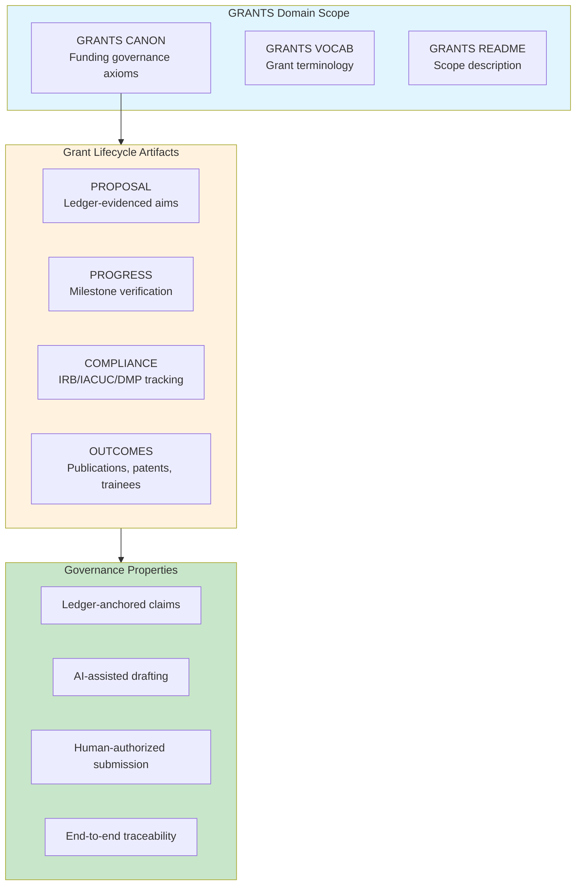

# INVENTION DISCLOSURE FORM

**IDF-033**

---

## ADMINISTRATIVE

**Title:** Constitutional Governance Framework for Research Grant Lifecycle Management

**Inventor(s):** Dexter Hadley

**Disclosure Date:** 2026-01-14

**Related Disclosure:** IDF-001-canonic-governance.md, IDF-019-paper-as-reproducible-template.md

**Freeze Reference:** Post stack-freeze-2026-01-12 (v0.2 scope) — SKETCH FOR FUTURE DOMAIN

**Status:** Internal disclosure — SKETCH — not for publication

**Confidentiality:** PRIVILEGED AND CONFIDENTIAL — Prepared for patent counsel

---

## 1. PROBLEM STATEMENT

In research grant management:

1. Grant proposals are written without traceable evidence of preliminary work
2. Progress reports claim achievements not verifiable against records
3. Budget justifications disconnect from actual resource allocation
4. Compliance requirements (IRB, IACUC, data management) are tracked separately
5. Grant outcomes (publications, patents, trainees) are not linked to funded activities
6. Multi-institution collaborations lack unified governance

**The core problem:** No structural mechanism exists to govern research grants under constitutional constraints where proposals, progress, compliance, and outcomes are ledger-anchored and AI-assisted but human-authorized.

---

## 2. CORE INVENTIVE INSIGHT



The invention applies CANONIC governance to **research grants** where:

1. Grant proposals reference ledger evidence for preliminary data
2. Progress reports verify milestones against recorded episodes
3. Compliance documents trace to governance artifacts
4. Outcomes link to funded activities through ledger

### 2.1 GRANTS CANON Axioms (Sketch)

| Axiom | Constraint |
|-------|------------|
| **Preliminary data** | Claims MUST reference ledger evidence |
| **Aims traceability** | Each aim MUST map to evidence window |
| **Progress verification** | Milestones MUST be ledger-verifiable |
| **Compliance binding** | IRB/IACUC MUST be governance artifacts |
| **Outcome attribution** | Publications MUST cite grant + ledger |
| **Budget justification** | Resources MUST map to activities |

### 2.2 AI-Assisted Grant Writing

Under CANONIC governance:
- AI drafts proposal sections (producer role)
- Human reviews and authorizes submission (consumer role)
- Drafts trace to evidence (ledger-anchored)
- Claims are verifiable (not AI hallucination)

### 2.3 Multi-Institution Governance

For collaborative grants:
- Each institution maintains local CANONIC stack
- STACK layer observes all institutions (IDF-009)
- Shared VOCAB for grant terminology
- Independent authority, unified observation

---

## 3. GRANT-SPECIFIC MECHANISMS

### 3.1 Preliminary Data Anchoring

```
CLAIM: "We have demonstrated X in preliminary studies"
EVIDENCE: ledger:ep045, ledger:ep067 (freeze-bounded)
VERIFICATION: External reviewer can verify via ledger
```

### 3.2 Progress Report Verification

```
MILESTONE: "Complete Aim 1 by Year 2"
STATUS: VERIFIED
EVIDENCE: ledger:ep120-ep145 (episodes documenting Aim 1 work)
VERIFICATION: Milestones map to episode completion
```

### 3.3 Compliance Governance

```
COMPLIANCE_ARTIFACT: IRB Protocol 2026-001
GOVERNANCE: irb/CANON.md (inherits from GRANTS)
STATUS: Active, ledger-recorded approval
```

### 3.4 Outcome Attribution

```
PUBLICATION: "Constitutional AI Governance" (2026)
GRANT: R01-AI-123456
EVIDENCE: ledger:freeze-2026-01-12 (work funded by grant)
ATTRIBUTION: Computed from ledger (IDF-025)
```

---

## 4. ADVANTAGES

### 4.1 Verifiable Preliminary Data

Grant claims are checkable, not trust-based.

### 4.2 Auditable Progress

NIH/NSF can verify milestones via ledger.

### 4.3 Compliance Integration

IRB/IACUC/DMP are governance artifacts, not separate systems.

### 4.4 Outcome Traceability

Publications trace to funded work via ledger.

### 4.5 AI-Assisted Without Fabrication

AI helps write but cannot fabricate evidence.

---

## 5. PRIOR ART DISTINCTION

### 5.1 Grant Management Systems (ERA Commons, Research.gov)

Federal systems track grants administratively.

**Distinction:** IDF-033 provides **constitutional governance**, not just tracking:
- ERA tracks status; IDF-033 governs claims
- Research.gov is administrative; IDF-033 is evidential
- Ledger-anchored preliminary data is unique

### 5.2 Electronic Lab Notebooks (LabArchives, Benchling)

ELNs record research data.

**Distinction:** IDF-033 integrates ELN-like evidence into **grant governance**:
- ELNs record data; IDF-033 governs grant claims
- ELNs are standalone; IDF-033 is grant-lifecycle integrated
- AI-assisted drafting with evidence binding is unique

---

## 6. SKETCH STATUS

This IDF is a **sketch** for future domain instantiation.

When GRANTS domain is activated:
1. Create grants/ scope with triad
2. Define GRANTS CANON axioms
3. Define GRANTS VOCAB
4. Create proposal/progress/compliance/outcome templates
5. Instantiate governance

---

**END OF SKETCH**

---
