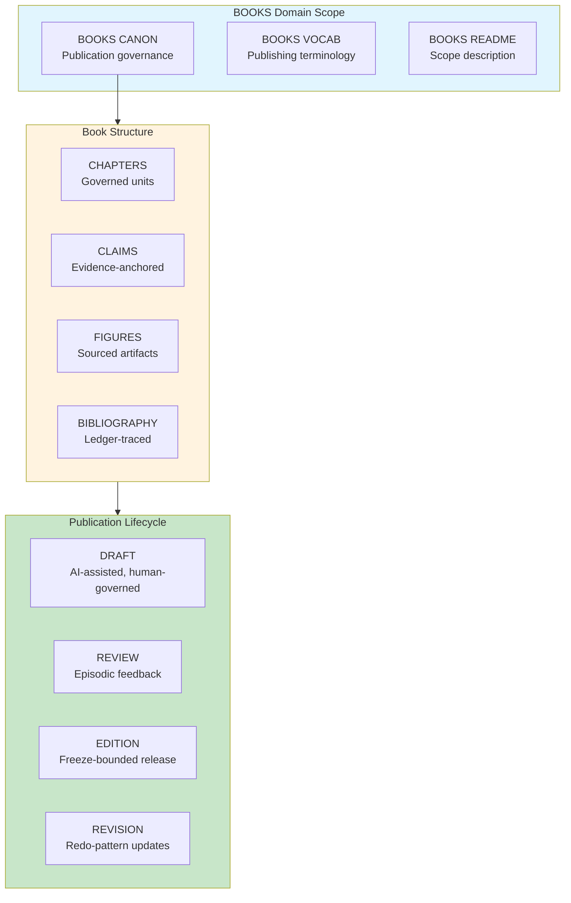

# INVENTION DISCLOSURE FORM

**IDF-034**

---

## ADMINISTRATIVE

**Title:** Constitutional Governance Framework for Long-Form Publication (Books/Textbooks)

**Inventor(s):** Dexter Hadley

**Disclosure Date:** 2026-01-14

**Related Disclosure:** IDF-001-canonic-governance.md, IDF-011-evidence-based-epistemic-writing.md, IDF-019-paper-as-reproducible-template.md

**Freeze Reference:** Post stack-freeze-2026-01-12 (v0.2 scope) — SKETCH FOR FUTURE DOMAIN

**Status:** Internal disclosure — SKETCH — not for publication

**Confidentiality:** PRIVILEGED AND CONFIDENTIAL — Prepared for patent counsel

---

## 1. PROBLEM STATEMENT

In book and textbook authorship:

1. Long-form works accumulate over months/years without governance
2. AI-assisted writing creates attribution ambiguity
3. Claims in books are not evidence-anchored
4. Revisions between editions are not systematically tracked
5. Multi-author collaborations lack constitutional structure
6. Educational content quality is not verifiable

**The core problem:** No structural mechanism exists to govern long-form publications (books, textbooks, monographs) under constitutional constraints where chapters, claims, and revisions are ledger-anchored and AI-collaboration is transparent.

---

## 2. CORE INVENTIVE INSIGHT



The invention applies CANONIC governance to **books** where:

1. Chapters are governed artifacts with traceability
2. Claims within chapters reference evidence
3. Editions are freeze-bounded releases
4. Revisions follow redo-pattern (preserve history)

### 2.1 BOOKS CANON Axioms (Sketch)

| Axiom | Constraint |
|-------|------------|
| **Chapter atomicity** | Chapters are atomic governance units |
| **Claim evidence** | Factual claims MUST reference sources |
| **AI attribution** | AI contributions MUST be disclosed per chapter |
| **Edition freeze** | Each edition is a freeze-bounded artifact |
| **Revision redo** | Updates create new editions, not overwrites |
| **Figure sourcing** | Figures MUST trace to source artifacts |

### 2.2 Chapter as Governed Unit

Each chapter operates like an episode:
- Metadata (author, AI model, date)
- Content (governed by BOOKS CANON)
- Claims (evidence-anchored)
- Corrections (via revision, not overwrite)

### 2.3 Edition as Freeze

Book editions map to freeze boundaries:
- Edition 1 = freeze-2026-01-12
- Edition 2 = freeze-2027-01-12
- Each edition is epistemically closed (IDF-030)
- Claims verifiable within edition's evidence window

### 2.4 Multi-Author Governance

For collaborative books:
- Each author maintains chapter authority
- Shared BOOKS CANON for consistency
- STACK-like observation across chapters
- Editor role = human authority over compilation

---

## 3. BOOK-SPECIFIC MECHANISMS

### 3.1 AI-Assisted Drafting

```
CHAPTER: "Introduction to Constitutional AI"
AUTHOR: Dexter Hadley
AI_CONTRIBUTION: Claude Opus 4.5 (drafting assistance)
EVIDENCE: ledger:ep001-ep030 (source episodes)
DISCLOSURE: "AI-assisted drafting; all claims human-verified"
```

### 3.2 Claim Anchoring

```
CLAIM: "Definitional closure prevents undefined term usage"
TYPE: Observation (IDF-011 claim type)
EVIDENCE: ledger:ep060, IDF-006
VERIFIABLE: Yes (external reader can check)
```

### 3.3 Edition Lifecycle

```
EDITION 1.0:
  FREEZE: 2026-01-12
  CHAPTERS: 1-10
  STATUS: Published

EDITION 2.0:
  FREEZE: 2027-06-01
  CHAPTERS: 1-12 (2 new chapters)
  REVISIONS: Chapter 3 (redo of 1.0 Chapter 3)
  STATUS: In preparation
```

### 3.4 Textbook Exercises

For educational books:
```
EXERCISE: "Verify VOCAB closure for the given CANON"
CHAPTER: 5
SOLUTION: Anchored to ledger evidence
LEARNING_OBJECTIVE: Demonstrate introspection (IDF-006)
```

---

## 4. ADVANTAGES

### 4.1 AI Transparency

AI contributions explicitly tracked and disclosed.

### 4.2 Verifiable Claims

Readers can verify factual claims against evidence.

### 4.3 Edition Integrity

Each edition is a complete, frozen artifact.

### 4.4 Revision History

Full history preserved (no silent corrections).

### 4.5 Educational Quality

Textbook claims are evidence-based, not authority-based.

---

## 5. PRIOR ART DISTINCTION

### 5.1 Version Control for Writing (Git, Google Docs)

Writing tools track document versions.

**Distinction:** IDF-034 provides **governance**, not just versioning:
- Git tracks changes; IDF-034 governs claims
- Google Docs is collaborative; IDF-034 is constitutional
- Edition-as-freeze with epistemological closure is unique

### 5.2 Academic Publishing (Peer Review)

Academic books undergo peer review.

**Distinction:** IDF-034 is **self-evidencing**, not externally reviewed:
- Peer review validates by authority; IDF-034 validates by evidence
- Traditional publishing is trust-based; IDF-034 is ledger-based
- AI attribution at chapter level is unique

### 5.3 Open Textbooks (OpenStax, OER)

Open educational resources provide free textbooks.

**Distinction:** IDF-034 adds **constitutional governance**:
- OER focuses on access; IDF-034 focuses on evidence
- OpenStax is content; IDF-034 is governed content
- Claim-level evidence anchoring is unique

---

## 6. SKETCH STATUS

This IDF is a **sketch** for future domain instantiation.

When BOOKS domain is activated:
1. Create books/ scope with triad
2. Define BOOKS CANON axioms
3. Define BOOKS VOCAB
4. Create chapter/edition/revision templates
5. Instantiate governance for first book project

---

**END OF SKETCH**

---
