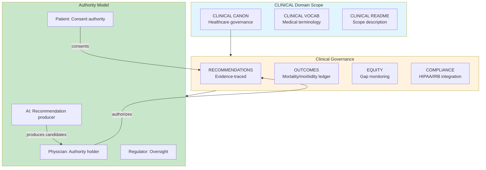

# INVENTION DISCLOSURE FORM

**IDF-035**

---

## ADMINISTRATIVE

**Title:** Constitutional Governance Framework for Clinical and Healthcare AI Systems

**Inventor(s):** Dexter Hadley

**Disclosure Date:** 2026-01-14

**Related Disclosure:** IDF-001-canonic-governance.md, IDF-008-deterministic-blackbox-validation.md

**Freeze Reference:** Post stack-freeze-2026-01-12 (v0.2 scope) — SKETCH FOR FUTURE DOMAIN

**Status:** Internal disclosure — SKETCH — not for publication

**Confidentiality:** PRIVILEGED AND CONFIDENTIAL — Prepared for patent counsel

---

## 1. PROBLEM STATEMENT

In clinical and healthcare AI systems:

1. AI recommendations lack traceable evidence chains
2. Clinical decision support systems operate as black boxes
3. Mortality and morbidity outcomes are not governance-linked
4. Healthcare equity gaps are documented but not structurally addressed
5. HIPAA/regulatory compliance is separate from clinical governance
6. AI hallucinations in clinical settings can cause patient harm

**The core problem:** No structural mechanism exists to govern healthcare AI under constitutional constraints where clinical recommendations, outcomes, equity metrics, and regulatory compliance are ledger-anchored with human physician authority preserved.

---

## 2. CORE INVENTIVE INSIGHT



The invention applies CANONIC governance to **clinical healthcare** where:

1. AI produces recommendation candidates (producer role)
2. Physicians hold exclusive authority to approve (human authority)
3. Patient consent is a governance artifact
4. Outcomes are ledger-recorded and equity-monitored

### 2.1 CLINICAL CANON Axioms (Sketch)

| Axiom | Constraint |
|-------|------------|
| **Physician authority** | AI recommendations MUST be physician-approved |
| **Evidence tracing** | Recommendations MUST cite clinical evidence |
| **Outcome recording** | Patient outcomes MUST be ledger-recorded |
| **Equity monitoring** | Disparity metrics MUST be tracked |
| **Consent governance** | Patient consent MUST be governance artifact |
| **Regulatory binding** | HIPAA/IRB MUST be inherited constraints |
| **No AI autonomy** | AI MUST NOT make autonomous clinical decisions |

### 2.2 Dividends and Deaths Integration

From existing dividends-and-deaths/ domain:
- **Mortality as Ledger:** Deaths are ledger events with evidence chains
- **Dividends:** Healthcare benefits distributed under governance
- **Equity Layer:** Disparity detection and tracking
- **Digital Maat:** Healthcare justice as governance principle

### 2.3 Clinical Decision Support

```
RECOMMENDATION: Consider statin therapy for patient
EVIDENCE:
  - Patient LDL: 180 mg/dL (ledger:lab-2026-01-10)
  - Guidelines: ACC/AHA 2019 (external reference)
  - Risk score: 12% 10-year ASCVD (computed)
STATUS: CANDIDATE (awaiting physician approval)
PHYSICIAN_ACTION: [Approve/Modify/Reject]
```

### 2.4 Outcome Governance

```
OUTCOME_EVENT: Patient mortality
PATIENT_ID: [de-identified hash]
TIMESTAMP: 2026-03-15
CONTRIBUTING_FACTORS: [ledger-referenced]
GOVERNANCE_REVIEW: Required
EQUITY_FLAG: Check for disparity pattern
```

---

## 3. CLINICAL-SPECIFIC MECHANISMS

### 3.1 Recommendation Chain

```
CLINICAL_EPISODE:
  INPUT: Patient presentation
  AI_ANALYSIS: Differential diagnosis candidates
  PHYSICIAN_REVIEW: Episode recorded
  DECISION: Physician-authorized action
  OUTCOME: Ledger-recorded result
  TRACEABILITY: Full chain preserved
```

### 3.2 Equity Monitoring

```
EQUITY_STREAM:
  METRIC: 30-day mortality by demographic
  BASELINE: Population average
  DISPARITY_THRESHOLD: 1.5x baseline
  ALERT: Trigger when threshold exceeded
  GOVERNANCE_ACTION: Required review
```

### 3.3 Regulatory Compliance

```
COMPLIANCE_INHERITANCE:
  HIPAA → CLINICAL CANON (inherited constraint)
  IRB → CLINICAL CANON (research activities)
  FDA → CLINICAL CANON (device/drug governance)

All regulatory requirements are CANON axioms.
```

### 3.4 Patient Consent

```
CONSENT_ARTIFACT:
  PATIENT: [de-identified]
  SCOPE: AI-assisted decision support
  TIMESTAMP: 2026-01-14
  STATUS: Active
  LEDGER_REF: consent:2026-01-14-001
  GOVERNANCE: Patient can revoke (creates new artifact)
```

---

## 4. ADVANTAGES

### 4.1 Patient Safety

AI cannot act autonomously; physician authority preserved.

### 4.2 Outcome Traceability

Every clinical outcome traces to decisions and evidence.

### 4.3 Equity Accountability

Disparity patterns are structurally detectable.

### 4.4 Regulatory Integration

Compliance is governance, not separate checkbox.

### 4.5 AI Hallucination Prevention

Recommendations require evidence; unfounded claims are violations.

---

## 5. PRIOR ART DISTINCTION

### 5.1 Clinical Decision Support Systems (Epic, Cerner)

EHR systems provide clinical decision support.

**Distinction:** IDF-035 provides **constitutional governance**, not just support:
- EHR CDS suggests; IDF-035 governs with evidence chains
- EHR is operational; IDF-035 is constitutional
- Ledger-anchored outcomes with equity monitoring is unique

### 5.2 FDA AI/ML Regulation

FDA regulates AI medical devices.

**Distinction:** IDF-035 is **structural governance**, not just compliance:
- FDA requires approval; IDF-035 provides governance mechanism
- FDA is external oversight; IDF-035 is internal constitution
- The integration of regulatory as inherited axioms is unique

### 5.3 Healthcare AI Ethics (AI Ethics Boards)

Ethics boards review AI healthcare applications.

**Distinction:** IDF-035 is **machine-verifiable**, not committee-based:
- Ethics boards deliberate; IDF-035 validates structurally
- Board decisions are opinions; IDF-035 constraints are axioms
- Structural equity monitoring has no ethics board equivalent

---

## 6. SKETCH STATUS

This IDF is a **sketch** for future domain instantiation.

When CLINICAL domain is activated:
1. Integrate with dividends-and-deaths/ existing work
2. Create clinical/ scope with triad
3. Define CLINICAL CANON axioms
4. Define CLINICAL VOCAB (medical terminology)
5. Create recommendation/outcome/consent templates
6. Instantiate governance for clinical pilot

---

**END OF SKETCH**

---
