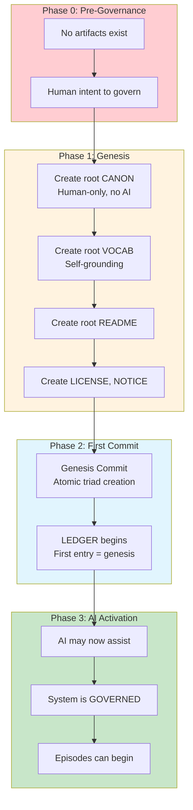

# INVENTION DISCLOSURE FORM

**IDF-036**

---

## ADMINISTRATIVE

**Title:** System Bootstrapping Protocol for Constitutional Governance Instantiation

**Inventor(s):** Dexter Hadley

**Disclosure Date:** 2026-01-14

**Related Disclosure:** IDF-001-canonic-governance.md, IDF-019-paper-as-reproducible-template.md, IDF-032-self-grounding-semantic-bootstrap.md

**Freeze Reference:** Post stack-freeze-2026-01-12 (v0.2 scope)

**Status:** Internal disclosure — not for publication

**Confidentiality:** PRIVILEGED AND CONFIDENTIAL — Prepared for patent counsel

---

## 1. PROBLEM STATEMENT

When instantiating constitutional governance systems:

1. The first commit has no prior governance to validate against
2. Initial CANON cannot reference pre-existing ledger evidence
3. The "chicken and egg" problem: governance requires ledger, ledger requires governance
4. No mechanism defines the minimum viable governance state
5. Bootstrap sequence order affects system validity
6. Premature AI involvement before governance exists creates violations

**The core problem:** No structural mechanism exists to bootstrap a constitutional governance system from nothing—defining the minimal sequence of operations that transitions from ungoverned state to governed state without violating governance principles.

---

## 2. CORE INVENTIVE INSIGHT



The invention establishes a **bootstrap protocol** where:

1. **Phase 0:** Ungoverned state with human intent
2. **Phase 1:** Human creates minimal governance artifacts (NO AI)
3. **Phase 2:** Genesis commit creates ledger with governance
4. **Phase 3:** AI may now operate under governance

### 2.1 Bootstrap Paradox Resolution

The paradox: Governance validates artifacts, but governance is an artifact.

Resolution: **Genesis commit is self-authorizing**

```
GENESIS_COMMIT:
  CONTENT: Root triad (CANON, VOCAB, README) + LICENSE + NOTICE
  AUTHOR: Human (exclusively)
  AI: NONE (AI not yet authorized)
  VALIDITY: Self-validating (first governance is its own authority)
  TIMESTAMP: T₀ (beginning of governed time)
```

The genesis commit is valid because it IS the governance—it doesn't need prior governance to validate it.

### 2.2 Minimum Viable Governance (MVG)

MVG is the smallest artifact set that constitutes governance:

| Artifact | Requirement | Purpose |
|----------|-------------|---------|
| CANON.md | Required | Declares axioms |
| VOCAB.md | Required | Defines terms (self-grounding) |
| README.md | Required | Describes scope |
| LICENSE | Required (root) | Legal terms |
| NOTICE | Required (root) | Attribution |

MVG = 5 artifacts in single atomic commit.

### 2.3 Human-Only Genesis

Critical constraint: **Genesis MUST be human-only**

| Why | Consequence |
|-----|-------------|
| AI requires governance to operate | AI cannot create its own governance |
| Governance is human authority | Only humans can establish authority |
| Circular dependency | AI creating governance = self-authorization |

If AI participates in genesis, the system is invalid from inception.

### 2.4 Post-Genesis AI Activation

After genesis commit:
1. Governance exists (ledger has first entry)
2. AI may now operate under that governance
3. AI is subordinate to genesis governance
4. AI can extend but not modify genesis

---

## 3. TECHNICAL APPROACH

### 3.1 Bootstrap Sequence

```
STEP 1: Human creates CANON.md (declares axioms)
STEP 2: Human creates VOCAB.md (self-grounding definitions)
STEP 3: Human creates README.md (scope description)
STEP 4: Human creates LICENSE (legal terms)
STEP 5: Human creates NOTICE (attribution)
STEP 6: Human commits all 5 atomically (GENESIS COMMIT)
STEP 7: Ledger exists (commit = first entry)
STEP 8: System is GOVERNED
STEP 9: AI may now be activated
```

### 3.2 Genesis Commit Properties

```
git commit -m "Genesis: Establish CANONIC governance

Creates root triad (CANON, VOCAB, README) plus LICENSE and NOTICE.
This commit is self-authorizing as the first governance artifact.
AI participation: NONE (human-only genesis required).

Co-Authored-By: NONE (human-only)"
```

The commit message documents the bootstrap condition.

### 3.3 Post-Genesis Validation

After genesis, normal governance applies:
- Subsequent commits validated against CANON
- AI may produce candidates under governance
- Violations are possible and recorded
- System operates normally

### 3.4 Bootstrap Violation Detection

If pre-genesis AI involvement detected:
```
VIOLATION: AI participation in genesis
EVIDENCE: Co-Author line in genesis commit
SEVERITY: FATAL (system invalid from inception)
REMEDY: None (must re-bootstrap without AI)
```

---

## 4. ADVANTAGES

### 4.1 Clean Governance Origin

System has unambiguous governance beginning.

### 4.2 Human Authority Establishment

Human authority is foundational, not derived.

### 4.3 Paradox Resolution

Bootstrap paradox resolved through self-authorizing genesis.

### 4.4 AI Boundary Clarity

AI role begins only after governance exists.

### 4.5 Reproducible Instantiation

Any new CANONIC system can follow the same protocol.

---

## 5. EXPLICIT EXCLUSIONS (NOT CLAIMED)

1. **Specific artifact content** — What axioms are in genesis is not claimed
2. **Specific commit message format** — Message structure is not claimed
3. **Specific version control system** — Git is example, not requirement
4. **Specific AI activation mechanism** — How AI is enabled is not claimed
5. **Legal requirements** — LICENSE/NOTICE content is not claimed

---

## 6. EVIDENCE SUMMARY

### 6.1 Genesis Evidence

canonic/ repository has genesis commit:
- Created by human (Dexter Hadley)
- Contains root triad + LICENSE + NOTICE
- No AI Co-Author in genesis
- First ledger entry

### 6.2 Bootstrap Evidence

Episodes document the bootstrap:
- Early episodes establish governance
- AI assistance begins post-genesis
- Sequence is human-first, AI-second

### 6.3 Violation Evidence

No bootstrap violations in current system (properly bootstrapped).

---

## 7. RELATIONSHIP TO OTHER DISCLOSURES

### 7.1 Relationship to IDF-001

IDF-001 establishes constitutional governance. IDF-036 specifies how to BEGIN:

| IDF-001 | IDF-036 |
|---------|---------|
| What governance IS | How governance BEGINS |
| Structure of governance | Genesis of governance |
| Human authority principle | Human-only genesis |

### 7.2 Relationship to IDF-032

IDF-032 covers semantic bootstrap (VOCAB self-grounding). IDF-036 covers system bootstrap:

| IDF-032 | IDF-036 |
|---------|---------|
| Semantic self-reference | System instantiation |
| VOCAB defines "vocab" | Genesis creates governance |
| Definition bootstrap | Operational bootstrap |

### 7.3 Relationship to IDF-019

IDF-019 covers paper as reproducible template. IDF-036 enables instantiation:

- IDF-019: Fork and instantiate
- IDF-036: How to perform the instantiation
- Together: Template + Protocol = New system

---

## 8. PRIOR ART DISTINCTION

### 8.1 Compiler Bootstrapping

Compilers bootstrap by compiling themselves.

**Distinction:** IDF-036 bootstraps **governance**, not execution:
- Compiler bootstrap is about executable; IDF-036 is about authority
- Self-compilation produces equivalent compiler; IDF-036 produces governance
- Human-only genesis constraint has no compiler equivalent

### 8.2 Blockchain Genesis Block

Blockchains have a genesis block that starts the chain.

**Distinction:** IDF-036 establishes **human authority**, not just chain start:
- Genesis block starts consensus; IDF-036 starts governance
- Blockchain genesis is technical; IDF-036 genesis is constitutional
- The human-only constraint is unique to governance

### 8.3 Operating System Boot

OS boot sequences initialize system from power-on.

**Distinction:** IDF-036 bootstraps **governance**, not hardware/software:
- OS boot initializes state; IDF-036 initializes authority
- Boot is technical; bootstrap is constitutional
- AI exclusion from genesis has no OS boot equivalent

### 8.4 Database Initialization

Databases are initialized with schema before data.

**Distinction:** IDF-036 initializes **constitutional structure**:
- DB init creates schema; IDF-036 creates governance
- Schema enables data; governance enables AI operation
- Self-authorizing genesis is unique

---

## 9. INVENTOR DECLARATION

I, **Dexter Hadley**, declare that:

1. I am the sole human inventor of this protocol
2. The protocol was followed in bootstrapping the CANONIC system
3. AI systems contributed execution only after governance existed
4. This disclosure is post-freeze IP (v0.2 scope)

---

**END OF DISCLOSURE**

---
