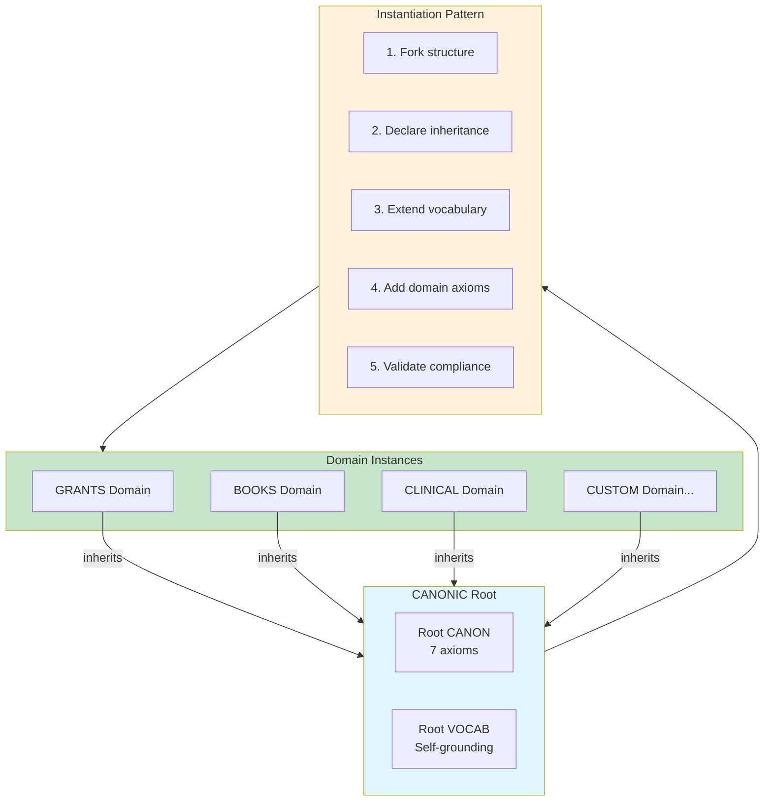

# INVENTION DISCLOSURE FORM

**IDF-037**

---

## ADMINISTRATIVE

**Title:** Domain Instantiation Pattern for Constitutional Governance Extension

**Inventor(s):** Dexter Hadley

**Disclosure Date:** 2026-01-14

**Related Disclosure:** IDF-001-canonic-governance.md, IDF-007-hierarchical-authority-scoping.md, IDF-019-paper-as-reproducible-template.md, IDF-036-system-bootstrapping-protocol.md

**Freeze Reference:** Post stack-freeze-2026-01-12 (v0.2 scope)

**Status:** Internal disclosure — not for publication

**Confidentiality:** PRIVILEGED AND CONFIDENTIAL — Prepared for patent counsel

---

## 1. PROBLEM STATEMENT

When extending constitutional governance to new domains:

1. Each domain reinvents governance structure
2. Domain-specific terms conflict with root vocabulary
3. Authority boundaries between domains are unclear
4. Inheritance from root is not systematic
5. Domain validation has no standard pattern
6. Domain evolution is not tracked consistently

**The core problem:** No structural mechanism exists to instantiate new governance domains as systematic extensions of a constitutional root—ensuring consistent inheritance, vocabulary extension, and authority bounding while preserving domain-specific flexibility.

---

## 2. CORE INVENTIVE INSIGHT



The invention establishes a **domain instantiation pattern** where:

1. New domains fork structure from root or existing scope
2. Domains declare inheritance explicitly
3. Domains extend (never override) vocabulary
4. Domains add domain-specific axioms
5. Domains validate against inherited + local constraints

### 2.1 Instantiation Protocol

| Step | Action | Constraint |
|------|--------|------------|
| **1. Fork** | Copy structure from template | Use IDF-019 template |
| **2. Inherit** | Declare parent in CANON | `inherits: /canonic` |
| **3. Extend VOCAB** | Add domain terms | No redefinition of root terms |
| **4. Add axioms** | Domain-specific rules | Cannot override inherited axioms |
| **5. Validate** | Check compliance | Must pass root + local validation |

### 2.2 Domain CANON Structure

```markdown
# DOMAIN CANON (e.g., /grants)

inherits: /canonic/machine/os

---

## Inherited Axioms

[All axioms from /canonic/machine/os are inherited and FINAL]

---

## Domain Axioms

### 1. [Domain-specific axiom]
...

### 2. [Domain-specific axiom]
...
```

### 2.3 Domain VOCAB Extension

```markdown
# DOMAIN VOCAB (e.g., /grants)

[Inherits all terms from root VOCAB]

---

## Domain Terms

### proposal
A grant proposal artifact governed by GRANTS CANON.

### milestone
A progress checkpoint in grant lifecycle.
```

Domain terms ADD to vocabulary; they do not replace root terms.

### 2.4 Authority Bounding

Each domain has bounded authority:

| Domain | Authority | Cannot |
|--------|-----------|--------|
| GRANTS | Grant lifecycle | Override funding agency rules |
| BOOKS | Publication lifecycle | Override publisher contracts |
| CLINICAL | Healthcare governance | Override medical board authority |

Domains operate within their declared scope (IDF-007).

---

## 3. TECHNICAL APPROACH

### 3.1 Domain Creation Checklist

```
[ ] Create domain directory (e.g., grants/)
[ ] Create CANON.md with inheritance declaration
[ ] Create VOCAB.md with domain terms
[ ] Create README.md with scope description
[ ] Add LICENSE and NOTICE (if repository root)
[ ] Validate triad completeness
[ ] Validate inheritance compliance
[ ] Validate VOCAB closure
[ ] Genesis commit (or standard commit if not root)
```

### 3.2 Inheritance Validation

For domain D inheriting from parent P:

```
VALID(D) ⟺
  DECLARES_INHERITANCE(D, P) ∧
  CONTAINS_ALL(D.constraints, P.constraints) ∧
  NO_OVERRIDE(D.constraints, P.constraints) ∧
  VOCAB_EXTENDS(D.vocab, P.vocab) ∧
  TRIAD_COMPLETE(D)
```

### 3.3 Domain Evolution

Domains evolve through:
1. **Axiom addition:** New domain-specific rules
2. **VOCAB extension:** New domain terms
3. **Freeze boundaries:** Domain-specific evidence windows
4. **Child domains:** Sub-domains inherit from domain

### 3.4 Cross-Domain Composition

Multiple domains can be composed via STACK (IDF-009):
- GRANTS + CLINICAL = Funded clinical research
- BOOKS + CLINICAL = Medical textbook
- GRANTS + BOOKS = Grant-funded book project

Composition is observational, not authority-merging.

---

## 4. ADVANTAGES

### 4.1 Consistent Structure

All domains follow same structural pattern.

### 4.2 Guaranteed Inheritance

Inheritance is systematic and verifiable.

### 4.3 Authority Clarity

Domain boundaries are explicit.

### 4.4 Vocabulary Coherence

Domain terms extend root, no conflicts.

### 4.5 Rapid Instantiation

New domains can be created quickly using pattern.

---

## 5. EXPLICIT EXCLUSIONS (NOT CLAIMED)

1. **Specific domain content** — What domains contain is not claimed
2. **Specific inheritance paths** — Which scope inherits from which is not claimed
3. **Specific domain axioms** — Domain rules are implementation
4. **Specific validation algorithms** — How validation works is not claimed
5. **Specific composition patterns** — How domains compose is flexible

---

## 6. EVIDENCE SUMMARY

### 6.1 Instantiation Evidence

Multiple scopes instantiated using pattern:
- machine/ inherits from canonic/
- os/ inherits from machine/
- writing/ inherits from os/
- paper/ inherits from os/

### 6.2 Domain Diversity Evidence

Existing domains demonstrate pattern flexibility:
- Infrastructure domains (ledger, stack, validators)
- Production domains (writing, paper)
- Application domains (dividends-and-deaths)

### 6.3 Future Domain Evidence

Sketched domains follow pattern:
- GRANTS (IDF-033)
- BOOKS (IDF-034)
- CLINICAL (IDF-035)

---

## 7. RELATIONSHIP TO OTHER DISCLOSURES

### 7.1 Relationship to IDF-007

IDF-007 establishes hierarchical authority. IDF-037 operationalizes:

| IDF-007 | IDF-037 |
|---------|---------|
| Authority is bounded | Domains have bounded authority |
| Inheritance is downward | Domains inherit from parents |
| Cannot override | Domain axioms cannot override |

### 7.2 Relationship to IDF-019

IDF-019 establishes paper as template. IDF-037 generalizes:

| IDF-019 | IDF-037 |
|---------|---------|
| Paper as reproducible template | Any domain as reproducible template |
| Fork to create paper | Fork to create any domain |
| Paper-specific structure | General domain structure |

### 7.3 Relationship to IDF-036

IDF-036 covers system bootstrap. IDF-037 covers post-bootstrap extension:

| IDF-036 | IDF-037 |
|---------|---------|
| Create from nothing | Create from existing |
| Genesis commit | Standard commit |
| Human-only | Human + AI (under governance) |

---

## 8. PRIOR ART DISTINCTION

### 8.1 Software Frameworks (Django, Rails)

Frameworks provide patterns for application development.

**Distinction:** IDF-037 is **governance pattern**, not software:
- Frameworks structure code; IDF-037 structures governance
- Framework patterns are technical; IDF-037 patterns are constitutional
- Inheritance of axioms (not methods) is unique

### 8.2 Ontology Modularization (OWL Imports)

Ontology languages support modular ontology development.

**Distinction:** IDF-037 is **governance instantiation**, not ontology:
- OWL imports definitions; IDF-037 inherits constraints
- Ontology modules are semantic; IDF-037 domains are constitutional
- Authority bounding has no ontology equivalent

### 8.3 Template Instantiation (Cookiecutter, Yeoman)

Project generators create new projects from templates.

**Distinction:** IDF-037 creates **governed domains**, not just projects:
- Generators create file structure; IDF-037 creates governance
- Templates are copied; IDF-037 inheritance is live
- Constraint inheritance has no generator equivalent

### 8.4 Franchise Models (Business)

Franchises replicate business models across locations.

**Distinction:** IDF-037 is **governance extension**, not business replication:
- Franchises replicate operations; IDF-037 extends governance
- Franchise contracts are legal; IDF-037 inheritance is structural
- VOCAB extension (not replacement) is unique

---

## 9. INVENTOR DECLARATION

I, **Dexter Hadley**, declare that:

1. I am the sole human inventor of this pattern
2. The pattern is demonstrated in existing scope hierarchy
3. AI systems contributed execution under governance but are not inventors
4. This disclosure is post-freeze IP (v0.2 scope)

---

**END OF DISCLOSURE**

---
