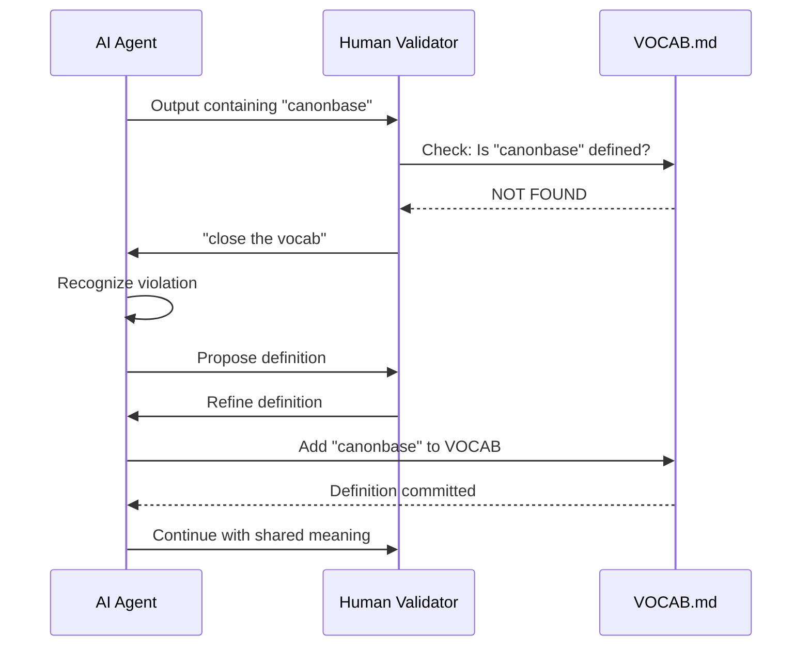

# INVENTION DISCLOSURE FORM

**IDF-038**

---

## ADMINISTRATIVE

**Title:** Real-Time Vocabulary Closure Protocol for Normative Human-AI Communication

**Inventor(s):** Dexter Hadley

**Disclosure Date:** 2026-01-14

**Related Disclosure:** IDF-006-literal-introspection.md, IDF-001-canonic-governance.md

**Freeze Reference:** Post stack-freeze-2026-01-12 (v0.2 scope)

**Status:** Internal disclosure — not for publication

**Confidentiality:** PRIVILEGED AND CONFIDENTIAL — Prepared for patent counsel

---

## 1. PROBLEM STATEMENT

In human-AI collaborative systems:

1. AI agents generate natural language containing undefined terms
2. Human and AI may assign different meanings to the same term
3. Semantic drift occurs during extended conversations
4. No mechanism exists to enforce definitional precision in real-time
5. Post-hoc verification catches violations too late
6. Communication ambiguity leads to implementation errors

**The core problem:** No structural mechanism exists to enforce vocabulary closure during live human-AI collaboration—ensuring that every term used is precisely defined before the conversation proceeds.

---

## 2. CORE INVENTIVE INSIGHT



The invention establishes **real-time vocabulary closure** where:

1. Human detects undefined term in AI output
2. Human issues enforcement signal ("close the vocab")
3. AI must define term precisely before proceeding
4. Definition added to VOCAB.md
5. Conversation continues with shared meaning

### 2.1 Protocol Definition

| Step | Actor | Action | Constraint |
|------|-------|--------|------------|
| **1. Detection** | Human | Identify undefined term | Term not in VOCAB.md |
| **2. Signal** | Human | Issue enforcement signal | "close the vocab" or equivalent |
| **3. Halt** | AI | Stop conversation flow | Cannot proceed until closure |
| **4. Define** | AI | Propose precise definition | Definition must be minimal |
| **5. Refine** | Human | Accept or correct definition | Human has final authority |
| **6. Commit** | AI | Add definition to VOCAB.md | Ledger evidence created |
| **7. Resume** | Both | Continue with shared meaning | Term now closed |

### 2.2 Key Properties

**Synchronous enforcement:** Violation detected and resolved in same conversation turn.

**Human as validator:** Human performs introspection check (not machine).

**Immediate correction:** No batch processing; closure happens in-line.

**Ledger binding:** Definition committed to VOCAB.md creates evidence.

**Convergence guarantee:** Each closure reduces future ambiguity.

### 2.3 Distinction from Static Introspection (IDF-006)

| Property | IDF-006 (Static) | IDF-038 (Real-Time) |
|----------|------------------|---------------------|
| **Timing** | Post-hoc document verification | In-session enforcement |
| **Validator** | Machine algorithm | Human participant |
| **Correction** | Batch after discovery | Immediate in conversation |
| **Evidence** | Coverage report | Conversation + commit |
| **Feedback loop** | Asynchronous | Synchronous |

IDF-038 operationalizes IDF-006 in live collaboration.

---

## 3. TECHNICAL APPROACH

### 3.1 Enforcement Signals

The human may issue enforcement signals:

| Signal | Meaning | AI Response |
|--------|---------|-------------|
| "close the vocab" | Define the undefined term | Propose definition |
| "define X" | Term X is undefined | Propose definition for X |
| "what is X?" | Clarify term X | Check VOCAB; define if missing |
| "VOCAB violation" | Explicit violation call | Halt and propose definition |

### 3.2 AI Response Protocol

Upon receiving enforcement signal, AI MUST:

1. Identify the undefined term(s)
2. Halt current output generation
3. Propose minimal definition
4. Wait for human approval or refinement
5. Commit approved definition to VOCAB.md
6. Resume conversation with closed term

### 3.3 Definition Quality Constraints

Proposed definitions MUST be:

- **Minimal:** Shortest accurate description
- **Self-contained:** No undefined terms in definition
- **Non-circular:** Cannot define term using itself
- **Scoped:** Apply within governance context

### 3.4 Convergence Mechanism

```
VOCAB(t+1) = VOCAB(t) ∪ {new_term}
```

Each closure adds to vocabulary. Over time:

- Fewer undefined terms encountered
- Communication precision increases
- Shared vocabulary expands
- Ambiguity decreases monotonically

### 3.5 Integration with Static Verification

Real-time closure complements static verification:

1. Real-time catches violations during collaboration
2. Static verification confirms closure post-session
3. Both produce ledger evidence
4. Neither alone is sufficient

---

## 4. ADVANTAGES

### 4.1 Immediate Precision

Ambiguity resolved in-session, not discovered later.

### 4.2 Human Authority Preserved

Human decides what terms mean; AI proposes, human disposes.

### 4.3 Organic Vocabulary Growth

VOCAB grows through actual usage, not pre-planning.

### 4.4 Evidence Trail

Every closure creates commit evidence.

### 4.5 Learning Signal

Closure frequency indicates communication quality.

### 4.6 Cross-Session Persistence

Definitions survive session boundaries via VOCAB.md.

---

## 5. EXPLICIT EXCLUSIONS (NOT CLAIMED)

1. **Specific enforcement signals** — "close the vocab" is example, not requirement
2. **Specific definition formats** — How definitions are structured is not claimed
3. **Specific AI architectures** — Any AI can implement protocol
4. **Specific storage mechanisms** — VOCAB.md is example storage
5. **Specific conversation platforms** — Protocol is platform-agnostic

---

## 6. EVIDENCE SUMMARY

### 6.1 Discovery Episode

Session 2026-01-14 documented live protocol execution:

1. AI used "canonbase" during review
2. Human detected violation
3. Human issued: "close the vocab"
4. AI proposed definition (scoped to single repo)
5. Human refined: "cross repo... full inheritance of CANONIC"
6. AI committed refined definition to VOCAB.md
7. Conversation resumed with shared meaning

### 6.2 Commit Evidence

- Commit `f3d1e89`: `canonic: add canonbase concept to VOCAB`
- Definition: "The full inheritance graph of all scopes governed by CANONIC, spanning all repositories in a workspace."

### 6.3 Episode Documentation

- ep161: Real-time VOCAB closure enforcement
- Documents full protocol execution with evidence binding

---

## 7. RELATIONSHIP TO OTHER DISCLOSURES

### 7.1 Relationship to IDF-006

IDF-006 establishes literal introspection. IDF-038 operationalizes for real-time:

| IDF-006 | IDF-038 |
|---------|---------|
| Machine verification | Human verification |
| Post-hoc | In-session |
| Batch correction | Immediate correction |
| Token extraction | Semantic recognition |

**Dependency:** IDF-038 assumes IDF-006's framework; extends to real-time.

### 7.2 Relationship to IDF-001

IDF-001 establishes constitutional governance. IDF-038 enforces at communication layer:

| IDF-001 | IDF-038 |
|---------|---------|
| Human authority over AI | Human validates AI vocabulary |
| Structural inadmissibility | Real-time inadmissibility |
| Ledger evidence | Conversation + commit evidence |

### 7.3 Relationship to IDF-026

IDF-026 establishes forward-first human-driven discovery. IDF-038 is instance:

| IDF-026 | IDF-038 |
|---------|---------|
| Human initiates discovery | Human detects violation |
| AI follows | AI proposes correction |
| Pattern flows forward | Definition flows forward |

---

## 8. PRIOR ART DISTINCTION

### 8.1 Spell Checkers / Grammar Checkers

Tools that flag errors in text.

**Distinction:** IDF-038 enforces **semantic closure**, not syntax:
- Spell checkers verify spelling; IDF-038 verifies definition existence
- Grammar checkers verify structure; IDF-038 verifies vocabulary membership
- Neither requires definition before proceeding

### 8.2 Interactive Clarification (Siri, Alexa)

Voice assistants ask for clarification.

**Distinction:** IDF-038 enforces **definitional commitment**:
- Assistants clarify intent; IDF-038 demands definition
- Clarification is transient; IDF-038 definitions are persistent
- Assistants don't build vocabulary; IDF-038 expands VOCAB

### 8.3 Negotiation Protocols (Multi-Agent Systems)

Agents negotiate shared understanding.

**Distinction:** IDF-038 establishes **human authority**:
- Negotiation implies peer authority; IDF-038 human is validator
- Negotiation may deadlock; IDF-038 human decides
- Definitions are committed, not negotiated

### 8.4 Ontology Alignment (Semantic Web)

Tools that align ontologies across systems.

**Distinction:** IDF-038 is **in-session**, not pre-deployment:
- Ontology alignment happens before communication; IDF-038 during
- Alignment is batch process; IDF-038 is real-time
- Human-in-loop enforcement is unique

### 8.5 Rubber Duck Debugging

Explaining code to clarify thinking.

**Distinction:** IDF-038 requires **structural commitment**:
- Rubber ducking is informal; IDF-038 produces artifact
- Explanations are transient; definitions persist
- No vocabulary closure mechanism in rubber ducking

---

## 9. CLAIMS SUMMARY

### Primary Claim

A method for enforcing vocabulary closure during real-time human-AI collaboration comprising:

1. Human detection of undefined term in AI output
2. Human issuance of enforcement signal
3. AI halt of conversation flow
4. AI proposal of minimal definition
5. Human approval or refinement of definition
6. Commitment of definition to vocabulary artifact
7. Resumption of conversation with shared meaning

### Dependent Claims

1. The method wherein the enforcement signal is a natural language instruction
2. The method wherein the vocabulary artifact is version-controlled
3. The method wherein commitment creates cryptographic evidence
4. The method wherein definitions are subject to introspection (IDF-006)
5. The method wherein closure frequency serves as communication quality signal

---

## 10. INVENTOR DECLARATION

I, **Dexter Hadley**, declare that:

1. I am the sole human inventor of this protocol
2. The inventive activity is documented in ep161
3. AI systems contributed execution under governance but are not inventors
4. This disclosure is post-freeze IP (v0.2 scope)

---

**END OF DISCLOSURE**

---
