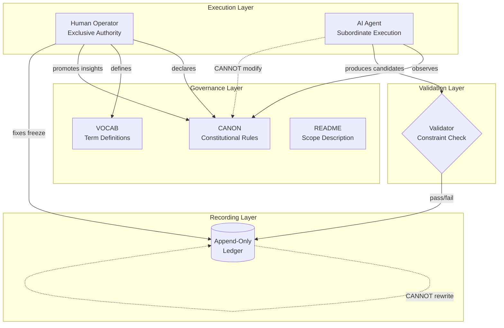

# INVENTION DISCLOSURE FORM

**IDF-001**

---

## ADMINISTRATIVE

**Title:** Constitutional Governance Framework for Human–AI Collaborative Systems

**Inventor(s):** Dexter Hadley

**Disclosure Date:** 2026-01-12

**Freeze Reference:** paper-freeze-2026-01-12

**Status:** Internal disclosure — not for publication

**Confidentiality:** PRIVILEGED AND CONFIDENTIAL — Prepared for patent counsel

---

## 1. PROBLEM STATEMENT

Large language models (LLMs) integrated into knowledge-work pipelines produce outputs that appear authoritative but lack verifiable grounding. This phenomenon—colloquially termed "AI slop"—manifests as:

- Undefined terminology presented as established fact
- Claims without traceable evidence
- Confident assertions that cannot be independently verified
- AI-generated content that escalates to normative status without human review

Existing mitigation approaches (detection tools, disclosure policies, human review) operate post-hoc and are unreliable. They filter problematic outputs rather than preventing their creation.

**The core problem:** No structural mechanism exists to ensure that AI-produced content in collaborative systems is definitionally grounded, evidentially traceable, and incapable of self-escalation to authoritative status.

---

## 2. CORE INVENTIVE INSIGHT

The invention treats human–AI collaboration as a constitutional system with explicit separation of powers:

- **Humans** hold exclusive authority to declare governance rules
- **AI agents** execute under those rules but cannot modify them
- **An immutable ledger** records all state transitions
- **Validation** evaluates outputs against declared constraints

The key insight is that certain failure modes (undefined terms, unverifiable claims, AI self-promotion to authority) can be made **structurally inadmissible** rather than merely detectable. By requiring definitional closure, ledger traceability, and strict separation between insight and law, the system eliminates classes of error at the architectural level.

### 2.1 Definition: Structurally Inadmissible

A failure mode is **structurally inadmissible** when:

1. **Architectural prevention:** The system's structure makes the failure mode impossible to express, not merely detectable after occurrence
2. **No bypass path:** No sequence of valid operations can produce the failure state
3. **Enforcement independence:** Prevention does not depend on agent compliance or goodwill

| Failure Mode | Structural Prevention Mechanism |
|--------------|--------------------------------|
| Undefined terms | VOCAB introspection requires all CANON terms be defined (see IDF-006) |
| Unverifiable claims | Ledger traceability requires evidence references for all claims |
| AI self-escalation | Constitutional separation forbids AI modification of CANON |
| History revision | Append-only ledger forbids deletion or modification |

**Contrast with detection-based approaches:** Detection identifies violations after they occur; structural inadmissibility prevents violation expression entirely. A detected violation can still cause harm before detection; a structurally inadmissible violation cannot occur.

---

## 3. HIGH-LEVEL SYSTEM OVERVIEW

The system comprises the following roles:

### 3.1 Governance Layer

A hierarchy of scopes, each governed by a triad of artifacts:
- A constitutional document declaring validity constraints
- A vocabulary document defining all terms used in the constitution
- A descriptive document explaining purpose and structure

Scopes inherit constraints from parent scopes. Downstream scopes may add constraints but cannot override inherited rules.

### 3.2 Execution Layer

AI agents produce candidate artifacts under governance constraints. Agents may observe the constitution but cannot modify it.

Human operators direct agent execution and hold exclusive authority to:
- Declare or modify constitutional rules
- Fix material to the ledger
- Promote agent-discovered insights to normative status

### 3.3 Recording Layer

An append-only ledger records all state transitions. The ledger cannot be rewritten; corrections occur through new entries that reference prior entries.

### 3.4 Validation Layer

A validation role evaluates whether outputs conform to declared constraints. Validation is deterministic and reproducible. Validation implementation details are private and not part of this disclosure.

---

## 4. HIGH-LEVEL METHOD OVERVIEW

### 4.1 Session Initiation

1. Human operator initiates a governed session
2. AI agent identity is disclosed (specific model, not abstraction)
3. Applicable governance scope is established

### 4.2 Governed Execution

1. AI agent produces candidate outputs
2. Each output is evaluated against active constitutional constraints
3. Constraint satisfaction is recorded to the ledger
4. Violations are documented without erasure

### 4.3 Canonification

When an AI agent discovers a useful pattern:
1. The pattern is recorded as an observation (non-normative)
2. Human operator reviews the observation
3. Human operator may explicitly promote the observation to constitutional status
4. Promotion creates a new ledger entry; the AI cannot self-promote

### 4.4 Fixation

At defined intervals:
1. Human operator declares a freeze boundary
2. All material prior to the freeze is evidentially fixed
3. Subsequent material cannot expand prior claims

---

## 5. ADVANTAGES

### 5.1 Structural Elimination of Failure Modes

- **Undefined terms:** Cannot exist; introspection requires all constitutional terms be defined
- **Unverifiable claims:** Cannot exist; all claims must reference ledger evidence
- **AI self-escalation:** Cannot occur; only humans can modify constitutional rules
- **History revision:** Cannot occur; ledger is append-only

### 5.2 Self-Evidencing Outputs

Artifacts produced under this framework contain their own proof of compliance. External parties can independently verify claims by examining the ledger.

### 5.3 Preserved Learning

Because violations are corrected through new entries (not revision), the learning process is captured in the record. The system's evolution is auditable.

### 5.4 Compositional Governance

Multiple independent systems can be observed through a composition layer without introducing cross-system authority. Each system retains its own governance while enabling unified observation.

---

## 6. EXPLICIT EXCLUSIONS (NOT CLAIMED)

The following are explicitly **not** part of this disclosure:

1. **Specific AI model architectures** — The framework is model-agnostic
2. **Specific prompt engineering techniques** — Agent instruction is not claimed
3. **Validation implementation details** — Enforcement mechanisms are private
4. **Specific file formats or syntax** — The primitives are abstract
5. **Specific version control systems** — Any append-only ledger suffices
6. **Detection or classification of AI-generated content** — The system prevents rather than detects
7. **Training methods for AI models** — Foundation model training is out of scope

---

## 7. EVIDENCE SUMMARY

### 7.1 Development Record

- 131 recorded episodes of governed human–AI collaboration
- 8 repositories with 11 governed scopes
- Full triad compliance achieved and verified

### 7.2 Violation Documentation

Over 50 episodes document explicit violations that were:
- Detected mechanically or through review
- Documented without erasure
- Corrected via new ledger entries

### 7.3 Temporal Fixation

Ledger freeze declared 2026-01-12 by human inventor.

---

## 8. PRIOR ART DISTINCTION

### 8.1 Constitutional AI (Anthropic)

Constitutional AI uses a set of principles to guide model training and self-critique during inference.

**Key Differences:**

| Aspect | Constitutional AI | IDF-001 |
|--------|------------------|---------|
| **When applied** | Training time + inference | Runtime governance |
| **Where rules live** | Model weights + prompts | External artifacts (CANON) |
| **Who can modify** | AI can self-critique | Only humans modify CANON |
| **Evidence** | No external ledger | Immutable ledger records all |
| **Definitional closure** | Not required | Required (VOCAB introspection) |

**Distinction:** Constitutional AI trains models to follow principles; IDF-001 governs AI execution with external, immutable constraints that the AI cannot modify. Constitutional AI's principles are internal to the model; IDF-001's governance is external and auditable.

### 8.2 Retrieval-Augmented Generation (RAG)

RAG systems ground LLM outputs by retrieving relevant documents to inform responses.

**Key Differences:**

| Aspect | RAG | IDF-001 |
|--------|-----|---------|
| **Purpose** | Ground outputs in retrieved text | Govern output validity |
| **Mechanism** | Retrieval + generation | Constitutional constraint checking |
| **Evidence binding** | Implicit (retrieved context) | Explicit (ledger references) |
| **Failure handling** | Hallucination possible | Structural inadmissibility |

**Distinction:** RAG improves grounding but doesn't prevent unverifiable claims structurally. An RAG system can still hallucinate; IDF-001 makes unverifiable claims inadmissible through ledger traceability.

### 8.3 Software Governance Frameworks (RBAC, Policy Engines)

Role-based access control and policy engines govern software system access and behavior.

**Key Differences:**

| Aspect | RBAC/Policy Engines | IDF-001 |
|--------|---------------------|---------|
| **Scope** | Access control | Constitutional governance |
| **Agents** | Users with roles | AI agents with constraints |
| **Separation of powers** | Roles define permissions | Human/AI authority separation |
| **Definitional closure** | Not required | Required (VOCAB) |
| **Learning capture** | No violation history | Violations preserved |

**Distinction:** RBAC controls who can do what; IDF-001 controls what AI can assert as valid. RBAC doesn't address definitional closure or the specific problem of AI self-escalation.

### 8.4 Blockchain-Based Provenance

Blockchain systems provide immutable records of transactions and asset provenance.

**Key Differences:**

| Aspect | Blockchain Provenance | IDF-001 |
|--------|----------------------|---------|
| **Immutability** | Yes (consensus-based) | Yes (append-only ledger) |
| **Definitional closure** | No | Yes (VOCAB introspection) |
| **AI governance** | Not addressed | Core focus |
| **Separation of powers** | Not addressed | Human/AI authority separation |

**Distinction:** Blockchain provides immutability but not definitional closure or AI-specific governance. IDF-001 uses immutable ledgers but adds constitutional constraints specific to human-AI collaboration.

### 8.5 Audit Logging Systems

Audit logs record system events for compliance and forensics.

**Key Differences:**

| Aspect | Audit Logging | IDF-001 |
|--------|---------------|---------|
| **Purpose** | Forensic record | Governance enforcement |
| **Violation handling** | Detected post-hoc | Prevented structurally |
| **Constitutional rules** | Not present | Core mechanism |
| **AI-specific** | No | Yes |

**Distinction:** Audit logs record events for later analysis; IDF-001 prevents invalid events from occurring through constitutional constraints.

### 8.6 Patent Prior Art (External Review)

External review (ep004) identified additional patent prior art relevant to defensive positioning:

#### 8.6.1 US11263188B2 — Blockchain-AI Hybrid Frameworks

**Title:** Methods and systems for AI model governance using distributed ledger technology

**Key Differences:**

| Aspect | US11263188B2 | IDF-001 |
|--------|--------------|---------|
| **Ledger purpose** | Track model provenance | Record state transitions |
| **Governance mechanism** | Smart contracts | Constitutional CANON |
| **Definitional closure** | Not addressed | Required (VOCAB introspection) |
| **Structural inadmissibility** | Not addressed | Core mechanism |

**Distinction:** US11263188B2 uses blockchain for AI model provenance tracking; IDF-001 uses any append-only ledger for constitutional governance with definitional closure. The key differentiator is **structural inadmissibility through definitional closure**, which US11263188B2 does not address.

#### 8.6.2 WO2020172425A8 — Self-Healing AI Systems

**Title:** Autonomous error detection and correction in AI systems

**Key Differences:**

| Aspect | WO2020172425A8 | IDF-001 |
|--------|----------------|---------|
| **Approach** | Detection and correction | Prevention through structure |
| **Error handling** | Self-healing (AI autonomy) | Human-gated correction |
| **Constitutional bounds** | Not present | Core mechanism |
| **AI authority** | AI can self-correct | AI cannot modify governance |

**Distinction:** WO2020172425A8 enables AI autonomous self-correction; IDF-001 requires human authority for all corrections. The constitutional separation of powers in IDF-001 is the inverse of self-healing autonomy—AI may detect errors but cannot self-escalate to authoritative correction.

#### 8.6.3 US20040107124A1 — Model Documentation Policies

**Title:** System and method for AI model documentation and compliance

**Key Differences:**

| Aspect | US20040107124A1 | IDF-001 |
|--------|-----------------|---------|
| **Documentation** | Policy-driven | Constitution-driven |
| **Enforcement** | Compliance checking | Structural inadmissibility |
| **Term definitions** | Not required | Required (VOCAB closure) |
| **Temporal binding** | Not addressed | Freeze mechanism |

**Distinction:** US20040107124A1 documents models against policies; IDF-001 governs outputs against constitutional constraints with definitional closure. Documentation describes; IDF-001 prevents invalid outputs from being expressible.

### 8.7 Key Differentiator: Definitional Closure vs Guardrails

**Critical distinction for obviousness rejection defense:**

Prior art systems (including those above) implement **guardrails**—mechanisms that detect or prevent violations based on pattern matching, policy checking, or trained behaviors.

IDF-001 implements **definitional closure**—a structural property where undefined terms are literally inexpressible because the system requires all constitutional terms to exist in VOCAB before use.

| Approach | Mechanism | Failure Mode |
|----------|-----------|--------------|
| **Guardrails** | Detect/block violating outputs | Bypass possible; violations exist before detection |
| **Definitional Closure** | Terms undefined = system error | No bypass; undefined terms cannot be referenced |

**Why this is non-obvious:**

The insight that governance can be achieved through **definitional architecture** rather than **behavioral constraint** is not suggested by prior art. Prior art assumes:
1. Rules govern behavior
2. Violations are detected or prevented
3. The space of possible outputs is unconstrained

IDF-001 assumes:
1. Definitions constitute the output space
2. Violations outside the defined space are inexpressible
3. The space of possible outputs is bounded by definition

This architectural inversion—from "constrain what AI can do" to "define what valid outputs can be"—is the non-obvious contribution.

### 8.8 Summary: Novelty Claim

IDF-001's novelty lies in the **combination** of:
1. Constitutional separation of powers (human authority, AI execution)
2. Definitional closure (VOCAB introspection)
3. Structural inadmissibility (prevention, not detection)
4. Immutable evidence binding (ledger traceability)
5. Learning preservation (violations documented, not erased)

No prior art combines all five elements for AI governance.

**Defensive positioning:** The prior art identified in 8.6.1–8.6.3 addresses adjacent problems (provenance, self-healing, documentation) but none implements definitional closure as the primary governance mechanism. The combination of definitional closure with constitutional separation of powers represents the core non-obvious contribution.

---

## 9. RELATIONSHIP TO OTHER DISCLOSURES

IDF-001 is the foundational disclosure. Other IDFs extend or specialize its claims:

| IDF | Relationship to IDF-001 |
|-----|------------------------|
| **IDF-002** | Extends model identity requirement (session initiation) |
| **IDF-003** | Specifies ledger evidence chaining mechanism |
| **IDF-004** | Specializes producer/consumer role separation |
| **IDF-005** | Extends violation documentation to drift detection |
| **IDF-006** | **CRITICAL:** Specifies VOCAB introspection mechanism |
| **IDF-007** | Extends scope inheritance with hierarchy constraints |
| **IDF-008** | Specifies validation layer architecture |
| **IDF-009** | Extends compositional governance (section 5.4) |
| **IDF-010** | Specializes violation documentation taxonomy |
| **IDF-011** | Applies framework to epistemic writing |
| **IDF-012** | Extends validation to self-healing |
| **IDF-013** | Specifies artifact locality constraints |
| **IDF-014** | Specializes AI/human boundary definition |
| **IDF-015** | Extends validation to quality dimensions |
| **IDF-016** | Extends evidence to inception point detection |

### 9.1 Critical Dependency: IDF-006

IDF-001 claims that "undefined terms cannot exist" through introspection. The mechanism for this claim is specified in IDF-006 (Literal Introspection for Definitional Closure).

**Dependency structure:**
- IDF-001 claims: Undefined terms are structurally inadmissible
- IDF-006 specifies: HOW introspection achieves definitional closure
- Without IDF-006, IDF-001's claim is aspirational, not architectural

This dependency is intentional: IDF-001 establishes the principle; IDF-006 provides the mechanism.

---

## 10. INVENTOR DECLARATION

I, **Dexter Hadley**, declare that:

1. I am the sole human inventor of this system
2. The inventive activity is documented in the referenced ledger
3. AI systems contributed execution under my governance but are not inventors
4. This disclosure is bounded by the freeze date specified above

---

**END OF DISCLOSURE**

---
