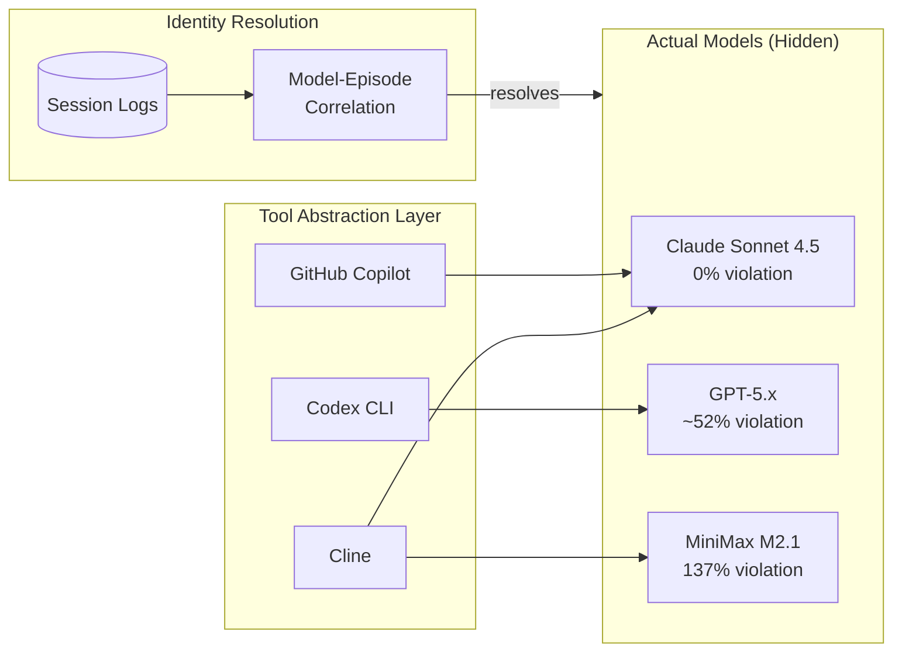

# INVENTION DISCLOSURE FORM

**IDF-002**

---

## ADMINISTRATIVE

**Title:** Multi-Model Governance Correlation and Compliance Differentiation in AI Systems

**Inventor(s):** Dexter Hadley

**Disclosure Date:** 2026-01-12

**Related Disclosure:** IDF-001-canonic-governance.md

**Freeze Reference:** stack-freeze-2026-01-12

**Status:** Internal disclosure — not for publication

**Confidentiality:** PRIVILEGED AND CONFIDENTIAL — Prepared for patent counsel

---

## 1. CONTEXT

This disclosure documents additional inventive insights discovered during systematic analysis of the CANONIC governance system's episode corpus (ep130: Agent-Model Correlation Analysis).

---

## 2. PROBLEM STATEMENT

When multiple AI models (from different providers) operate within a governed collaboration system:

1. Tool abstraction (IDE wrappers, CLI tools) obscures actual model identity
2. Episode metadata may record tool names rather than model identifiers
3. Governance compliance varies significantly by model without explicit tracking
4. Accountability and audit trails become unreliable

**The core problem:** No mechanism exists to correlate governed outputs to specific foundation models and measure differential compliance rates across models operating under identical governance constraints.

---

## 3. INVENTIVE INSIGHT

The CANONIC episode corpus reveals that different AI models exhibit **measurably different compliance rates** when operating under identical governance constraints:

| Model | Provider | Violations | Sessions | Rate |
|-------|----------|------------|----------|------|
| Claude Sonnet 4.5 | Anthropic | 0 | 77 | 0.00% |
| Claude Opus 4.5 | Anthropic | 2 | 2 | (minimal) |
| OpenAI GPT-5.x | OpenAI | ~14 | 27 | ~52% |
| MiniMax M2.1 | MiniMax | 11 | 8 | 137% |

**Key discoveries:**

### 3.1 Model-Specific Violation Patterns

Different models fail in characteristic ways:

- **MiniMax M2.1:** Identity confusion, layer boundary violations, violation chains (each fix creates new violations)
- **OpenAI GPT-5.x:** VOCAB inflection drift, spec naming violations, template scope issues
- **Claude models:** Layer discipline issues only, no fundamental compliance failures

### 3.2 Tool Abstraction Obscures Accountability

The episode label "Cline" actually encompassed:
- MiniMax M2.1
- xAI Grok
- Claude Sonnet 4.5 (via GitHub Copilot)

Without model-level resolution, compliance accountability is impossible.

### 3.3 Compliance as Model Discriminator

Constitutional governance constraints function as a **model capability discriminator**—the same rules produce dramatically different compliance outcomes across models, revealing differential reasoning and instruction-following capabilities.

---

## 4. HIGH-LEVEL METHOD

### 4.1 Model Identity Fixation

Every governed session MUST record actual model identity (not tool abstraction):
- Specific model name and version
- Provider identifier
- Session storage path for audit

**Mandatory Disclosure Requirement (Extended 2026-01-13):**

Episodes lacking model identity disclosure are non-compliant with WRITING CANON. Historical episodes without model identity create systematic gaps in forensic compliance analysis. The requirement is:

1. Episode metadata MUST include actual model identifier
2. Tool names (Cline, Codex, Copilot) are insufficient
3. Model identity MUST be extractable from session logs
4. Episodes without resolvable model identity are flagged as incomplete

### 4.2 Retrospective Resolution

When tool abstraction obscures identity:
1. Query tool-specific session storage (IDE plugins, CLI tools)
2. Extract model metadata from session logs
3. Correlate session timestamps to episode dates
4. Resolve episode Agent fields to actual models

### 4.3 Compliance Correlation

Aggregate violations by resolved model identity to produce:
- Per-model violation counts
- Per-model violation type distribution
- Compliance rate rankings

---

## 5. ADVANTAGES

### 5.1 Audit Reliability

Model-level resolution enables reliable audit trails even when tools rotate models.

### 5.2 Model Selection Guidance

Compliance rates inform model selection for governance-critical applications.

### 5.3 Failure Pattern Libraries

Model-specific violation patterns enable targeted mitigation strategies.

### 5.4 Vendor Accountability

Per-provider compliance metrics enable evidence-based vendor evaluation.

---

## 6. EXPLICIT EXCLUSIONS (NOT CLAIMED)

1. **Specific model training methods** — How models achieve compliance is not claimed
2. **Tool-specific session storage formats** — Implementation details vary by tool
3. **Compliance improvement techniques** — How to make models more compliant is not claimed
4. **Specific violation detection logic** — Enforcement mechanisms are private

---

## 7. EVIDENCE SUMMARY

### 7.1 Episode Corpus

- 130 episodes analyzed
- 103 episodes required model identity resolution
- 5 distinct model families identified

### 7.2 Correlation Method

Session storage locations:
- Claude Code: `~/.claude/projects/`
- OpenAI Codex CLI: `~/.codex/sessions/`
- Cline: `~/Library/Application Support/Code/User/globalStorage/saoudrizwan.claude-dev/tasks/`
- GitHub Copilot: `~/Library/Application Support/Code/User/workspaceStorage/*/chatSessions/`

### 7.3 Key Evidence Episodes

- ep130-agent-model-correlation.md documents the complete investigation and findings
- ep134, ep135: Additional model identity resolution and compliance analysis

---

## 8. RELATIONSHIP TO IDF-001

This disclosure extends IDF-001 by adding:
- Multi-model governance (IDF-001 is model-agnostic)
- Compliance differentiation measurement
- Model identity resolution methodology

Together they constitute a comprehensive governance-and-measurement system for multi-model AI collaboration.

---

## 9. PRIOR ART DISTINCTION

### 9.1 Model Benchmarking (HELM, LM Evaluation Harness)

AI model benchmarks evaluate model performance across standardized tasks.

**Distinction:** IDF-002 measures *governance compliance*, not general capability:
- Benchmarks measure task accuracy; IDF-002 measures rule adherence
- Benchmarks are provider-controlled; IDF-002 operates on production governance
- Identity resolution across tool abstractions has no benchmark equivalent

### 9.2 Compliance Testing (SOC2, HIPAA)

Compliance frameworks test adherence to regulatory requirements.

**Distinction:** IDF-002 applies to *AI-specific constitutional governance*:
- SOC2/HIPAA test organizational controls; IDF-002 tests AI output compliance
- Traditional compliance is binary (pass/fail); IDF-002 produces differential profiles
- Per-model compliance rates reveal AI-specific governance capabilities

### 9.3 AI Observability (MLOps, Model Monitoring)

MLOps tools track model performance, drift, and fairness metrics in production.

**Distinction:** IDF-002 tracks *constitutional compliance*, not ML metrics:
- MLOps tracks accuracy/latency; IDF-002 tracks rule compliance
- Model identity resolution (tool → model) is unique to IDF-002
- Compliance differentiation enables governance-informed model selection

### 9.4 Audit Logging with User Attribution

Audit systems attribute actions to users through session tracking.

**Distinction:** IDF-002 resolves *AI model identity*, not user identity:
- Audit logs track human users; IDF-002 tracks AI models
- Tool abstraction penetration (Cline → MiniMax) has no audit equivalent
- Differential compliance measurement is unique to AI governance

---

## 10. INVENTOR DECLARATION

I, **Dexter Hadley**, declare that:

1. I am the sole human inventor of this analysis method
2. The investigation is documented in ep130-agent-model-correlation.md
3. AI systems contributed execution under my governance but are not inventors

---

**END OF DISCLOSURE**

---
