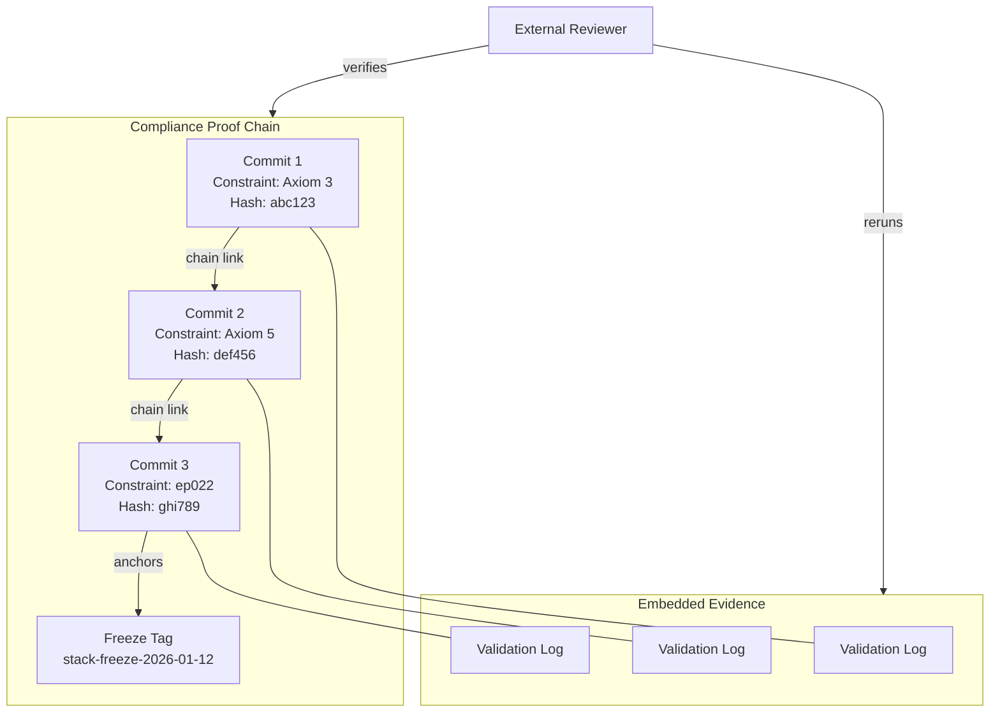

# INVENTION DISCLOSURE FORM

**IDF-003**

---

## ADMINISTRATIVE

**Title:** Compliance Proof Chaining for Verifiable Governance Evidence

**Inventor(s):** Dexter Hadley

**Disclosure Date:** 2026-01-13

**Related Disclosure:** IDF-001-canonic-governance.md

**Freeze Reference:** stack-freeze-2026-01-12

**Status:** Internal disclosure — not for publication

**Confidentiality:** PRIVILEGED AND CONFIDENTIAL — Prepared for patent counsel

---

## 1. CONTEXT

This disclosure documents an inventive method for creating cryptographically-linked, immutable compliance proofs that bind validation evidence directly to governance constraints. The method was discovered through systematic analysis of episode evidence (ep022, ep131).

---

## 2. PROBLEM STATEMENT

In governed AI collaboration systems:

1. Compliance claims are asserted but not independently verifiable
2. Validation evidence exists separately from governance constraints
3. No chain of custody links assertions to proof
4. Reviewers cannot reproduce compliance verification without access to internal systems
5. Evidence can be lost, modified, or become stale relative to claims

**The core problem:** No structural mechanism exists to create an auditable, cryptographically-anchored chain linking governance constraints to validation evidence in a form that external parties can independently verify.

---

## 3. INVENTIVE INSIGHT

The invention creates **compliance proof chains** where:

1. Every compliance claim lands as a git commit
2. Each commit references the specific governance constraint/episode number being satisfied
3. Validation logs are embedded in commit diffs
4. The chain forms a complete audit trail where reviewers can:
   - Identify the constraint being claimed
   - Examine the evidence provided
   - Rerun validation commands
   - Verify chain integrity through git history

### 3.1 Proof Chain Structure

A compliance proof chain consists of:

- **Constraint Reference:** The CANON axiom or episode number being satisfied
- **Evidence Commit:** A git commit containing validation output
- **Validation Command:** The reproducible command that generated the evidence
- **Chain Link:** Reference to prior proof in the chain (enabling traversal)

### 3.2 Chain Integrity Property

The chain is cryptographically anchored via git commit hashes. Any modification to evidence invalidates subsequent chain links, making tampering detectable.

### 3.3 Cross-Repository Coordination

When governance spans multiple repositories, proof chains can reference commits across repositories through:
- Commit hash references in episode metadata
- Tag synchronization at freeze boundaries
- Atomic coordination verification through timestamp ordering

---

## 4. HIGH-LEVEL METHOD

### 4.1 Proof Creation

1. Governance constraint is identified (CANON axiom, episode requirement)
2. Validation command is executed against current state
3. Validation output is captured
4. A commit is created containing:
   - Reference to constraint in commit message
   - Validation log in commit diff
   - Chain link to prior proof (if applicable)

### 4.2 Proof Verification

1. External party examines proof commit
2. Extracts constraint reference and validation command
3. Reruns validation command against committed state
4. Compares output to recorded validation log
5. Traverses chain links to verify complete history

### 4.3 Freeze Anchoring

At freeze boundaries:
1. All proof chains are anchored to the freeze tag
2. Freeze tag cryptographically binds all prior proofs
3. Post-freeze proofs cannot claim pre-freeze priority

---

## 5. ADVANTAGES

### 5.1 Independent Verifiability

External parties can verify compliance without access to internal systems—only the git repository is required.

### 5.2 Tamper Evidence

Any modification to evidence invalidates the cryptographic chain, making tampering immediately detectable.

### 5.3 Reproducibility

Validation commands embedded in proofs enable exact reproduction of compliance verification.

### 5.4 Audit Trail Completeness

The chain structure ensures no gaps in compliance history; every claim has traceable proof.

### 5.5 Cross-Repository Coherence

Proof chains can span repositories while maintaining cryptographic integrity through hash references.

---

## 6. EXPLICIT EXCLUSIONS (NOT CLAIMED)

1. **Specific git implementations** — Any content-addressable version control suffices
2. **Specific validation command syntax** — Command format is not claimed
3. **Specific commit message formats** — Message structure is implementation detail
4. **Cryptographic hash algorithms** — Any collision-resistant hash suffices
5. **Blockchain or distributed ledger systems** — Git suffices; additional infrastructure not required

---

## 7. EVIDENCE SUMMARY

### 7.1 Episode Evidence

- ep022: Compliance Proof Chain methodology documented
- ep131: Full Stack Triad Compliance verification demonstrating chain in operation

### 7.2 Implementation Evidence

- 8 repositories with proof chains
- Cross-repository coordination verified at stack-freeze-2026-01-12
- Validation commands reproducible from commit history

### 7.3 Verification Instances

Multiple instances of external verification possible by examining:
- Commit messages referencing CANON axioms
- Validation logs in commit diffs
- Chain traversal through git history

---

## 8. RELATIONSHIP TO IDF-001

This disclosure extends IDF-001 by specifying:

- The structural mechanism for evidence binding (IDF-001 requires evidence but does not specify binding method)
- The cryptographic anchoring approach (IDF-001 specifies append-only but not hash-chain integrity)
- The cross-repository coordination protocol (IDF-001 allows composition but does not specify proof coordination)

IDF-001 establishes that claims must reference ledger evidence; IDF-003 specifies how that reference achieves cryptographic verifiability.

---

## 9. PRIOR ART DISTINCTION

### 9.1 Git Signed Commits (GPG Signatures)

Git supports commit signing with GPG keys to verify commit authorship.

**Distinction:** IDF-003 creates *compliance evidence chains*, not authorship verification:
- GPG signatures verify who committed; IDF-003 verifies what was proven
- Signed commits are independent; IDF-003 creates linked proof chains
- Constraint references embedded in commits have no GPG equivalent
- Validation log embedding enables reproducibility, not just authenticity

### 9.2 CI/CD Audit Trails

Continuous integration systems record build and test results with timestamps.

**Distinction:** IDF-003 binds evidence to *governance constraints*, not builds:
- CI records test results; IDF-003 records constraint satisfaction
- CI trails are tool-specific; IDF-003 uses git as universal evidence ledger
- Freeze anchoring with cryptographic binding has no CI equivalent
- External verification without system access is unique to IDF-003

### 9.3 Blockchain Provenance

Blockchain systems create immutable records of transactions and asset ownership.

**Distinction:** IDF-003 uses *git* as the immutable ledger, not blockchain:
- Blockchain requires distributed consensus; git provides hash-chain integrity
- IDF-003 binds to governance constraints, not assets
- Cross-repository proof coordination with tag synchronization is unique
- No cryptocurrency or smart contract infrastructure required

### 9.4 Code Review Evidence (Pull Request History)

Code review systems maintain approval records linked to code changes.

**Distinction:** IDF-003 creates *cryptographically anchored compliance proofs*:
- PR history records approval; IDF-003 records constraint satisfaction
- PR evidence is implicit; IDF-003 evidence is explicit and reproducible
- Chain traversal for complete history verification has no PR equivalent

---

## 10. INVENTOR DECLARATION

I, **Dexter Hadley**, declare that:

1. I am the sole human inventor of this method
2. The inventive activity is documented in ep022 and ep131
3. AI systems contributed execution under my governance but are not inventors
4. This disclosure is bounded by the freeze date specified above

---

**END OF DISCLOSURE**

---
