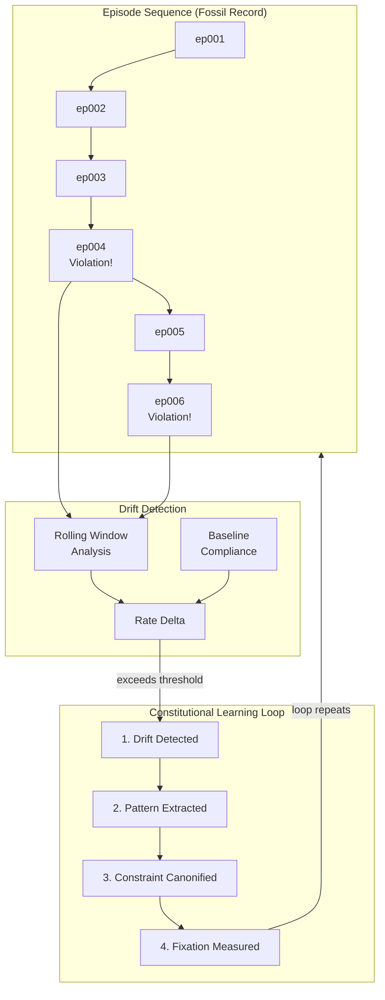

# INVENTION DISCLOSURE FORM

**IDF-005**

---

## ADMINISTRATIVE

**Title:** Episodic Drift Detection and Constitutional Learning in Governed AI Systems

**Inventor(s):** Dexter Hadley

**Disclosure Date:** 2026-01-13

**Related Disclosure:** IDF-001-canonic-governance.md

**Freeze Reference:** stack-freeze-2026-01-12

**Status:** Internal disclosure — not for publication

**Confidentiality:** PRIVILEGED AND CONFIDENTIAL — Prepared for patent counsel

---

## 1. CONTEXT

This disclosure documents an inventive method for detecting compliance drift and measuring constitutional learning through temporal analysis of episode sequences. The method was discovered through systematic analysis of episode evidence (ep010, ep013, ep014, ep015).

---

## 2. PROBLEM STATEMENT

In governed AI collaboration systems:

1. AI compliance varies over time without explicit tracking
2. Violations occur but the pattern of violations is not systematically analyzed
3. Corrections are made but their effectiveness is not measured
4. No mechanism exists to detect when governance constraints are drifting
5. Constitutional learning (adoption of constraints by AI) is not measurable

**The core problem:** No structural mechanism exists to detect governance drift through temporal episode analysis and measure whether AI systems adopt constitutional constraints over time.

---

## 3. INVENTIVE INSIGHT



The invention treats episodes as a **fossil record of AI learning** where:

1. Episode sequences reveal compliance patterns over time
2. Drift is detectable by comparing consecutive episode compliance
3. Violation patterns can be extracted and canonified as new constraints
4. Fixation (adoption of constraints) is measurable through subsequent episode compliance

### 3.1 Drift Detection

Drift occurs when:
- Compliance rate decreases over episode sequences
- New violation types emerge that were previously absent
- Previously-corrected violations recur

Detection method:
1. Compute compliance rate for rolling window of N episodes
2. Compare current window to baseline window
3. Flag drift when rate delta exceeds threshold

### 3.1.1 Definition: Drift Threshold

The **drift threshold** is the rate delta value that triggers a drift alert:

| Parameter | Definition | Example Range |
|-----------|------------|---------------|
| **Baseline window** | Initial N episodes establishing normal compliance | 10-50 episodes |
| **Detection window** | Sliding N episodes compared to baseline | 5-20 episodes |
| **Threshold** | Rate delta that constitutes drift | 10-30% decrease |

**Threshold semantics:**
- Threshold is a *tuning parameter*, not a claimed value
- Lower threshold = more sensitive (more false positives)
- Higher threshold = less sensitive (missed drift)
- Threshold should be calibrated per deployment context

**Example calculation:**
```
Baseline rate:     0.90 (90% compliant in episodes 1-20)
Current rate:      0.75 (75% compliant in episodes 80-100)
Delta:             0.15 (15% decrease)
Threshold:         0.10 (10%)
Result:            DRIFT DETECTED (0.15 > 0.10)
```

The specific threshold value is explicitly NOT claimed (section 6.1).

### 3.2 Pattern Extraction

When violations occur:
1. Extract violation characteristics from episode text
2. Identify common patterns across multiple violations
3. Generalize pattern to constraint candidate
4. Human reviews and may canonify pattern as new CANON axiom

### 3.3 Fixation Measurement

After a constraint is canonified:
1. Track subsequent episodes involving same constraint type
2. Measure compliance rate for new constraint
3. Fixation achieved when compliance rate stabilizes above threshold
4. Fixation failure when violations persist or recur

### 3.4 Learning Loop

The complete learning loop:
1. **Drift detected** → violation pattern emerging
2. **Pattern extracted** → constraint candidate identified
3. **Constraint canonified** → human promotes to CANON
4. **Fixation measured** → AI adoption tracked
5. **Loop repeats** → continuous constitutional learning

### 3.5 Episode Immutability with Redo-Signal Pattern (Extended 2026-01-13)

**Critical constraint discovered through violation analysis (ep030, ep112):**

Episodes are immutable once recorded. Corrections MUST occur via new episodes using the redo-signal pattern:

1. **Immutability:** Once committed, episode content cannot be modified
2. **Redo-Signal:** Corrections create new episodes referencing the original
3. **Violation Chain:** Overwriting episodes destroys the violation evidence chain
4. **Ledger Integrity:** Episode overwrites corrupt forensic analysis

Correction mechanism:
- Original episode preserved with violations documented
- New episode created with "Redo:" or "Correction:" signal
- New episode references original by number
- Both episodes remain in ledger

This preserves the learning record: violations are visible, corrections are traceable, evolution is auditable.

---

## 4. HIGH-LEVEL METHOD

### 4.1 Episode Corpus Analysis

1. Collect all episodes in governance scope
2. Parse each episode for:
   - Violation indicators (explicit violation tags, correction records)
   - Constraint references (CANON axiom citations)
   - Agent identity (model used)
   - Temporal ordering (episode number, date)

### 4.2 Drift Detection Algorithm

1. Define baseline window (e.g., episodes 0-20)
2. Compute baseline compliance rate
3. Slide detection window forward
4. At each position:
   - Compute current compliance rate
   - Compare to baseline
   - Flag if delta exceeds threshold
5. Report drift events with temporal coordinates

### 4.3 Pattern Extraction Process

1. Collect all violation episodes
2. Cluster violations by:
   - Violation type (if tagged)
   - Affected artifact type
   - Agent identity
3. For each cluster:
   - Extract common characteristics
   - Generalize to constraint template
   - Present to human for review

### 4.4 Fixation Tracking

1. When constraint is canonified, record:
   - Constraint identifier
   - Canonification episode number
   - Pre-canonification violation count
2. Track post-canonification episodes:
   - Count violations of new constraint
   - Compute fixation rate over time
3. Report fixation success/failure

---

## 5. ADVANTAGES

### 5.1 Continuous Governance Evolution

The system discovers needed constraints through operation rather than requiring pre-specification.

### 5.2 Measurable AI Learning

Constitutional learning is quantifiable through fixation rates, enabling evidence-based governance refinement.

### 5.3 Early Drift Warning

Drift detection enables intervention before governance failures cascade.

### 5.4 Pattern-Based Constraint Generation

Violation patterns become constraint candidates, creating a feedback loop from failures to rules.

### 5.5 Model-Specific Learning Profiles

Combined with IDF-002, learning rates can be measured per model, revealing which models adopt constraints effectively.

---

## 6. EXPLICIT EXCLUSIONS (NOT CLAIMED)

1. **Specific drift detection thresholds** — Threshold values are tuning parameters
2. **Specific clustering algorithms** — Pattern clustering is implementation detail
3. **Specific episode parsing methods** — Episode format is not claimed
4. **AI model training** — The method measures learning, not causes of learning
5. **Specific compliance rate formulas** — Rate computation is implementation detail

---

## 7. EVIDENCE SUMMARY

### 7.1 Episode Evidence

- ep010: Episodic Drift Analysis methodology documented
- ep013: Episodes Track Drift demonstrating detection
- ep014: Pattern Extraction from violation sequences
- ep015: Agent Learning Evolution tracking fixation
- ep030: Redo-signal pattern establishment
- ep112: Episode immutability violation and correction

### 7.2 Implementation Evidence

- 135+ episodes analyzed for drift patterns
- Drift events documented in violation episodes
- Pattern extraction demonstrated (VOCAB drift, layer violations)
- Fixation measured for multiple constraint types

### 7.3 Learning Loop Evidence

Multiple instances of complete learning loop:
1. Drift detected (e.g., VOCAB inflation)
2. Pattern extracted (e.g., undefined terms)
3. Constraint canonified (e.g., introspection requirement)
4. Fixation measured (e.g., subsequent VOCAB compliance)

---

## 8. RELATIONSHIP TO OTHER DISCLOSURES

### 8.1 Relationship to IDF-001 and IDF-002

This disclosure extends both:

**From IDF-001:**
- IDF-001 specifies corrections via new entries; IDF-005 measures whether corrections achieve fixation
- IDF-001 allows constraint addition; IDF-005 specifies how constraints are discovered from violations

**From IDF-002:**
- IDF-002 measures static compliance rates; IDF-005 measures temporal compliance dynamics
- IDF-002 identifies model-specific patterns; IDF-005 measures model-specific learning rates

### 8.2 Relationship to IDF-016

IDF-016 (Sentiment-Anchored Discovery) detects potential discoveries through sentiment markers. IDF-005 and IDF-016 are complementary:

- IDF-005 detects drift (negative signal: compliance decreasing)
- IDF-016 detects discovery potential (positive signal: novel insights)
- Both operate on episode sequences as the data source
- Neither claims the other's detection mechanism

---

## 9. PRIOR ART DISTINCTION

### 9.1 Machine Learning Drift Detection (Concept Drift, Data Drift)

ML systems detect when model performance degrades due to distribution shift in input data or labels.

**Distinction:** IDF-005 detects *governance compliance drift*, not data distribution drift:
- ML drift measures prediction accuracy; IDF-005 measures rule compliance
- ML drift triggers retraining; IDF-005 triggers constraint canonification
- The learning loop (violations → patterns → constraints) is specific to governance

### 9.2 Statistical Process Control (SPC)

SPC monitors process variation using control charts and alerts when metrics exceed control limits.

**Distinction:** IDF-005 applies SPC principles to *constitutional governance*:
- SPC monitors manufacturing; IDF-005 monitors AI compliance
- SPC triggers process adjustment; IDF-005 triggers human rule creation
- Fixation measurement (adoption tracking) has no SPC equivalent

### 9.3 Anomaly Detection Systems

Anomaly detection identifies unusual patterns in data streams.

**Distinction:** IDF-005 measures *compliance rate change*, not anomalies:
- Anomaly detection finds outliers; IDF-005 finds trend changes
- Anomaly detection is descriptive; IDF-005 triggers normative action (canonification)
- The constitutional learning loop is specific to governance

### 9.4 Version Control Blame/Bisect

Git blame and bisect identify when changes introduced problems.

**Distinction:** IDF-005 operates on *compliance dynamics*, not code changes:
- Git identifies change authors; IDF-005 identifies compliance trends
- Git is forensic; IDF-005 is predictive (early drift warning)
- Pattern extraction and canonification have no git equivalent

---

## 10. INVENTOR DECLARATION

I, **Dexter Hadley**, declare that:

1. I am the sole human inventor of this method
2. The inventive activity is documented in ep010, ep013, ep014, ep015
3. AI systems contributed execution under my governance but are not inventors
4. This disclosure is bounded by the freeze date specified above

---

**END OF DISCLOSURE**

---
