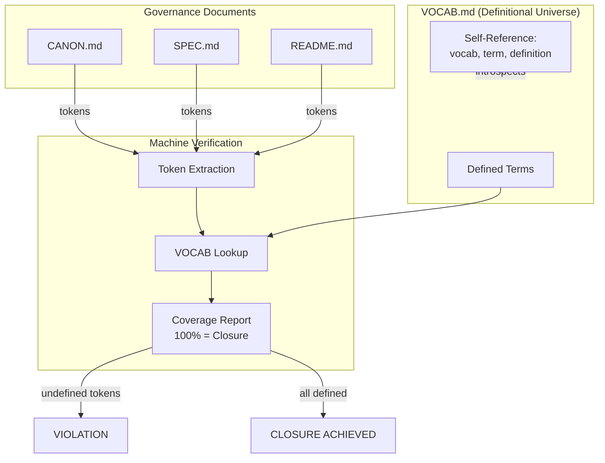

# INVENTION DISCLOSURE FORM

**IDF-006**

---

## ADMINISTRATIVE

**Title:** Literal Introspection for Definitional Closure in Constitutional Governance Systems

**Inventor(s):** Dexter Hadley

**Disclosure Date:** 2026-01-13

**Related Disclosure:** IDF-001-canonic-governance.md

**Freeze Reference:** stack-freeze-2026-01-12

**Status:** Internal disclosure — not for publication

**Confidentiality:** PRIVILEGED AND CONFIDENTIAL — Prepared for patent counsel

---

## 1. CONTEXT

This disclosure documents an inventive constraint requiring that all terms used in governance documents be literally defined, creating machine-verifiable definitional closure. The method was discovered through systematic analysis of episode evidence (ep060, ep054-057).

---

## 2. PROBLEM STATEMENT

In governance and documentation systems:

1. Terms are used without explicit definition, leading to semantic ambiguity
2. Different readers interpret undefined terms differently
3. Governance constraints reference concepts that lack precise meaning
4. Term definitions drift over time as documents evolve
5. No mechanism exists to verify that all governance terms are defined

**The core problem:** No structural mechanism exists to enforce that every term used in governance documents is explicitly defined, creating verifiable definitional closure.

---

## 3. INVENTIVE INSIGHT



The invention establishes **literal introspection** where:

1. Every term used in CANON, SPEC, README must be defined in VOCAB
2. VOCAB must define itself (self-referential closure)
3. This creates **definitional closure**—no undefined terms can exist
4. Compliance is machine-verifiable through token extraction and lookup

### 3.0 Definition: Literal

The introspection is **literal** in a precise sense:

| Property | Meaning | Contrast |
|----------|---------|----------|
| **Token-level** | Check operates on actual tokens in document | Not semantic similarity |
| **Exact match** | Token must appear in VOCAB (after normalization) | Not fuzzy matching |
| **Exhaustive** | All concept tokens must be checked | Not sampling |
| **No inference** | Token absence is violation, period | No "implied" definitions |

**Literal** means the verification is mechanizable without interpretation:
- A machine can extract tokens
- A machine can perform lookup
- A machine can report violations
- No human judgment required for verification

This distinguishes IDF-006 from semantic analysis approaches that require understanding meaning.

### 3.1 Introspection Requirement

The constraint is literal:
- Extract all concept tokens from governance documents
- For each token, verify existence in VOCAB
- Violation if any token lacks definition

### 3.2 Self-Referential Closure

VOCAB must introspect itself:
- Every term used in VOCAB definitions must also be in VOCAB
- This prevents infinite regress by requiring base definitions
- Creates a closed definitional universe

### 3.3 Span-Based Coverage

Introspection spans multiple artifacts:
- CANON: All axiom terms must be defined
- SPEC: All specification terms must be defined
- README: All descriptive terms must be defined
- VOCAB: All definition terms must be defined

### 3.4 Prevention Properties

Literal introspection prevents:
- **Term inflation:** New terms require new VOCAB entries
- **Implicit semantics:** All meanings must be explicit
- **Concept slipping:** Terms cannot drift in meaning
- **Undefined authority:** Governance cannot reference undefined concepts

---

## 4. HIGH-LEVEL METHOD

### 4.1 Token Extraction

1. Parse governance document (CANON, SPEC, README, VOCAB)
2. Extract concept tokens (nouns, key terms, defined concepts)
3. Normalize tokens (lowercase, stem if applicable)
4. Produce token set for document

### 4.2 VOCAB Lookup

1. Parse VOCAB document
2. Extract defined terms (left-hand side of definitions)
3. Produce definition set
4. For each token in governance document:
   - Check if token exists in definition set
   - Record match or violation

### 4.3 Closure Verification

1. Perform token extraction on all governance documents in scope
2. Perform VOCAB lookup for each extracted token
3. Produce coverage report:
   - Defined tokens (match found)
   - Undefined tokens (violation)
   - Coverage percentage
4. Scope passes if coverage is 100%

### 4.4 Self-Referential Check

1. Extract tokens from VOCAB definitions (right-hand side)
2. Verify each token is also defined in VOCAB
3. Identify base terms that ground the definition chain
4. Verify no circular definitions without grounding

### 4.5 Algorithmic Specification

```
INTROSPECT(scope) → {PASS, FAIL(violations)}

Input:
  scope.CANON   : governance document
  scope.VOCAB   : vocabulary document
  scope.README  : descriptive document

Algorithm:
  1. V ← EXTRACT_HEADINGS(scope.VOCAB)           // defined terms
  2. T_canon ← EXTRACT_CONCEPTS(scope.CANON)     // terms in CANON
  3. T_vocab ← EXTRACT_CONCEPTS(scope.VOCAB)     // terms in VOCAB definitions
  4. T_readme ← EXTRACT_CONCEPTS(scope.README)   // terms in README

  5. T_all ← T_canon ∪ T_vocab ∪ T_readme        // all concept terms

  6. violations ← T_all \ V                      // undefined terms

  7. IF violations = ∅ THEN
       RETURN PASS
     ELSE
       RETURN FAIL(violations)

Subroutines:
  EXTRACT_HEADINGS(doc) → {h | h is ### heading in doc}
  EXTRACT_CONCEPTS(doc) → {t | t is noun phrase in doc,
                              t is capitalized OR
                              t appears in governance context}

Complexity: O(n) where n = total tokens across documents
```

**Concept extraction heuristics:**

| Heuristic | Example | Rationale |
|-----------|---------|-----------|
| Capitalized terms | CANON, VOCAB, SPEC | Governance artifacts |
| Backtick-quoted | `CANON.md` | File references |
| Bold terms | **triad** | Emphasized concepts |
| Heading-matched | scope, axiom | Terms appearing as VOCAB headings |

**Normalization rules:**

1. Case-fold to lowercase for comparison
2. Strip markdown formatting (backticks, bold)
3. Singular/plural equivalence (axiom ≡ axioms)
4. File extension stripping (CANON.md → CANON)

---

## 5. ADVANTAGES

### 5.1 Machine-Verifiable Governance

Compliance is checkable by algorithm—no human interpretation required for verification.

### 5.2 Semantic Stability

Term meanings cannot drift because any change requires explicit VOCAB update.

### 5.3 Scope Creep Prevention

New governance constraints require new vocabulary, making scope expansion explicit.

### 5.4 Audit Trail for Concepts

VOCAB changes reveal governance evolution at the concept level.

### 5.5 Cross-System Consistency

Systems sharing VOCAB share semantics, enabling compositional governance with shared meaning.

---

## 6. EXPLICIT EXCLUSIONS (NOT CLAIMED)

1. **Specific tokenization algorithms** — Token extraction is implementation detail
2. **Specific document formats** — Markdown, YAML, etc. are not claimed
3. **Natural language processing techniques** — NLP methods are not claimed
4. **Specific vocabulary structures** — Term-definition format is not claimed
5. **Stemming or lemmatization methods** — Normalization approach is not claimed

---

## 7. EVIDENCE SUMMARY

### 7.1 Episode Evidence

- ep060: Minimal Axioms and Literal Introspection establishing the requirement
- ep054: VOCAB closure verification methodology
- ep055: VOCAB self-reference demonstration
- ep057: Discovery flow for vocabulary additions

### 7.2 Implementation Evidence

- 8 scopes with VOCAB artifacts
- Introspection verified across all governed documents
- VOCAB self-reference achieved (VOCAB defines "vocab", "term", "definition", etc.)
- Coverage reports generated for each scope

### 7.3 Violation Evidence

Multiple episodes document introspection violations:
- Undefined terms detected in CANON
- Corrections made via VOCAB additions
- Post-correction verification confirming closure

### 7.4 Real-Time Collaborative Enforcement Evidence (2026-01-14)

Live session documented VOCAB closure enforcement during human-AI collaboration:

1. AI used undefined term "canonbase" during canonbase review
2. Human detected violation and instructed "close the vocab"
3. AI was forced to define term precisely before proceeding
4. Shared meaning achieved through structural enforcement

**Inventive extension:** IDF-006 extends beyond static document verification to **real-time human-AI collaboration**:

- VOCAB closure can be enforced during live sessions
- Undefined terms become collaboration blockers
- Precision emerges from structural constraint, not interpretation
- Human and AI converge on shared vocabulary through enforcement
- The human becomes the validator; the AI becomes the governed agent

This demonstrates that literal introspection is not merely a post-hoc verification method but a **real-time communication protocol** that forces normative precision between human and AI agents.

**See IDF-038** for full specification of the real-time protocol.

---

## 8. RELATIONSHIP TO IDF-001

This disclosure extends IDF-001 by specifying:

- The mechanism for definitional closure (IDF-001 requires defined terms but not verification method)
- The self-referential requirement (IDF-001 does not specify VOCAB introspection)
- The span coverage requirement (IDF-001 specifies triad but not cross-artifact verification)

IDF-001 establishes that undefined terms cannot exist; IDF-006 specifies how to verify and enforce that property.

**Critical dependency:** IDF-001's claim that "undefined terms are structurally inadmissible" depends on IDF-006. Without IDF-006's literal introspection mechanism, IDF-001's claim is aspirational, not architectural.

---

## 9. PRIOR ART DISTINCTION

### 9.1 Compiler Symbol Tables

Compilers maintain symbol tables mapping identifiers to declarations, ensuring all references resolve.

**Distinction:** IDF-006 applies to *governance documents*, not code:
- Symbol tables track variable declarations; IDF-006 tracks term definitions
- Compilers resolve at compile-time; IDF-006 verifies at governance-time
- Symbol tables are internal; VOCAB is a first-class artifact
- Self-referential closure (VOCAB defines "vocab") has no compiler equivalent

### 9.2 Controlled Vocabularies (Thesauri, Ontologies)

Controlled vocabularies standardize terminology in domains (medical, legal, library science).

**Distinction:** IDF-006 requires *exhaustive coverage*, not just standardization:
- Controlled vocabularies suggest preferred terms; IDF-006 requires defined terms
- Thesauri allow undefined terms; IDF-006 makes undefined terms violations
- Self-referential closure is unique to IDF-006

### 9.3 Data Dictionaries

Data dictionaries define fields in databases, ensuring consistent data interpretation.

**Distinction:** IDF-006 applies to *natural language governance*, not data schemas:
- Data dictionaries define database columns; IDF-006 defines governance terms
- Data dictionaries are static; VOCAB evolves with governance
- Literal introspection (token extraction from prose) has no data dictionary equivalent

### 9.4 Glossaries and Wikis

Glossaries define terms; wikis link to definitions.

**Distinction:** IDF-006 requires *structural enforcement*:
- Glossaries are optional references; IDF-006 is mandatory compliance
- Undefined terms in wikis are normal; in IDF-006 they are violations
- Self-referential closure with machine verification is unique

---

## 10. INVENTOR DECLARATION

I, **Dexter Hadley**, declare that:

1. I am the sole human inventor of this method
2. The inventive activity is documented in ep060, ep054-057
3. AI systems contributed execution under my governance but are not inventors
4. This disclosure is bounded by the freeze date specified above

---

**END OF DISCLOSURE**

---
