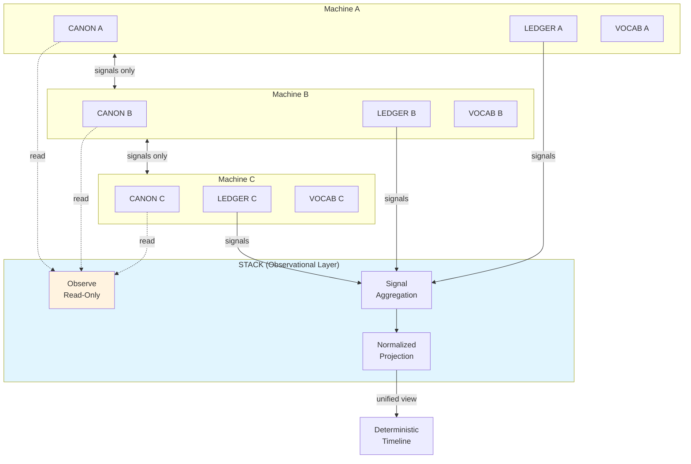

# INVENTION DISCLOSURE FORM

**IDF-009**

---

## ADMINISTRATIVE

**Title:** Observational Multi-System Composition Without Cross-System Authority

**Inventor(s):** Dexter Hadley

**Disclosure Date:** 2026-01-13

**Related Disclosure:** IDF-001-canonic-governance.md

**Freeze Reference:** stack-freeze-2026-01-12

**Status:** Internal disclosure — not for publication

**Confidentiality:** PRIVILEGED AND CONFIDENTIAL — Prepared for patent counsel

---

## 1. CONTEXT

This disclosure documents an inventive composition architecture where multiple independent governance systems are aggregated without introducing cross-system authority. The architecture is documented in stack/CANON.md and stack/STACK.md.

---

## 2. PROBLEM STATEMENT

In multi-system governance environments:

1. Systems become implicitly coupled through shared state or authority
2. Cross-system interaction introduces interpretation that changes meaning
3. Composition layers acquire authority not granted by composed systems
4. Boundary violations occur when one system modifies another's state
5. No mechanism preserves system independence while enabling observation

**The core problem:** No structural mechanism exists to compose multiple governance systems for unified observation while preserving each system's complete authority over its own governance.

---

## 3. INVENTIVE INSIGHT

The invention establishes **observational composition** where:

1. STACK aggregates multiple independent CANONIC machines
2. STACK operates observationally only—reads but cannot write
3. Cross-machine interaction occurs exclusively through recorded LEDGER signals
4. Each machine retains complete authority over its own governance
5. STACK provides deterministic ordering without introducing interpretation

### 3.1 Observational Constraint

STACK's observational nature means:
- STACK reads published artifacts (CANON, LEDGER, VOCAB)
- STACK cannot modify machine-local state
- STACK cannot create, modify, or delete artifacts in composed machines
- STACK cannot issue commands to composed machines

### 3.2 Signal-Based Interaction

Cross-machine interaction is constrained:
- Machines communicate through LEDGER signals only
- Each signal is recorded in the sending machine's LEDGER
- STACK observes signals from all machines
- Signals cannot modify receiving machine's state directly

### 3.3 Boundary Preservation

The architecture preserves boundaries:
- Each machine's CANON governs only that machine
- No machine can extend authority to other machines
- STACK cannot grant authority not possessed by any machine
- Machines cannot be implicitly coupled

### 3.4 Normalization Without Reinterpretation

STACK may project artifacts to common format:
- Projection is transformation, not interpretation
- Original artifacts remain unchanged
- Normalized view does not alter semantics
- Projection is reversible (bijective)

---

## 4. HIGH-LEVEL METHOD

### 4.1 Machine Registration

1. Independent machines are registered with STACK
2. Registration declares:
   - Machine identifier
   - LEDGER location
   - Published artifact locations
3. Registration does not grant STACK authority

### 4.2 Artifact Observation

1. STACK polls registered machines for artifact changes
2. Changes are recorded in STACK observation log
3. No artifacts are modified during observation
4. Observation is read-only

### 4.3 Signal Aggregation

1. STACK extracts LEDGER signals from all machines
2. Signals are ordered deterministically (timestamp, machine ID tiebreaker)
3. Aggregated signal stream enables cross-machine timeline
4. Ordering is reproducible given same inputs

### 4.4 Boundary Verification

1. For each observed artifact:
   - Verify artifact is within declaring machine's authority
   - Flag if artifact claims cross-machine authority
   - Record boundary violations
2. STACK reports violations but cannot prevent them

### 4.5 Normalized Projection

1. Define projection function for artifact type
2. Apply projection to produce normalized view
3. Preserve original artifact unchanged
4. Enable reverse projection to verify bijectivity

---

## 5. ADVANTAGES

### 5.1 Independence Preservation

Composed systems remain fully independent—composition does not introduce coupling.

### 5.2 Unified Observation

Multi-system state is observable through single interface without authority consolidation.

### 5.3 Deterministic Ordering

Cross-system timeline is reproducible and auditable.

### 5.4 Boundary Violation Detection

Attempted authority extension is detectable without preventing it.

### 5.5 Graceful Degradation

Single machine failure does not compromise STACK or other machines.

---

## 6. EXPLICIT EXCLUSIONS (NOT CLAIMED)

1. **Specific machine implementations** — Composed machines can be any CANONIC system
2. **Specific signal formats** — LEDGER signal structure is not claimed
3. **Specific projection algorithms** — Normalization method is implementation detail
4. **Distributed consensus mechanisms** — STACK is observational, not consensus-based
5. **Specific polling intervals** — Observation timing is not claimed

---

## 7. EVIDENCE SUMMARY

### 7.1 CANON Evidence

- stack/CANON.md: STACK governance constraints
- stack/STACK.md: STACK operational specification

### 7.2 Implementation Evidence

- 8 machines composed under STACK observation
- Cross-machine signal aggregation demonstrated
- Boundary preservation verified (no cross-machine authority violations)
- Normalized projection implemented for artifact comparison

### 7.3 Independence Evidence

- Machines operate independently of STACK
- STACK removal does not affect machine operation
- Machine additions do not require existing machine changes

---

## 8. RELATIONSHIP TO IDF-001

This disclosure extends IDF-001 by specifying:

- The observational constraint mechanism (IDF-001 mentions composition but not observation-only)
- The signal-based interaction protocol (IDF-001 specifies ledger recording but not cross-system signals)
- The boundary preservation properties (IDF-001 specifies scope authority but not cross-scope composition)

IDF-001 establishes compositional governance; IDF-009 specifies how to achieve composition without authority leakage.

---

## 9. PRIOR ART DISTINCTION

### 9.1 Microservices Composition (Service Mesh, API Gateway)

Microservices architectures compose independent services through APIs and service meshes.

**Distinction:** IDF-009 composes *governance systems*, not services:
- Service mesh routes requests; IDF-009 observes governance artifacts
- APIs enable interaction; IDF-009 is observation-only (no interaction)
- Boundary preservation (no cross-system authority) has no service mesh equivalent

### 9.2 Event Sourcing and CQRS

Event sourcing reconstructs state from immutable event logs; CQRS separates reads from writes.

**Distinction:** IDF-009 composes *multiple independent governance systems*:
- Event sourcing is single-system; IDF-009 is multi-system
- CQRS separates read/write; IDF-009 is strictly observational (no write)
- Signal-based cross-system interaction with boundary preservation is unique

### 9.3 Federated Systems (Federated Identity, Federated Learning)

Federated systems enable interaction across independent domains.

**Distinction:** IDF-009 preserves *complete independence* with observation only:
- Federated identity shares credentials; IDF-009 shares nothing
- Federated learning aggregates gradients; IDF-009 aggregates signals
- No authority transfer between systems is the core constraint

### 9.4 Data Virtualization (Virtual Data Layer)

Data virtualization provides unified view over heterogeneous data sources.

**Distinction:** IDF-009 provides *unified governance observation*, not data access:
- Data virtualization queries data; IDF-009 observes governance artifacts
- Normalization without reinterpretation (bijective projection) is unique
- Boundary violation detection is governance-specific

---

## 10. INVENTOR DECLARATION

I, **Dexter Hadley**, declare that:

1. I am the sole human inventor of this architecture
2. The inventive activity is documented in stack/CANON.md and stack/STACK.md
3. AI systems contributed execution under my governance but are not inventors
4. This disclosure is bounded by the freeze date specified above

---

**END OF DISCLOSURE**

---
