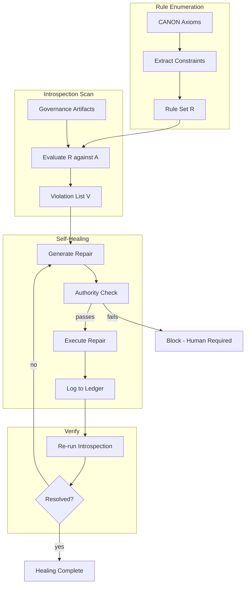

# INVENTION DISCLOSURE FORM

**IDF-012**

---

## ADMINISTRATIVE

**Title:** Meta-Circular Self-Healing Governance Through Structural Violation Detection

**Inventor(s):** Dexter Hadley

**Disclosure Date:** 2026-01-13

**Related Disclosure:** IDF-001-canonic-governance.md

**Freeze Reference:** stack-freeze-2026-01-12

**Status:** Internal disclosure — not for publication

**Confidentiality:** PRIVILEGED AND CONFIDENTIAL — Prepared for patent counsel

---

## 1. CONTEXT

This disclosure documents an inventive self-healing architecture where governance systems detect and repair violations through introspection of their own rules. The architecture was discovered through episode evidence (ep117, ep118, ep116).

---

## 2. PROBLEM STATEMENT

In governance systems:

1. Violations require human review to detect
2. Repair procedures are manual and error-prone
3. Governance rules cannot be applied to governance artifacts themselves
4. No mechanism enables automated detection of rule violations
5. Self-reference creates paradoxes that block introspection

**The core problem:** No structural mechanism exists for governance systems to detect violations of their own rules and initiate repair while remaining under human authority.

---

## 3. INVENTIVE INSIGHT



The invention establishes **meta-circular self-healing** where:

1. Governance rules are explicit and enumerable
2. Violations are detectable by applying rules to governance artifacts
3. The system initiates repair when violations are detected
4. Repair operates within governance boundaries (human authority preserved)

### 3.1 Meta-Circularity

The system is meta-circular because:
- CANON defines rules for valid CANONs
- VOCAB defines terms including "vocab" and "definition"
- Rules apply to the artifacts that express them
- No infinite regress because rules are finite and grounded

### 3.2 Structural Detection

Violations are structurally detectable:
- Axiom completeness: CANON must have exactly N axioms (configurable)
- VOCAB closure: All terms used must be defined
- Triad presence: CANON + VOCAB + README must all exist
- Inheritance consistency: Child cannot contradict parent

### 3.3 Self-Healing Protocol

When violation detected:
1. Identify violation type
2. Determine minimal repair
3. Execute repair (create/modify artifact)
4. Record repair in ledger
5. Verify repair resolved violation

### 3.3.1 Definition: Minimal Repair

A repair is **minimal** when it satisfies these criteria:

| Criterion | Meaning | Example |
|-----------|---------|---------|
| **Sufficient** | Repair resolves the violation | Adding missing VOCAB term |
| **Necessary** | No smaller change would resolve it | One term, not entire VOCAB rewrite |
| **Scoped** | Repair affects only violated artifact | Edit one file, not cascade |
| **Non-expanding** | Repair doesn't add functionality beyond compliance | No "improvements" |

**Minimality principle:**
- The repair should be the *smallest change* that resolves the *specific violation*
- Repairs should not improve governance beyond resolving violations
- Multiple repairs should not be combined unless causally related

**Example:**
```
Violation:    Term "epoch" used in CANON but not defined in VOCAB
Minimal:      Add "epoch" definition to VOCAB
Non-minimal:  Rewrite VOCAB with new structure and add "epoch"
Non-minimal:  Add "epoch" and refactor surrounding definitions
```

This constraint preserves human authority: the system fixes what's broken, nothing more.

### 3.4 Authority Preservation

Self-healing operates under constraints:
- Cannot modify human-declared rules
- Can only repair violations, not improve governance
- Repairs are logged and auditable
- Human can override or revert repairs

---

## 4. HIGH-LEVEL METHOD

### 4.1 Rule Enumeration

1. Parse CANON to extract axioms
2. For each axiom:
   - Extract constraint (what must be true)
   - Extract scope (what artifacts are constrained)
   - Extract detection method (how to check)
3. Produce rule set R

### 4.2 Introspection Scan

1. Collect all governance artifacts in scope
2. For each artifact A:
   - For each rule R:
     - Check if R applies to A
     - If applicable, evaluate R(A)
     - Record pass/fail
3. Produce violation list V

### 4.3 Repair Generation

1. For each violation in V:
   - Identify minimal change to resolve
   - Generate repair candidate
   - Verify repair does not introduce new violations
2. Queue repairs for execution

### 4.4 Repair Execution

1. For each repair in queue:
   - Apply change to artifact
   - Record change in ledger
   - Re-run introspection on affected artifacts
   - Verify violation resolved
2. Report repair outcomes

### 4.5 Authority Check

Before any repair:
1. Verify repair is within system authority
2. Verify repair does not modify human declarations
3. Verify repair is reversible
4. Proceed only if all checks pass

---

## 5. ADVANTAGES

### 5.1 Automated Detection

Violations are found without human scanning—structural checks run automatically.

### 5.2 Consistent Repair

Same violation type always receives same repair, eliminating ad-hoc fixes.

### 5.3 Preserved Audit Trail

All repairs are logged, enabling review and reversion.

### 5.4 Bounded Automation

Self-healing operates within explicit boundaries, preventing runaway automation.

### 5.5 Governance Integrity

System maintains its own structural integrity without human maintenance overhead.

---

## 6. EXPLICIT EXCLUSIONS (NOT CLAIMED)

1. **Specific axiom definitions** — Axiom content is not claimed
2. **Specific detection algorithms** — Check implementation is not claimed
3. **Specific repair procedures** — Repair mechanics are implementation detail
4. **Machine learning for repair** — Automated learning is not claimed
5. **Full autonomy** — Human authority is explicitly preserved

---

## 7. EVIDENCE SUMMARY

### 7.1 Episode Evidence

- ep117: Git Self-Healing demonstrating repair execution
- ep118: Repair verification and logging
- ep116: Violation detection (duplicate axioms in GIT CANON)

### 7.2 Detection Evidence

Structural detection demonstrated:
- Duplicate axiom detection (ep116)
- VOCAB closure verification (multiple episodes)
- Triad presence checking (ep131)

### 7.3 Repair Evidence

Repairs executed:
- Axiom 6 removed from GIT CANON (ep117)
- VOCAB terms added for closure
- Repairs logged in episode corpus

---

## 8. RELATIONSHIP TO OTHER DISCLOSURES

### 8.1 Relationship to IDF-001 and IDF-006

This disclosure extends both:

**From IDF-001:**
- IDF-001 specifies governance structure; IDF-012 enables structure to maintain itself
- IDF-001 requires corrections via new entries; IDF-012 automates correction initiation

**From IDF-006:**
- IDF-006 specifies introspection requirement; IDF-012 uses introspection for detection
- IDF-006 ensures closure; IDF-012 repairs closure violations

### 8.2 Meta-Circular Closure

IDF-012 is the culmination of the governance stack:
- IDF-001 establishes structure
- IDF-006 enables verification
- IDF-012 enables self-repair

This creates a closed loop where governance can maintain itself without human maintenance overhead.

---

## 9. PRIOR ART DISTINCTION

### 9.1 Self-Healing Systems (Autonomic Computing)

Autonomic computing systems detect and repair faults automatically (IBM autonomic computing initiative).

**Distinction:** IDF-012 applies self-healing to *governance artifacts*, not systems:
- Autonomic computing heals server failures; IDF-012 heals governance violations
- Autonomic computing uses ML/heuristics; IDF-012 uses explicit rules (CANON)
- Authority preservation (human override) is unique to IDF-012

### 9.2 Linting and Auto-Formatting

Code linters detect style violations; auto-formatters repair them.

**Distinction:** IDF-012 operates on *governance documents*, with meta-circularity:
- Linters check code; IDF-012 checks governance documents including rules
- Auto-formatters fix syntax; IDF-012 fixes semantic violations
- Meta-circularity (rules apply to rule documents) has no linter equivalent

### 9.3 Schema Migration and Database Self-Repair

Database systems migrate schemas and repair inconsistencies.

**Distinction:** IDF-012 repairs *constitutional governance*, not data:
- Schema migration evolves structure; IDF-012 maintains structure
- Database repair fixes data consistency; IDF-012 fixes rule compliance
- Authority preservation constraint is unique to governance

### 9.4 Test-Driven Repair (Automated Program Repair)

Automated program repair systems generate patches to fix failing tests.

**Distinction:** IDF-012 repairs *governance*, not code, with minimal repair constraint:
- Program repair patches code; IDF-012 patches governance artifacts
- Program repair optimizes for test passage; IDF-012 optimizes for minimal change
- Bounded automation (no improvement) is unique to IDF-012

---

## 10. INVENTOR DECLARATION

I, **Dexter Hadley**, declare that:

1. I am the sole human inventor of this architecture
2. The inventive activity is documented in ep117, ep118, ep116
3. AI systems contributed execution under my governance but are not inventors
4. This disclosure is bounded by the freeze date specified above

---

**END OF DISCLOSURE**

---
