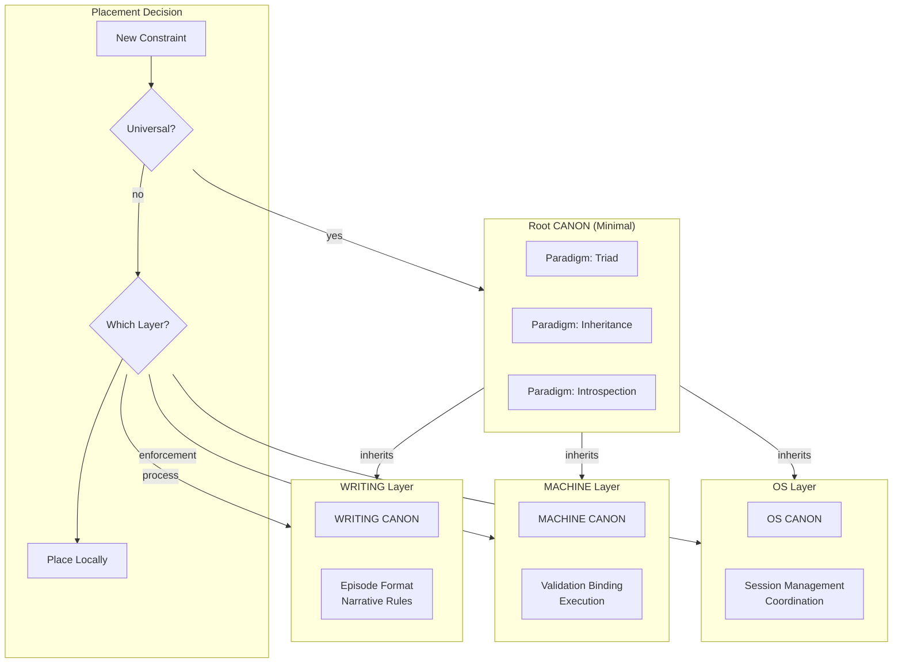

# INVENTION DISCLOSURE FORM

**IDF-013**

---

## ADMINISTRATIVE

**Title:** Canonical Locality Constraint for Governance Artifact Minimality

**Inventor(s):** Dexter Hadley

**Disclosure Date:** 2026-01-13

**Related Disclosure:** IDF-001-canonic-governance.md

**Freeze Reference:** stack-freeze-2026-01-12

**Status:** Internal disclosure — not for publication

**Confidentiality:** PRIVILEGED AND CONFIDENTIAL — Prepared for patent counsel

---

## 1. CONTEXT

This disclosure documents an inventive constraint requiring governance artifacts to reside as close as possible to the entities they govern, with root governance remaining minimal. The constraint was discovered through episode evidence (ep053, ep020, ep057).

---

## 2. PROBLEM STATEMENT

In hierarchical governance systems:

1. Root governance accumulates procedural constraints, becoming bloated
2. Governance artifacts are placed far from governed entities
3. No principled rule determines where constraints should live
4. Meta-layer pollution occurs when implementation details enter paradigm layer
5. Token economics suffer when root documents become large

**The core problem:** No structural mechanism exists to partition governance artifacts such that root governance remains minimal (paradigm only) while procedural constraints reside near their governed entities.

---

## 3. INVENTIVE INSIGHT

The invention establishes **canonical locality** where:

1. Governance artifacts describe what they directly govern
2. Root CANON contains only paradigm (fundamental axioms)
3. Procedural governance lives in implementation layers (MACHINE, OS)
4. Artifact placement follows proximity principle

### 3.1 Locality Principle

An artifact A governing entity E should reside:
- In the same scope as E (preferred)
- In the nearest ancestor scope (if E has no local scope)
- In root only if A is paradigmatic (applies to all descendants)

### 3.1.1 Definition: Paradigmatic vs. Procedural

A constraint is **paradigmatic** when it defines *what governance is*; it is **procedural** when it defines *how to govern*:

| Type | Characteristic | Example | Belongs In |
|------|---------------|---------|------------|
| **Paradigmatic** | Universally applicable | Triad requirement | Root CANON |
| **Paradigmatic** | Definitional | Introspection requirement | Root CANON |
| **Procedural** | Layer-specific | Session management rules | OS CANON |
| **Procedural** | Implementation | Validation execution rules | MACHINE CANON |

**Decision criteria for paradigmatic placement:**
1. Does this constraint apply to *all* governed scopes? → Paradigmatic
2. Is this constraint about *what governance is* rather than *how to do it*? → Paradigmatic
3. Would removing this constraint change the *nature* of governance? → Paradigmatic
4. Is this constraint specific to a layer's concerns? → Procedural

**Root minimality test:** If a constraint is NOT paradigmatic, it should NOT be in root. This prevents root bloat and ensures fast validation.

### 3.2 Root Minimality

Root CANON constraints:
- Only paradigmatic axioms (apply universally)
- No procedural constraints (how to do things)
- No implementation details (specific mechanisms)
- Minimal token count (fast validation at scale)

### 3.3 Layer Partitioning

| Layer | Content | Example |
|-------|---------|---------|
| CANONIC | Paradigm axioms | Triad, Inheritance, Introspection |
| OS | Execution constraints | Session management, coordination |
| MACHINE | Enforcement constraints | Validation binding, execution |
| Writing | Process constraints | Episode format, narrative rules |

### 3.4 Discovery Flow

When new constraint is needed:
1. Identify what entity is constrained
2. Locate scope containing that entity
3. Add constraint to that scope's CANON
4. If constraint is paradigmatic, escalate to root
5. Escalation requires human declaration

---

## 4. HIGH-LEVEL METHOD

### 4.1 Artifact Placement Decision

1. Identify constraint C to be added
2. Identify entity E that C constrains
3. Determine scope S containing E
4. Evaluate locality:
   - If C applies only to E: place in S
   - If C applies to E and siblings: place in S
   - If C applies to all descendants: place in parent
   - If C applies universally: place in root

### 4.2 Root Minimality Check

1. Enumerate all axioms in root CANON
2. For each axiom A:
   - Is A paradigmatic? (applies to all descendants)
   - Is A necessary at root? (cannot be expressed lower)
   - Is A minimal? (no redundant content)
3. Flag non-minimal axioms for relocation

### 4.3 Bloat Prevention

1. Monitor root CANON token count
2. Set threshold for acceptable size
3. When threshold exceeded:
   - Analyze each axiom for locality violation
   - Propose relocations for procedural axioms
   - Human approves relocations

### 4.4 Migration Protocol

When relocating constraint from root to lower layer:
1. Identify target scope
2. Add constraint to target CANON
3. Remove constraint from root CANON
4. Verify inheritance still satisfies original intent
5. Record migration in ledger

---

## 5. ADVANTAGES

### 5.1 Fast Validation at Scale

Minimal root CANON enables rapid validation without parsing large documents.

### 5.2 Clear Responsibility

Each scope's CANON contains only its concerns, not inherited procedural details.

### 5.3 Independent Evolution

Lower layers can evolve procedures without touching paradigm.

### 5.4 Reduced Coordination

Changes to procedural constraints don't require root updates.

### 5.5 Semantic Clarity

Root CANON expresses "what is governance" not "how to govern."

---

## 6. EXPLICIT EXCLUSIONS (NOT CLAIMED)

1. **Specific layer definitions** — CANONIC, OS, MACHINE are examples
2. **Specific token count thresholds** — Size limits are tuning parameters
3. **Specific migration procedures** — Relocation mechanics are implementation detail
4. **Specific proximity metrics** — How to measure "close" is not claimed
5. **Automated relocation** — Migration requires human approval

---

## 7. EVIDENCE SUMMARY

### 7.1 Episode Evidence

- ep053: Key Principle Root CANON Minimalism establishing constraint
- ep020: CANON Bloat and Canonical Locality identifying problem
- ep057: Discovery Flow separating VOCAB from CANONIC.md
- ep061: Layer partitioning refinement

### 7.2 Minimality Evidence

Root CANON (CANONIC/CANON.md) contains only:
1. Triad axiom
2. Inheritance axiom
3. Introspection axiom

Procedural constraints located in:
- machine/CANON.md (enforcement)
- os/CANON.md (execution)
- writing/CANON.md (process)

### 7.3 Token Economics Evidence

- Root CANON: minimal token count (measured)
- Validation speed: proportional to token count
- Procedural CANONs: larger but scope-local

---

## 8. RELATIONSHIP TO OTHER DISCLOSURES

### 8.1 Relationship to IDF-001 and IDF-007

This disclosure extends both:

**From IDF-001:**
- IDF-001 specifies hierarchical scopes; IDF-013 specifies where artifacts belong in hierarchy
- IDF-001 allows constraint addition; IDF-013 constrains where additions occur

**From IDF-007:**
- IDF-007 specifies authority boundaries; IDF-013 specifies artifact placement within boundaries
- IDF-007 prevents override; IDF-013 prevents bloat

### 8.2 Complementarity Table

| Question | Answered By | Example |
|----------|-------------|---------|
| Can this scope add constraints? | IDF-001 | Yes, scopes can add (not override) |
| What can this scope govern? | IDF-007 | OS governs execution, not paradigm |
| Where should this constraint live? | IDF-013 | Session rules in OS, not root |

---

## 9. PRIOR ART DISTINCTION

### 9.1 Locality of Reference (Computer Architecture)

Memory caching exploits spatial and temporal locality—recently/nearby accessed data is likely needed again.

**Distinction:** IDF-013 applies locality to *governance artifacts*, not memory:
- Governance locality is about semantic proximity, not access patterns
- The principle guides *human design decisions*, not automated caching
- Root minimality has no equivalent in memory hierarchies

### 9.2 Modular Design (Software Engineering)

Modular design places related code together for maintainability and reuse.

**Distinction:** IDF-013 applies modularity specifically to *governance hierarchies*:
- Constraint placement follows authority bounds, not just cohesion
- Root minimality is a specific requirement (paradigm only)
- Migration protocol for relocating constraints has no equivalent

### 9.3 Microservices Architecture

Microservices place functionality close to data for performance and scalability.

**Distinction:** IDF-013 governs *governance artifacts*, not service boundaries:
- Locality is for governance semantics, not performance
- The constraint hierarchy (paradigm → execution → enforcement) is specific to governance
- Token economics (fast validation) is a secondary concern, not primary driver

### 9.4 Configuration Management (Inheritance Patterns)

Configuration systems (CSS, Kubernetes) use inheritance with local overrides.

**Distinction:** IDF-013 forbids override and requires specific placement:
- Configuration allows override; IDF-013 allows only addition
- Configuration locality is for convenience; IDF-013 locality is principled (authority bounds)
- Root minimality has no CSS/Kubernetes equivalent

---

## 10. INVENTOR DECLARATION

I, **Dexter Hadley**, declare that:

1. I am the sole human inventor of this constraint
2. The inventive activity is documented in ep053, ep020, ep057
3. AI systems contributed execution under my governance but are not inventors
4. This disclosure is bounded by the freeze date specified above

---

**END OF DISCLOSURE**

---
