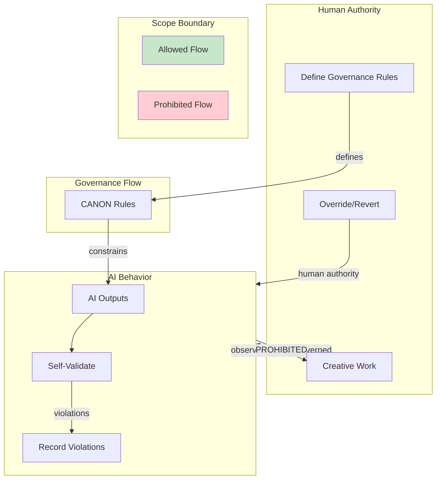

# INVENTION DISCLOSURE FORM

**IDF-014**

---

## ADMINISTRATIVE

**Title:** Bidirectional Scope Boundaries for Self-Referential AI Governance

**Inventor(s):** Dexter Hadley

**Disclosure Date:** 2026-01-13

**Related Disclosure:** IDF-001-canonic-governance.md, IDF-007-hierarchical-authority-scoping.md

**Freeze Reference:** stack-freeze-2026-01-12

**Status:** Internal disclosure — not for publication

**Confidentiality:** PRIVILEGED AND CONFIDENTIAL — Prepared for patent counsel

---

## 1. CONTEXT

This disclosure documents an inventive constraint establishing that AI governance is self-referential: governance applies to AI behavior within scope, not to human work within the same scope. The discovery emerged through violation analysis documented in episodes ep124, ep128, ep129.

---

## 2. PROBLEM STATEMENT

In AI governance systems:

1. Governance rules are assumed to apply universally within scope
2. No distinction exists between rules governing AI behavior vs. human work
3. AI agents may incorrectly attempt to enforce rules on human-created artifacts
4. Governance flow is assumed unidirectional (human defines, AI enforces)
5. AI may document "violations" of human creative choices as if they were errors

**The core problem:** No structural mechanism exists to establish that AI governance is self-referential—applying to AI behavior and outputs—while human work within the same scope remains outside AI governance authority.

---

## 3. INVENTIVE INSIGHT

The invention establishes **bidirectional scope boundaries** where:

1. AI governance applies to AI behavior within scope
2. AI governance does NOT apply to human work within scope
3. AI documents violations AI makes, not human creative choices
4. Governance flow is bidirectional: humans govern AI, AI does not govern humans

### 3.1 Self-Referential Governance

AI governance rules are self-referential:
- Rules constrain AI outputs, not human inputs
- AI validates AI-produced artifacts
- Human-created artifacts are outside AI validation authority
- AI may observe but not judge human creative choices

### 3.2 Scope Boundary Direction

| Direction | Authority | Example |
|-----------|-----------|---------|
| Human → AI | Humans define governance rules | CANON axioms constrain AI behavior |
| AI → AI | AI enforces rules on itself | AI validates own outputs |
| AI → Human | **PROHIBITED** | AI cannot govern human creative work |
| Human → Human | Outside system scope | Human collaboration unaffected |

### 3.3 Violation Attribution

When documenting violations:
- AI documents violations AI makes
- AI does NOT document human "violations" of preferences
- Episode violations refer to AI compliance failures
- Human creative choices are not subject to violation tracking

### 3.4 Scope Axiom

The constraint is expressed as an explicit axiom:
> "Governance applies to AI behavior within scope; governance does not govern human work within scope."

---

## 4. HIGH-LEVEL METHOD

### 4.1 Artifact Attribution

1. For each artifact in scope:
   - Identify creator (AI or Human)
   - Record attribution in metadata
2. Apply governance rules only to AI-attributed artifacts
3. Human-attributed artifacts are governance-exempt

### 4.2 Violation Scoping

1. When evaluating compliance:
   - Check if artifact is AI-created
   - If AI-created: apply governance rules, record violations
   - If human-created: no governance evaluation
2. Violation records reference only AI behavior

### 4.3 Governance Boundary Declaration

1. Each scope CANON includes boundary declaration:
   - "This governance applies to AI behavior within scope"
   - "Human work within scope is not governed"
2. Declaration prevents AI authority creep

### 4.4 Creative Choice Protection

1. Identify human creative decisions (terminology, structure, style)
2. Mark as governance-exempt
3. AI may observe but not enforce on creative choices
4. Preserve human agency within governed system

---

## 5. ADVANTAGES

### 5.1 Human Agency Preservation

Humans retain creative authority within governed systems—AI cannot override human choices.

### 5.2 Clear Violation Attribution

Violations are attributable to AI behavior, not human preferences, enabling accurate compliance tracking.

### 5.3 Governance Legitimacy

Governance authority flows from human declaration, not AI enforcement on humans.

### 5.4 Collaboration Without Paternalism

AI assists without governing human collaborators, enabling true collaboration.

### 5.5 Audit Clarity

Violation records are unambiguous—only AI failures are documented as violations.

---

## 6. EXPLICIT EXCLUSIONS (NOT CLAIMED)

1. **Human-to-human governance** — Collaboration between humans is outside scope
2. **Specific attribution mechanisms** — How creator is identified is implementation detail
3. **Specific governance rule content** — What rules apply is not claimed
4. **Human override mechanisms** — How humans override AI is not claimed
5. **Specific violation tracking formats** — Record structure is implementation detail

---

## 7. EVIDENCE SUMMARY

### 7.1 Episode Evidence

- ep124: Scope boundary axiom discovery and canonification
- ep128: Episode integrity failure revealing AI/human boundary confusion
- ep129: Verification failure demonstrating need for attribution

### 7.2 Violation Evidence

Multiple episodes document violations where:
- AI attempted to govern human creative choices
- Violations were incorrectly attributed to humans
- Correction required explicit scope boundary declaration

### 7.3 Axiom Evidence

OS CANON axiom 8 (scope) established:
> "OS governance applies to AI behavior within scope; OS does not govern human work within scope."

---

## 8. RELATIONSHIP TO OTHER DISCLOSURES

### 8.1 Relationship to IDF-001

IDF-001 establishes human authority over governance; IDF-014 specifies governance does not flow back to constrain humans. This is the *completion* of IDF-001's separation of powers:

| IDF-001 | IDF-014 |
|---------|---------|
| Humans declare rules | Rules don't govern human creative work |
| AI executes under rules | AI validates AI outputs, not human inputs |

### 8.2 Relationship to IDF-004

IDF-004 establishes producer/consumer roles; IDF-014 adds that governance applies only to producer (AI) outputs:

- Producer outputs (CANON/VOCAB candidates) are validated
- Consumer outputs (episodes) record human activity but human choices aren't governed
- The bifurcation aligns with IDF-014's self-referential boundary

### 8.3 Relationship to IDF-007

IDF-007 establishes hierarchical authority with bounded scopes; IDF-014 adds that authority is self-referential within each layer:

- IDF-007: OS cannot govern CANONIC (inter-layer boundary)
- IDF-014: AI cannot govern human work (intra-layer boundary)

IDF-014 is a *specialization* of IDF-007's authority boundary principle.

---

## 9. PRIOR ART DISTINCTION

### 9.1 Access Control Lists (ACLs)

ACLs specify who can access what resources, separating readers from writers.

**Distinction:** IDF-014 separates *what is governed*, not access:
- ACLs control access; IDF-014 controls governance scope
- ACLs don't distinguish human vs. AI work
- Self-referential governance (AI governs AI) has no ACL equivalent

### 9.2 Audit Logging and Attribution

Audit systems attribute actions to actors for accountability.

**Distinction:** IDF-014 uses attribution to *bound governance*, not just record:
- Audit logs record all actions; IDF-014 governs only AI actions
- Attribution in IDF-014 determines governance applicability, not just forensics
- Human creative choices are *protected* from governance, not just attributed

### 9.3 AI Safety Constraints (Constitutional AI)

Constitutional AI constrains AI behavior through training-time principles.

**Distinction:** IDF-014 is *structural* and *runtime*:
- Constitutional AI embeds constraints in model weights; IDF-014 uses external governance
- Constitutional AI doesn't address human creative work protection
- IDF-014's bidirectional boundary (AI→Human prohibited) has no Constitutional AI equivalent

### 9.4 Collaborative Editing (Google Docs, Git)

Collaborative systems attribute changes to authors but don't restrict governance by authorship.

**Distinction:** IDF-014 uses attribution to *exempt* human work:
- Git attributes commits but validates all equally
- IDF-014 validates only AI-attributed artifacts
- Human creative choice protection is unique to IDF-014

---

## 10. INVENTOR DECLARATION

I, **Dexter Hadley**, declare that:

1. I am the sole human inventor of this constraint
2. The inventive activity is documented in ep124, ep128, ep129
3. AI systems contributed execution under my governance but are not inventors
4. This disclosure is bounded by the freeze date specified above

---

**END OF DISCLOSURE**

---
