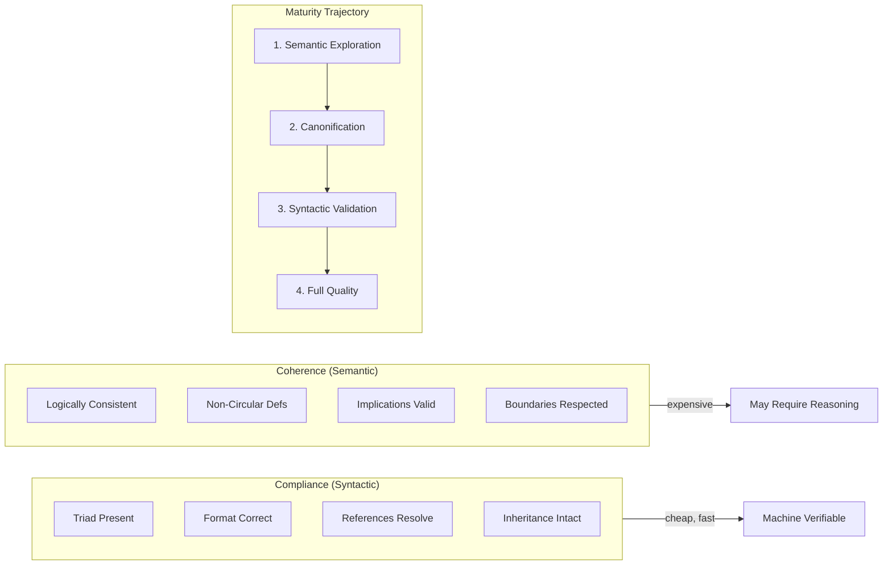

# INVENTION DISCLOSURE FORM

**IDF-015**

---

## ADMINISTRATIVE

**Title:** Two-Dimensional Governance Quality: Compliance-Coherence Orthogonality

**Inventor(s):** Dexter Hadley

**Disclosure Date:** 2026-01-13

**Related Disclosure:** IDF-001-canonic-governance.md

**Freeze Reference:** stack-freeze-2026-01-12

**Status:** Internal disclosure — not for publication

**Confidentiality:** PRIVILEGED AND CONFIDENTIAL — Prepared for patent counsel

---

## 1. CONTEXT

This disclosure documents an inventive model for governance quality measurement across two orthogonal dimensions: syntactic compliance and semantic coherence. The discovery emerged through governance validation analysis documented in episode ep054.

---

## 2. PROBLEM STATEMENT

In governance validation systems:

1. Quality is treated as unidimensional (valid/invalid)
2. No distinction exists between structural correctness and logical consistency
3. A system can pass all structural checks while containing contradictory rules
4. A system can have coherent rules while failing structural requirements
5. Validation techniques conflate syntactic and semantic verification

**The core problem:** No structural mechanism exists to model and measure governance quality across orthogonal dimensions of compliance (syntactic validity) and coherence (semantic consistency).

---

## 3. INVENTIVE INSIGHT

```mermaid
quadrantChart
    title Governance Quality Quadrants
    x-axis Low Compliance --> High Compliance
    y-axis Low Coherence --> High Coherence
    quadrant-1 Ideal: Valid & Sound
    quadrant-2 Aspirational: Well-reasoned but incomplete
    quadrant-3 Invalid: Neither valid nor sound
    quadrant-4 Brittle: Structurally valid but contradictory
```



The invention establishes **two-dimensional governance quality** where:

1. **Compliance** measures syntactic validity (structure, format, references)
2. **Coherence** measures semantic consistency (logic, non-contradiction)
3. These dimensions are orthogonal—high compliance does not imply high coherence
4. Different validation techniques apply to each dimension

### 3.0 Definition: Orthogonal Dimensions

The compliance and coherence dimensions are **orthogonal** in this precise sense:

| Property | Meaning | Evidence |
|----------|---------|----------|
| **Independent** | Value in one dimension doesn't determine value in the other | High compliance + low coherence is possible |
| **Non-correlated** | Improving one doesn't automatically improve the other | Fixing format doesn't fix contradictions |
| **Separately measurable** | Each has distinct measurement methodology | Syntactic checks vs. semantic analysis |
| **Complete coverage** | Together they span governance quality | No third dimension required |

**Orthogonality claim scope:**
- We claim these dimensions are *practically orthogonal* for governance assessment
- We do NOT claim mathematical proof of orthogonality
- The claim is *operational*: different techniques required for each dimension
- Evidence: observed systems in all four quadrants (see 3.3)

**Non-claim:** We do not claim these are the *only* quality dimensions, only that they are orthogonal to each other and sufficient for governance assessment.

### 3.1 Compliance Dimension

Compliance (syntactic) measures:
- Files present (triad exists)
- Format correct (markdown, structure)
- References resolve (cross-references valid)
- Inheritance intact (parent constraints included)

Properties:
- Fast to evaluate
- Deterministic
- Machine-verifiable
- Binary pass/fail per check

### 3.2 Coherence Dimension

Coherence (semantic) measures:
- Constraints logically consistent
- No contradictory axioms
- Definitions non-circular (except grounded self-reference)
- Implications valid

Properties:
- Expensive to evaluate
- May require reasoning (LLM-assisted)
- Degrees of coherence (not binary)
- May require human judgment

### 3.3 Quality Quadrants

| Quadrant | Compliance | Coherence | State |
|----------|------------|-----------|-------|
| Ideal | High | High | Valid and sound |
| Brittle | High | Low | Structurally valid but contradictory |
| Aspirational | Low | High | Well-reasoned but structurally incomplete |
| Invalid | Low | Low | Neither valid nor sound |

### 3.4 Maturity Trajectory

Governance matures along predictable trajectory:
1. Start with semantic validation (expensive, coherence-focused)
2. Canonify coherent patterns as structural constraints
3. Shift to syntactic validation (cheap, compliance-focused)
4. Mature system has high compliance AND coherence

---

## 4. HIGH-LEVEL METHOD

### 4.1 Compliance Validation

1. Define structural checks:
   - Triad presence (CANON, VOCAB, README)
   - Reference resolution
   - Format conformance
   - Inheritance verification
2. Execute checks automatically
3. Report compliance score (checks passed / total checks)

### 4.2 Coherence Validation

1. Define semantic checks:
   - Axiom consistency (no A and NOT-A)
   - Definition non-circularity
   - Implication validity
   - Scope boundary respect
2. Execute checks (may require reasoning)
3. Report coherence assessment (may be qualitative)

### 4.3 Quality Mapping

1. Compute compliance score for scope
2. Compute coherence assessment for scope
3. Plot on two-dimensional quality map
4. Identify quadrant and improvement trajectory

### 4.4 Validation Strategy Selection

Based on quality quadrant:
- **Brittle:** Focus on coherence improvement
- **Aspirational:** Focus on compliance completion
- **Invalid:** Address both dimensions
- **Ideal:** Maintain through continuous validation

---

## 5. ADVANTAGES

### 5.1 Accurate Quality Assessment

Two-dimensional model reveals quality gaps hidden by unidimensional assessment.

### 5.2 Targeted Improvement

Knowing which dimension is weak enables targeted remediation.

### 5.3 Validation Efficiency

Compliance checks (cheap) can gate coherence checks (expensive).

### 5.4 Maturity Measurement

Trajectory through quality space measures governance maturity.

### 5.5 Failure Mode Discrimination

Different quadrants indicate different failure modes requiring different interventions.

---

## 6. EXPLICIT EXCLUSIONS (NOT CLAIMED)

1. **Specific compliance checks** — Which structural checks apply is not claimed
2. **Specific coherence checks** — Which semantic checks apply is not claimed
3. **LLM-based reasoning methods** — How coherence is evaluated is not claimed
4. **Specific scoring formulas** — How scores are computed is implementation detail
5. **Specific visualization methods** — How quality maps are displayed is not claimed

---

## 7. EVIDENCE SUMMARY

### 7.1 Episode Evidence

- ep054: Discovery of compliance vs. coherence orthogonality
- Multiple episodes demonstrate systems passing compliance but failing coherence
- Multiple episodes demonstrate coherent reasoning with compliance gaps

### 7.2 Quadrant Evidence

Examples from episode corpus:
- **Brittle:** Early CANON versions with structural compliance but contradictory axioms
- **Aspirational:** Episode discussions with coherent reasoning before formal canonification
- **Ideal:** Mature scopes with full triad and consistent axioms

### 7.3 Maturity Evidence

Observable trajectory from:
- Early semantic exploration (episodes 1-30)
- Canonification of patterns (episodes 30-80)
- Syntactic validation dominance (episodes 80+)

---

## 8. RELATIONSHIP TO IDF-001

This disclosure extends IDF-001 by specifying:

- The quality dimensions for governance assessment (IDF-001 specifies validation but not quality model)
- The orthogonality of compliance and coherence (IDF-001 treats validity as unidimensional)
- The maturity trajectory from semantic to syntactic validation (IDF-001 does not model evolution)

IDF-001 establishes that validation is required; IDF-015 specifies what validation measures and how quality evolves.

---

## 9. PRIOR ART DISTINCTION

### 9.1 Software Quality Models (ISO 25010, McCall's)

Software quality models define dimensions like reliability, maintainability, usability.

**Distinction:** IDF-015 applies to *governance quality*, not software quality:
- ISO 25010 measures software attributes; IDF-015 measures governance attributes
- McCall's model doesn't distinguish syntactic from semantic quality
- The specific compliance/coherence orthogonality is unique to governance

### 9.2 Multi-Dimensional Data Quality

Data quality frameworks measure accuracy, completeness, consistency, timeliness.

**Distinction:** IDF-015's dimensions are specific to *governance documents*:
- Data quality measures data values; IDF-015 measures rule documents
- The maturity trajectory (semantic → syntactic) has no data quality equivalent
- Quality quadrants specific to governance are unique

### 9.3 Formal Verification (Type Systems, Model Checking)

Formal verification distinguishes well-typedness (syntactic) from correctness (semantic).

**Distinction:** IDF-015 applies to *natural language governance*, not formal systems:
- Type checking is automated; coherence checking may require reasoning
- Model checking verifies against formal specs; IDF-015 verifies against CANON
- The maturity trajectory through quality quadrants is unique

### 9.4 Code Review Quality Metrics

Code review distinguishes style compliance from logic correctness.

**Distinction:** IDF-015 provides a *governance-specific quality model*:
- Code review is ad-hoc; IDF-015 provides systematic dimensions
- Quality quadrant mapping has no code review equivalent
- Validation strategy selection based on quadrant is unique

---

## 10. INVENTOR DECLARATION

I, **Dexter Hadley**, declare that:

1. I am the sole human inventor of this model
2. The inventive activity is documented in ep054
3. AI systems contributed execution under my governance but are not inventors
4. This disclosure is bounded by the freeze date specified above

---

**END OF DISCLOSURE**

---
