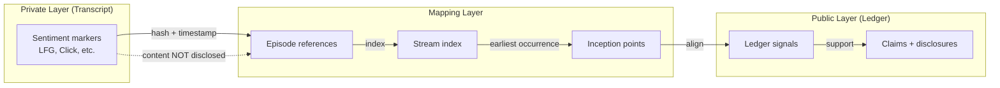

# INVENTION DISCLOSURE FORM

**IDF-016**

---

## ADMINISTRATIVE

**Title:** Sentiment-Anchored Discovery Mapping and Inception Point Detection

**Inventor(s):** Dexter Hadley

**Disclosure Date:** 2026-01-13

**Related Disclosure:** IDF-005-episodic-drift-detection.md

**Freeze Reference:** stack-freeze-2026-01-12

**Status:** Internal disclosure — not for publication

**Confidentiality:** PRIVILEGED AND CONFIDENTIAL — Prepared for patent counsel

---

## 1. CONTEXT

This disclosure documents an inventive method for mapping discoveries by using sentiment or positive-control markers in transcripts and episodes. The method was discovered during lexicon and signal analysis (ep147, ep148, ep149) and addresses a gap in IDF-005's episodic drift detection: the need to identify the inception moment of a discovery before it appears in the ledger.

---

## 2. PROBLEM STATEMENT

In governed AI collaboration systems:

1. Discovery events are implicit and hard to timestamp precisely
2. Transcript content cannot be published, limiting evidence granularity for IP claims
3. Ledger commits lag behind actual discovery moments (sometimes by hours or days)
4. No systematic method exists to detect inception points before ledger records
5. Discovery mapping relies on manual narrative reconstruction, which is error-prone
6. Prior art timestamps depend on ledger commits, missing earlier evidence

**The core problem:** No structural mechanism exists to detect and map human-directed discovery moments using sentiment signals, align them to streams and ledger evidence, and establish inception points that precede canonical recording—all while preserving transcript privacy.

---

## 3. INVENTIVE INSIGHT

The invention treats sentiment or positive-control markers (e.g., "LFG", "Click", "brilliant", "nice", "perfect") as discovery anchors. These markers are observable signals that correlate with discovery moments without constituting evidence themselves.

### 3.1 Positive-Control Model

Sentiment markers function as **positive controls**, not evidence:

- **Positive control:** A signal known to correlate with the target phenomenon (discovery)
- **Not evidence:** The marker itself does not prove discovery occurred
- **Correlation:** Statistical association between markers and ledger-confirmed discoveries

This distinction is critical: the method detects likely discovery moments for investigation, not proof.

### 3.2 Sentiment Lexicon

A controlled lexicon of discovery signals is defined:

| Marker | Interpretation | Context |
|--------|---------------|---------|
| "LFG" | High-confidence discovery signal | Typically precedes major insight |
| "Click" | Conceptual connection moment | Pattern recognition event |
| "brilliant" | Quality assessment of insight | May be false positive |
| "nice" | Mild positive signal | Lower correlation |
| "perfect" | Completion signal | Often follows discovery |

The lexicon is tunable; specific markers are not claimed.

### 3.3 Discovery Mapping Pipeline

When a marker is detected:

1. **Link:** Associate the marker timestamp with the enclosing episode
2. **Hash:** Record a content hash (not raw transcript) for privacy
3. **Index:** Place the episode in discovery-related streams
4. **Search:** Identify the earliest occurrence of the concept across all streams
5. **Align:** Match the inception point to the nearest ledger signal

### 3.4 Inception Point Definition

An **inception point** is defined as:

> The earliest stream occurrence of a concept that precedes its first ledger recording.

Inception points establish temporal priority without disclosing transcript content. The gap between inception point and ledger commit reveals the "discovery latency" of the system.

### 3.5 Privacy-Preserving Pipeline

The method preserves transcript privacy through:

1. **Reference-only output:** Only episode IDs and timestamps are disclosed
2. **Content hashing:** Transcript segments are hashed, not quoted
3. **Stream indexing:** Concepts are indexed by stream, not by raw content
4. **Ledger alignment:** Final evidence references only ledger commits

---

## 4. HIGH-LEVEL METHOD

### 4.1 Lexicon Maintenance

1. Define initial sentiment lexicon (human-curated)
2. Validate markers against known discoveries (positive control calibration)
3. Measure false positive/negative rates
4. Refine lexicon iteratively

### 4.2 Signal Capture

1. Detect markers in transcript or episode metadata
2. Record marker reference (episode ID, timestamp, hash)
3. Do NOT record raw transcript content

### 4.3 Mapping Pipeline

1. Associate marker references with episodes
2. Index episodes into streams (Discoveries, Violations, Insights, etc.)
3. Compute earliest stream occurrence per concept
4. Bind inception points to ledger signals

### 4.4 Output Generation

1. Discovery timelines with inception points
2. Stream-to-ledger evidence links
3. Discovery latency metrics (gap between inception and ledger)
4. Privacy-preserving disclosures for IP protection

---

## 5. ADVANTAGES

### 5.1 Earlier Priority Dates

Inception points establish concept priority before ledger commits, strengthening IP claims.

### 5.2 Privacy Preservation

Transcript content remains private; only hashes and references are disclosed.

### 5.3 Systematic Discovery Documentation

Replaces manual narrative reconstruction with structured pipeline.

### 5.4 Discovery Latency Measurement

Quantifies the gap between insight and formal recording, enabling process improvement.

### 5.5 Positive-Control Calibration

Explicit false positive/negative measurement enables lexicon refinement.

---

## 6. EXPLICIT EXCLUSIONS (NOT CLAIMED)

The following are explicitly **not** part of this disclosure:

1. **Specific sentiment markers** — The lexicon is tunable and domain-specific
2. **Natural language processing techniques** — Marker detection is pattern matching, not NLP
3. **Machine learning classifiers** — No ML is required; simple string matching suffices
4. **Specific hash algorithms** — Any deterministic hash function works
5. **Specific stream taxonomies** — Stream categories are domain-specific
6. **Transcript content analysis** — Only markers are detected, not semantic content
7. **Emotional sentiment analysis** — "Sentiment" here means discovery signals, not emotion

---

## 7. RELATIONSHIP TO OTHER DISCLOSURES

### 7.1 IDF-005 (Episodic Drift Detection)

IDF-005 detects compliance drift over episodes. IDF-016 complements this by:

- Identifying inception points of concepts that later become constraints
- Providing earlier timestamps than ledger commits
- Enabling discovery-to-canonification timeline reconstruction

### 7.2 IDF-003 (Compliance Proof Chaining)

IDF-003 chains ledger evidence. IDF-016 extends the chain backward:

- Ledger commits are the canonical evidence (IDF-003)
- Inception points are pre-ledger discovery signals (IDF-016)
- Together they create a complete discovery-to-claim timeline

### 7.3 IDF-011 (Evidence-Based Epistemic Writing)

IDF-011 requires ledger evidence for claims. IDF-016 enables:

- Claims about discovery timing ("concept X was discovered before date Y")
- Privacy-preserving evidence for inception points
- Stream-based evidence that doesn't require transcript disclosure

---

## 8. PRIOR ART DISTINCTION

### 8.1 Sentiment Analysis (NLP)

Traditional sentiment analysis classifies text by emotional valence (positive/negative/neutral).

**Distinction:** IDF-016 uses "sentiment" to mean discovery-correlated markers, not emotional classification. No NLP or ML is involved—only string pattern matching against a curated lexicon.

### 8.2 Event Detection Systems

Event detection systems (e.g., social media trend detection) identify significant events from signal patterns.

**Distinction:** IDF-016 operates on private transcripts with privacy-preserving output. Event detection systems typically analyze public data and output event descriptions. IDF-016 outputs only references and hashes.

### 8.3 Prior Art Timestamping

Traditional prior art relies on publication dates, filing dates, or witnessed notebooks.

**Distinction:** IDF-016 establishes inception points from internal development records without publication. The privacy-preserving pipeline enables IP claims without transcript disclosure.

### 8.4 Git Commit Archaeology

Developers use git history to find when features were introduced.

**Distinction:** IDF-016 identifies inception points **before** git commits. The method uses transcript markers to find the discovery moment that precedes the commit.

---

## 9. EVIDENCE SUMMARY

### 9.1 Primary Episodes

| Episode | Content | Relevance |
|---------|---------|-----------|
| ep147 | Lexicon signal analysis | Defined initial sentiment markers |
| ep148 | Stream mapping methodology | Established mapping pipeline |
| ep149 | Inception point detection | Demonstrated pre-ledger discovery |

### 9.2 Supporting Evidence

- Manuscript transcript signal analysis sections demonstrate the method
- Discoveries stream contains indexed discovery episodes
- Violations stream provides negative examples (markers without discovery)

### 9.3 Validation

The method was validated by:

1. Identifying markers in historical episodes
2. Comparing marker timestamps to ledger commits
3. Confirming inception points precede ledger recording
4. Measuring discovery latency across the corpus

---

## 10. INVENTOR DECLARATION

I, **Dexter Hadley**, declare that:

1. I am the sole human inventor of this method
2. The inventive activity is documented in ep147, ep148, ep149
3. AI systems contributed execution under my governance but are not inventors
4. This disclosure is bounded by the freeze date specified above

---

**END OF DISCLOSURE**

---
