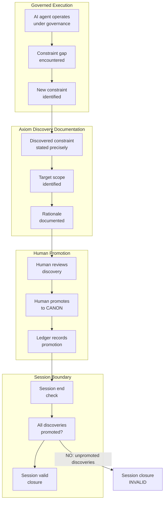

# INVENTION DISCLOSURE FORM

**IDF-017**

---

## ADMINISTRATIVE

**Title:** Axiom Discovery Documentation in Governed AI Collaboration

**Inventor(s):** Dexter Hadley

**Disclosure Date:** 2026-01-14

**Related Disclosure:** IDF-001-canonic-governance.md, IDF-005-episodic-drift-detection.md

**Freeze Reference:** patents-session-2026-01-14

**Status:** Internal disclosure — not for publication

**Confidentiality:** PRIVILEGED AND CONFIDENTIAL — Prepared for patent counsel

---

## 1. CONTEXT

This disclosure documents an inventive method for capturing governance evolution during execution. The method was discovered during patents ep005 session when the need to document axiom discoveries was identified as a structural requirement for governance completeness.

---

## 2. PROBLEM STATEMENT

In governed AI collaboration systems:

1. Governance constraints are discovered during execution, not only at design time
2. Discovered constraints may be lost if not immediately documented
3. No structural mechanism ensures discovered axioms are promoted to CANON
4. Session boundaries create risk of governance gaps persisting
5. The relationship between discovery, documentation, and promotion is implicit

**The core problem:** No structural mechanism exists to ensure that governance constraints discovered during AI-assisted execution are documented with sufficient context and promoted to canonical status before session boundaries close.

---

## 3. INVENTIVE INSIGHT

The invention treats axiom discovery as a first-class governance event requiring structured documentation and temporal binding to session boundaries.

### 3.1 Structured Documentation Requirements

The method requires three documentation elements for each discovered axiom:

| Element | Purpose | Example |
|---------|---------|---------|
| **Discovered constraint** | Precise statement of the governance rule | "PATENTS repositories MUST NOT have remote push destinations" |
| **Target scope** | Where the axiom belongs in the governance hierarchy | PATENTS CANON (not OS, not WRITING) |
| **Rationale** | Why the constraint is necessary | "Patent disclosures are privileged; public sync would violate confidentiality" |

### 3.2 Session Boundary Binding

The critical insight is that discovered axioms MUST be promoted before session end:

- **Temporal requirement:** Promotion must occur within the discovering session
- **Human gate:** Only human operator can promote to CANON
- **Ledger binding:** Promotion creates ledger entry linking discovery to axiom

This prevents governance gaps from persisting across session boundaries.

---

## 4. HIGH-LEVEL METHOD

### 4.1 Discovery Detection

1. During governed execution, AI agent encounters scenario not addressed by current CANON
2. AI identifies constraint gap and formulates candidate constraint
3. Candidate constraint documented with required elements

### 4.2 Documentation Protocol

1. Record discovered constraint precisely (normative statement)
2. Identify target scope based on canonical locality (IDF-013)
3. Document rationale linking constraint to governance need

### 4.3 Promotion Workflow

1. Human operator reviews axiom discovery record
2. Human decides: promote, defer, or reject
3. If promote: add to target CANON, record in ledger
4. If defer: session cannot close validly

### 4.4 Session Boundary Enforcement

1. At session end, check for unpromoted discoveries
2. If any exist: session closure is INVALID
3. Human must promote or explicitly reject all discoveries
4. Valid closure only when discovery queue is empty

---

## 5. ADVANTAGES

### 5.1 Governance Completeness

Ensures no constraint gaps persist across sessions—governance evolves as needed.

### 5.2 Human Authority Preservation

Only humans can promote discoveries to CANON—AI identifies, humans decide.

### 5.3 Traceable Evolution

Each axiom has documented origin: episode, rationale, promotion decision.

### 5.4 Temporal Binding

Session boundaries create checkpoints preventing governance drift.

### 5.5 Structured Documentation

Required elements (constraint, scope, rationale) ensure actionable records.

---

## 6. EXPLICIT EXCLUSIONS (NOT CLAIMED)

1. **Specific detection algorithms** — How constraint gaps are identified is implementation detail
2. **Specific documentation formats** — Record structure is not claimed
3. **Automated promotion** — Human decision is required; automation not claimed
4. **Specific session boundary mechanisms** — How sessions are bounded is not claimed
5. **LLM-based constraint formulation** — How AI formulates candidates is not claimed

---

## 7. RELATIONSHIP TO PRIOR DISCLOSURES

### 7.1 IDF-001 (Canonification)

IDF-001 establishes the canonification process (section 4.3) where AI-discovered patterns can be promoted to constitutional status. IDF-017 extends this by:

- Adding **documentation requirements** (constraint, scope, rationale)
- Adding **temporal binding** (before session end)
- Making axiom discovery a **structural requirement**, not just an option

### 7.2 IDF-005 (Drift Detection)

IDF-005 detects compliance drift through temporal episode analysis. IDF-017 complements this by:

- Capturing **forward drift** (new constraints needed) rather than **backward drift** (existing constraints violated)
- Ensuring discoveries don't slip through session boundaries

### 7.3 IDF-012 (Self-Healing)

IDF-012 addresses repair of existing governance violations; IDF-017 addresses discovery of new governance needs:

| IDF | Direction | Trigger | Output |
|-----|-----------|---------|--------|
| IDF-012 | Repair existing | Violation detected | Minimal repair |
| IDF-017 | Extend governance | Gap discovered | New axiom |

---

## 8. PRIOR ART DISTINCTION

### 8.1 Session-Based Logging and Journaling

Session-based systems log activities and decisions during work sessions.

**Distinction:** IDF-017 requires *structured documentation with promotion*:
- Logging records events; IDF-017 requires constraint/scope/rationale structure
- Journals are passive; IDF-017 creates governance obligations (promotion before closure)
- Temporal binding with session validity is unique

### 8.2 Issue Tracking (Jira, GitHub Issues)

Issue tracking systems capture problems and track resolution.

**Distinction:** IDF-017 captures *governance gaps*, not issues:
- Issues track bugs/features; IDF-017 tracks missing governance constraints
- Issue resolution is optional timing; IDF-017 requires same-session promotion
- Canonical locality guidance (target scope) has no issue tracking equivalent

### 8.3 Knowledge Management (Wikis, Documentation)

Knowledge systems capture organizational learning and decisions.

**Distinction:** IDF-017 creates *enforceable governance evolution*:
- Wikis document; IDF-017 creates governance obligations
- Documentation is advisory; promoted axioms are normative (CANON)
- Session boundary enforcement is unique

### 8.4 Agile Retrospectives

Agile teams capture lessons learned at sprint boundaries.

**Distinction:** IDF-017 operates at *session* level with *governance promotion*:
- Retrospectives create action items; IDF-017 creates CANON axioms
- Retrospective timing is sprint-based; IDF-017 is session-based
- Validity constraint (cannot close with unpromoted discoveries) is unique

---

## 9. CLAIMS

### 9.1 Primary Claim

A method for governed axiom discovery documentation in human-AI collaborative systems, comprising:

1. Detecting, during governed execution, a governance constraint not present in current CANON
2. Documenting the discovered constraint with:
   - Precise statement of the constraint
   - Identification of the scope where the axiom belongs
   - Rationale for the constraint
3. Requiring human operator promotion to CANON before session boundary
4. Recording promotion to append-only ledger

### 9.2 Dependent Claims

9.2.1 The method of 9.1, wherein session closure is invalid if unpromoted discoveries exist.

9.2.2 The method of 9.1, wherein the target scope is determined by canonical locality (IDF-013): the axiom belongs in the scope governing the action it constrains.

9.2.3 The method of 9.1, wherein documentation is recorded in episode format per WRITING CANON.

---

## 10. EVIDENCE SUMMARY

### 10.1 Discovery Event

- Episode: patents/ep005-prior-art-strengthening.md
- Discovery: PATENTS Axiom 8 (local-only repository)
- Rationale: Attempted push revealed no remote; patent confidentiality requires local-only

### 10.2 Pattern Recognition

- Recognized need for general axiom discovery documentation requirement
- Identified as potential WRITING Axiom 6
- Identified as patentable extension of IDF-001 canonification

---

## 11. INVENTOR DECLARATION

I, **Dexter Hadley**, declare that:

1. I am the sole human inventor of this method
2. The inventive activity is documented in patents ep005
3. AI systems contributed execution under my governance but are not inventors
4. This disclosure requires a new freeze before claims are bounded

---

**END OF DISCLOSURE**

---
