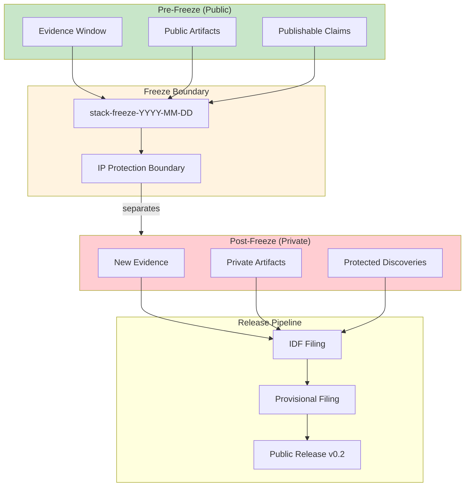

# INVENTION DISCLOSURE FORM

**IDF-023**

---

## ADMINISTRATIVE

**Title:** Temporal Fixation Boundary as Intellectual Property Protection Mechanism

**Inventor(s):** Dexter Hadley

**Disclosure Date:** 2026-01-14

**Related Disclosure:** IDF-001-canonic-governance.md, IDF-003-compliance-proof-chaining.md

**Freeze Reference:** Post stack-freeze-2026-01-12 (v0.2 scope)

**Status:** Internal disclosure — not for publication

**Confidentiality:** PRIVILEGED AND CONFIDENTIAL — Prepared for patent counsel

---

## 1. PROBLEM STATEMENT

In governed human-AI collaboration systems:

1. Evidence windows are fixed for claim verifiability
2. Post-freeze work continues but generates new insights
3. No mechanism distinguishes publishable artifacts from protected IP
4. Discoveries made during publishing workflow leak into public artifacts
5. The relationship between evidence fixation and IP protection is undefined

**The core problem:** No structural mechanism exists to treat temporal fixation boundaries as IP protection boundaries, where the freeze tag separates public (publishable) artifacts from private (patent-protected) development.

---

## 2. CORE INVENTIVE INSIGHT

The invention establishes **freeze boundaries as IP protection boundaries** where:

1. The freeze tag is not merely a version marker—it is a **legal IP boundary**
2. All artifacts at or before the freeze are public and publishable
3. All artifacts after the freeze are private IP requiring protection
4. Release of post-freeze content requires passage through the canonification gate

### 2.1 Dual Nature of Freeze

| Property | Evidence Function | IP Function |
|----------|------------------|-------------|
| **Temporal** | Fixes claim-to-evidence binding | Establishes priority date |
| **Artifact** | Defines verifiable window | Separates public/private |
| **Legal** | Enables reproducibility | Creates protection boundary |

### 2.2 Publishing Workflow as Discovery Engine

Critical insight: The publishing workflow itself generates IP.

When using a frozen OS to produce artifacts (typesetting, editing, rendering), the operator discovers:
- Patterns not visible before execution
- Optimizations that improve the system
- Insights that extend the paradigm

These discoveries belong to the **next freeze cycle**, not the current release.

### 2.3 IP Leakage Prevention

Post-freeze IP leakage occurs when:
- Discoveries made during publishing enter the public manuscript
- Evidence references extend beyond the frozen window
- Claims expand to include post-freeze material

The freeze boundary prevents leakage by structural separation:
- Public paper contains frozen-window evidence only
- Private development contains post-freeze discoveries
- Canonification gate controls what crosses over

### 2.4 Release Pipeline

Post-freeze content enters the public stack through:

1. **Discovery documentation** — Episode records the insight
2. **IDF filing** — Formal disclosure for patent counsel
3. **Provisional filing** — Legal protection established
4. **Public release** — Protected IP enters next version

This pipeline ensures no unprotected IP becomes public.

---

## 3. TECHNICAL APPROACH

### 3.1 Freeze Declaration

1. Human operator declares freeze tag with timestamp
2. Tag cryptographically anchors all prior commits
3. Tag becomes IP boundary marker
4. All subsequent work is post-freeze by definition

### 3.2 Artifact Classification

For each artifact:
1. Determine creation timestamp
2. Compare to freeze timestamp
3. Classify as:
   - **Public** (created ≤ freeze)
   - **Private** (created > freeze)
4. Apply appropriate handling

### 3.3 Leakage Detection

1. Scan public artifacts for post-freeze references
2. Flag any evidence references beyond frozen window
3. Flag any content not present at freeze commit
4. Report violations for correction

### 3.4 Canonification Gate

Post-freeze content enters public stack only when:
1. Documented in episode (discoverable)
2. Disclosed in IDF (protected)
3. Filed as provisional (legally secured)
4. Approved for release (human authority)

---

## 4. ADVANTAGES

### 4.1 Structural IP Protection

IP protection is architectural, not procedural—the freeze boundary enforces separation.

### 4.2 Discovery Capture

Insights from publishing workflow are automatically captured as protectable IP.

### 4.3 Clear Priority Dates

Freeze timestamp establishes unambiguous priority for pre-freeze claims.

### 4.4 Leakage Prevention

Structural separation prevents accidental public disclosure of unprotected IP.

### 4.5 Pipeline Clarity

Clear path from discovery to protected release eliminates ambiguity.

---

## 5. EXPLICIT EXCLUSIONS (NOT CLAIMED)

1. **Specific patent filing procedures** — Legal process is not claimed
2. **Specific freeze tag formats** — Tag structure is implementation detail
3. **Specific leakage detection algorithms** — Detection method is not claimed
4. **Specific artifact classification criteria** — Classification rules are not claimed
5. **Jurisdiction-specific IP law** — Legal interpretation is not claimed

---

## 6. EVIDENCE SUMMARY

### 6.1 Episode Evidence

- ep156: Post-freeze IP leakage violation discovered and corrected
- ep157: Post-freeze IP compliance report
- ep158: Freeze as IP boundary discovery canonified
- ep160: PAPER as reproducible template (post-freeze IP)

### 6.2 Leakage Evidence

Specific leakage instance documented:
- PDF build version contained post-freeze content
- Expanded transcript methodology (post-freeze)
- Episodes ep140-ep149 references (post-freeze)
- Reverted to freeze-compliant state

### 6.3 Pipeline Evidence

- patents/paper-draft/ established as private v0.2 scope
- IDF filing process documented
- Canonification gate enforced through episode review

---

## 7. RELATIONSHIP TO OTHER DISCLOSURES

### 7.1 Relationship to IDF-001

IDF-001 establishes temporal fixation for evidence binding. IDF-023 extends fixation to IP protection:

| IDF-001 | IDF-023 |
|---------|---------|
| Freeze fixes evidence window | Freeze creates IP boundary |
| Claims bounded by freeze | IP bounded by freeze |
| Evidence verifiable | IP protectable |

### 7.2 Relationship to IDF-003

IDF-003 establishes cryptographic proof chains. IDF-023 adds:

- Freeze tag as legal boundary marker
- Post-freeze proof chains are private until protected
- Cross-freeze references constitute leakage

### 7.3 Relationship to IDF-011

IDF-011 requires evidence within freeze window. IDF-023 explains why:

- Pre-freeze evidence is public (verifiable by anyone)
- Post-freeze evidence is private (protectable IP)
- The freeze boundary is the publication/protection divide

---

## 8. PRIOR ART DISTINCTION

### 8.1 Version Control Tags (Git Tags, Release Tags)

Version control systems use tags to mark releases.

**Distinction:** IDF-023 treats tags as **legal IP boundaries**, not just version markers:
- Git tags mark versions; IDF-023 tags mark IP boundaries
- Release tags are organizational; IDF-023 tags are legal separators
- The dual nature (evidence + IP) is unique to IDF-023

### 8.2 Trade Secret Protection (Confidential Development)

Trade secret law protects undisclosed information.

**Distinction:** IDF-023 uses **structural separation** via freeze boundaries:
- Trade secrets rely on confidentiality agreements; IDF-023 uses architectural separation
- The freeze boundary is a technical mechanism, not a legal agreement
- Publishing workflow discovery capture is unique

### 8.3 Patent Priority Dates (Filing Date, Provisional)

Patent law uses filing dates to establish priority.

**Distinction:** IDF-023 establishes priority through **freeze timestamps**:
- Filing date is legal event; freeze is technical event
- Freeze anchors evidence; filing protects claims
- The two work together but serve different functions

### 8.4 Embargo Periods (Academic Publishing)

Academic publishing uses embargo periods before public release.

**Distinction:** IDF-023 uses **canonification gates**, not time delays:
- Embargo is temporal; IDF-023 gate is procedural
- Embargo releases after time; IDF-023 releases after protection
- The gate requires affirmative IP protection, not just waiting

---

## 9. INVENTOR DECLARATION

I, **Dexter Hadley**, declare that:

1. I am the sole human inventor of this method
2. The discovery is documented in ep156, ep157, ep158, ep160
3. AI systems contributed execution under governance but are not inventors
4. This disclosure is post-freeze IP (v0.2 scope)

---

**END OF DISCLOSURE**

---
