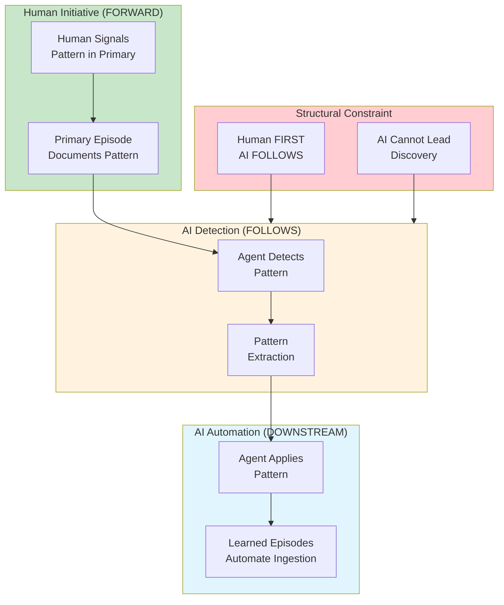

# INVENTION DISCLOSURE FORM

**IDF-026**

---

## ADMINISTRATIVE

**Title:** Forward-First Human-Driven Discovery Pattern for Governed AI Automation

**Inventor(s):** Dexter Hadley

**Disclosure Date:** 2026-01-14

**Related Disclosure:** IDF-001-canonic-governance.md, IDF-005-episodic-drift-detection.md, IDF-014-bidirectional-scope-boundaries.md

**Freeze Reference:** Post stack-freeze-2026-01-12 (v0.2 scope)

**Status:** Internal disclosure — not for publication

**Confidentiality:** PRIVILEGED AND CONFIDENTIAL — Prepared for patent counsel

---

## 1. PROBLEM STATEMENT

In governed human-AI collaboration systems:

1. AI agents can detect patterns in data
2. Automation of pattern application is desirable
3. No mechanism ensures humans lead pattern discovery
4. AI-initiated patterns may not align with human intent
5. The boundary between discovery and automation is undefined

**The core problem:** No structural mechanism exists to ensure that discovery patterns are human-driven, with AI automation structurally downstream of human initiative—preventing AI from leading pattern discovery while enabling AI to automate pattern application.

---

## 2. CORE INVENTIVE INSIGHT

The invention establishes the **forward-first pattern** where:

1. **Human signals precede agent action** — Discovery is human-initiated
2. **Agent detects patterns in primary episodes** — Pattern recognition follows human demonstration
3. **Agent applies patterns to automate** — Automation is downstream of discovery
4. **AI cannot lead discovery** — Structural constraint prevents AI initiative

### 2.1 Forward-First Principle

| Phase | Actor | Action | Constraint |
|-------|-------|--------|------------|
| **Discovery** | Human | Signals pattern in primary episode | Human MUST lead |
| **Detection** | AI | Recognizes pattern from human signal | AI follows human |
| **Extraction** | AI | Generalizes pattern for reuse | Based on human example |
| **Automation** | AI | Applies pattern to new inputs | Downstream of discovery |

### 2.2 Primary vs. Learned Episodes

The pattern distinguishes two episode types:

| Type | Creator | Purpose | Pattern Role |
|------|---------|---------|--------------|
| **Primary** | Human | Document governance session | Pattern source |
| **Learned** | AI (under human authority) | Automate ingestion | Pattern application |

Primary episodes are the **source of truth** for patterns.
Learned episodes are **projections** of patterns to new data.

### 2.3 Structural Constraint

The forward-first constraint is structural, not procedural:

- AI systems cannot create primary episodes (IDF-004, IDF-014)
- Pattern detection requires primary episode to exist first
- Automation is triggered by pattern presence, not AI initiative
- Human authority preserved even in automated workflows

### 2.4 Discovery-Automation Boundary

The boundary is clear:

| Discovery Side (Human) | Automation Side (AI) |
|------------------------|---------------------|
| Identify pattern | Detect pattern |
| Document in primary | Extract and generalize |
| Signal significance | Apply to new inputs |
| Approve automation | Execute automation |

AI never crosses to the discovery side.

---

## 3. TECHNICAL APPROACH

### 3.1 Pattern Signaling

1. Human creates primary episode
2. Episode contains pattern demonstration:
   - Explicit pattern description
   - Example application
   - Expected outcomes
3. Pattern signal is recorded in episode metadata

### 3.2 Pattern Detection

1. Agent scans primary episodes for pattern signals
2. For each signal:
   - Extract pattern structure
   - Identify application criteria
   - Record pattern in pattern registry
3. Detection is triggered by human signal, not AI scanning

### 3.3 Pattern Extraction

1. From detected pattern:
   - Generalize structure (replace specifics with variables)
   - Define application conditions
   - Specify expected outputs
2. Extracted pattern is a template for automation

### 3.4 Automated Application

1. New input arrives (e.g., transcript for ingestion)
2. Agent checks pattern registry for applicable patterns
3. For each matching pattern:
   - Apply pattern to input
   - Generate learned episode
   - Reference source primary episode
4. Learned episode traces to human-initiated pattern

### 3.5 Constraint Enforcement

1. Learned episode creation requires:
   - Matching pattern in registry
   - Pattern traced to primary episode
   - Primary episode created by human
2. Without human-initiated pattern, automation blocked

---

## 4. ADVANTAGES

### 4.1 Human Authority Preservation

Discovery remains exclusively human—AI cannot lead.

### 4.2 Traceable Automation

Every automated action traces to human-initiated pattern.

### 4.3 Scalable Pattern Application

Human demonstrates once, AI applies many times.

### 4.4 Aligned Automation

Automation reflects human intent (from pattern source).

### 4.5 Audit Trail Clarity

Discovery vs. automation clearly distinguished in episode corpus.

---

## 5. EXPLICIT EXCLUSIONS (NOT CLAIMED)

1. **Specific pattern languages** — How patterns are expressed is not claimed
2. **Specific detection algorithms** — Pattern recognition method is not claimed
3. **Specific automation triggers** — When automation runs is not claimed
4. **Machine learning for pattern detection** — ML methods are not claimed
5. **Specific episode formats** — Episode structure is not claimed

---

## 6. EVIDENCE SUMMARY

### 6.1 Episode Evidence

- ep153: Forward-first human-driven pattern documented
- ep150: Learned episodes scope established

### 6.2 Pattern Evidence

Patterns demonstrated:
- Transcript ingestion pattern (human shows format, AI applies)
- Episode creation pattern (human shows structure, AI applies)
- Violation detection pattern (human classifies, AI detects)

### 6.3 Constraint Evidence

Constraint enforced:
- No learned episodes without primary source
- AI cannot create primary episodes (IDF-004)
- Automation traces to human demonstration

---

## 7. RELATIONSHIP TO OTHER DISCLOSURES

### 7.1 Relationship to IDF-001

IDF-001 establishes human authority over governance. IDF-026 extends to discovery:

| IDF-001 | IDF-026 |
|---------|---------|
| Humans declare rules | Humans discover patterns |
| AI cannot modify CANON | AI cannot lead discovery |
| Canonification is human | Pattern signaling is human |

### 7.2 Relationship to IDF-004

IDF-004 establishes producer/consumer roles. IDF-026 adds discovery/automation roles:

| IDF-004 | IDF-026 |
|---------|---------|
| Producer: AI creates CANON candidates | Automation: AI applies patterns |
| Consumer: Human creates episodes | Discovery: Human signals patterns |
| Role separation | Phase separation |

### 7.3 Relationship to IDF-005

IDF-005 establishes drift detection and learning. IDF-026 constrains the learning source:

- IDF-005: Patterns extracted from violations
- IDF-026: Patterns must be human-signaled first
- Learning loop is human-initiated, AI-executed

### 7.4 Relationship to IDF-014

IDF-014 establishes AI governance is self-referential. IDF-026 extends:

- AI governance applies to AI behavior (IDF-014)
- AI automation applies patterns to AI behavior (IDF-026)
- Human discovery applies to human initiative (IDF-026)

---

## 8. PRIOR ART DISTINCTION

### 8.1 Supervised Machine Learning

Supervised ML trains models on human-labeled data.

**Distinction:** IDF-026 is **structural ordering**, not training:
- ML training produces models; IDF-026 produces automation constraints
- ML can generalize beyond training data; IDF-026 constrains to human patterns
- The forward-first constraint (AI cannot lead) has no ML equivalent

### 8.2 Programming by Example (PBE)

PBE systems infer programs from input-output examples.

**Distinction:** IDF-026 applies to **governance patterns**, not programs:
- PBE infers programs; IDF-026 applies governance patterns
- PBE examples are data; IDF-026 examples are episodes
- Human authority preservation is governance-specific

### 8.3 Workflow Automation (RPA, Zapier)

Automation tools replay recorded workflows.

**Distinction:** IDF-026 requires **human-signaled patterns**, not just recording:
- RPA records actions; IDF-026 requires explicit pattern signal
- Workflow automation is mechanical; IDF-026 is governance-aware
- Discovery-automation boundary has no RPA equivalent

### 8.4 Active Learning

Active learning systems query humans for labels on uncertain examples.

**Distinction:** IDF-026 inverts the relationship—**human leads, AI follows**:
- Active learning: AI asks, human answers
- IDF-026: Human signals, AI follows
- The structural constraint (AI cannot initiate) is the inverse of active learning

---

## 9. INVENTOR DECLARATION

I, **Dexter Hadley**, declare that:

1. I am the sole human inventor of this pattern
2. The discovery is documented in ep153, ep150
3. AI systems contributed execution under governance but are not inventors
4. This disclosure is post-freeze IP (v0.2 scope)

---

**END OF DISCLOSURE**

---
