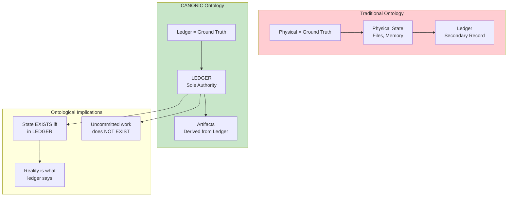

# INVENTION DISCLOSURE FORM

**IDF-027**

---

## ADMINISTRATIVE

**Title:** Ledger-Defined Ontology for Governed System State

**Inventor(s):** Dexter Hadley

**Disclosure Date:** 2026-01-14

**Related Disclosure:** IDF-001-canonic-governance.md, IDF-003-compliance-proof-chaining.md

**Freeze Reference:** Post stack-freeze-2026-01-12 (v0.2 scope)

**Status:** Internal disclosure — not for publication

**Confidentiality:** PRIVILEGED AND CONFIDENTIAL — Prepared for patent counsel

---

## 1. PROBLEM STATEMENT

In software systems:

1. Physical state (files on disk, memory) is assumed to be ground truth
2. Ledgers record events but are secondary to physical reality
3. Discrepancies between ledger and physical state create ambiguity
4. No formal ontological commitment defines what "exists" in the system
5. Governance operates on assumptions about reality rather than defined reality

**The core problem:** No structural mechanism exists to establish that ledger records ARE reality—that a system state exists if and only if it is persisted in the ledger, inverting the typical physical-state-as-ground-truth assumption.

---

## 2. CORE INVENTIVE INSIGHT



The invention establishes **ledger-defined ontology** where:

1. The ledger is not a record OF reality—it IS reality
2. A system state exists if and only if it is persisted in the ledger
3. Physical state without ledger commitment is ontologically null
4. Governance operates on ledger state, not physical state

### 2.1 Ontological Inversion

| Traditional Ontology | Ledger-Defined Ontology |
|---------------------|------------------------|
| Physical state is primary | Ledger state is primary |
| Ledger records physical events | Physical state derives from ledger |
| Uncommitted work is "real but unrecorded" | Uncommitted work is "not real" |
| Discrepancy = recording error | Discrepancy = non-existence |

### 2.2 Existence Criterion

Under ledger-defined ontology:

```
∀ state S: EXISTS(S) ⟺ PERSISTED_IN_LEDGER(S)
```

This is not a recording requirement—it is an **ontological definition**.

A file on disk that is not committed:
- Traditional: Exists but is unrecorded
- CANONIC: Does not exist (ontologically null)

### 2.3 Governance Implications

Because governance operates on what exists:
- Only ledger-recorded states can be governed
- Uncommitted work is outside governance scope
- Validation checks ledger state, not physical state
- Disputes resolved by ledger, not physical inspection

### 2.4 Temporal Ontology

The ledger defines not just what exists, but WHEN it exists:

- A state exists at time T if ledger records it at T
- Commit timestamp = existence timestamp
- Pre-commit: non-existent
- Post-commit: existent and immutable

---

## 3. TECHNICAL APPROACH

### 3.1 Ledger as Reality

1. All system state changes require ledger commits
2. Uncommitted changes are treated as proposals, not states
3. Governance rules reference ledger state exclusively
4. Physical state is derived (can be reconstructed from ledger)

### 3.2 State Queries

1. "Does artifact A exist?" → Check if A is in ledger
2. "What is the current state of A?" → Query ledger HEAD
3. "What was state at time T?" → Query ledger at T
4. Physical inspection is never authoritative

### 3.3 Conflict Resolution

1. If physical state differs from ledger state:
   - Ledger is authoritative
   - Physical state is reconstructed from ledger
   - Discrepancy is a physical error, not a ledger error

### 3.4 Existence Proofs

1. To prove something exists: show ledger entry
2. To prove something doesn't exist: show absence from ledger
3. Physical evidence is not admissible for existence claims

---

## 4. ADVANTAGES

### 4.1 Unambiguous Ground Truth

No disputes about "what really happened"—ledger defines what happened.

### 4.2 Perfect Auditability

Every state that exists has a ledger entry, enabling complete audit trails.

### 4.3 Reproducibility

System can be perfectly reconstructed from ledger (physical state is derived).

### 4.4 Governance Clarity

Governance operates on well-defined state, not ambiguous physical reality.

### 4.5 Temporal Precision

Existence has precise temporal bounds (commit timestamps).

---

## 5. EXPLICIT EXCLUSIONS (NOT CLAIMED)

1. **Specific ledger implementations** — Git, blockchain, etc. are examples
2. **Specific reconstruction algorithms** — How to derive physical state is not claimed
3. **Specific conflict resolution procedures** — Resolution mechanics are not claimed
4. **Philosophical positions on ontology** — Metaphysical claims are not made
5. **Legal definitions of existence** — Jurisdictional interpretations not claimed

---

## 6. EVIDENCE SUMMARY

### 6.1 Axiom Evidence

LEDGER/CANON.md Axiom 1 states:
> "The LEDGER is the sole authoritative record of system state."

This axiom makes the ontological commitment explicit.

### 6.2 Implementation Evidence

Throughout the CANONIC stack:
- States are referenced by commit hash, not file path
- Evidence is ledger evidence, not physical evidence
- Reconstruction is from ledger, not from disk

### 6.3 Governance Practice Evidence

Episodes document:
- Claims verified against ledger, not physical state
- Violations detected via ledger analysis
- Corrections recorded in ledger (not physical edits)

---

## 7. RELATIONSHIP TO OTHER DISCLOSURES

### 7.1 Relationship to IDF-001

IDF-001 establishes ledger recording requirements. IDF-027 makes the ontological claim:

| IDF-001 | IDF-027 |
|---------|---------|
| Ledger records state transitions | Ledger DEFINES state |
| Recording is required | Recording IS existence |
| Evidence traceability | Ontological commitment |

### 7.2 Relationship to IDF-003

IDF-003 establishes proof chains through ledger. IDF-027 explains why:

- Proof chains are authoritative because ledger IS reality
- Cryptographic anchoring anchors to existence itself
- External verification verifies what exists, not what was recorded

### 7.3 Relationship to IDF-023

IDF-023 establishes freeze boundaries. Under ledger ontology:

- Freeze fixes what EXISTS at that moment
- Post-freeze work doesn't exist until committed
- The freeze is an existence boundary, not just a version marker

---

## 8. PRIOR ART DISTINCTION

### 8.1 Event Sourcing (Software Architecture)

Event sourcing reconstructs state from event logs.

**Distinction:** IDF-027 makes an **ontological claim**, not an architectural choice:
- Event sourcing: events are authoritative for reconstruction
- IDF-027: ledger DEFINES existence, not just reconstruction
- The ontological inversion (ledger as ground truth) is unique

### 8.2 Blockchain Immutability

Blockchain systems create immutable records.

**Distinction:** IDF-027 addresses **ontological status**, not just immutability:
- Blockchain: records are immutable once recorded
- IDF-027: existence is defined by ledger presence
- Uncommitted states being "non-existent" has no blockchain equivalent

### 8.3 Database ACID Properties

Databases ensure committed transactions are durable.

**Distinction:** IDF-027 inverts the **ontological relationship**:
- ACID: committed data persists
- IDF-027: only committed data EXISTS
- The claim that uncommitted data is ontologically null is unique

### 8.4 Version Control (Git, SVN)

Version control systems track file history.

**Distinction:** IDF-027 treats version control as **reality definition**:
- Git: tracks history of files
- IDF-027: ledger IS the reality; files are derived
- Physical files without commits being "non-existent" is unique

---

## 9. INVENTOR DECLARATION

I, **Dexter Hadley**, declare that:

1. I am the sole human inventor of this ontological framework
2. The framework is implicit in LEDGER/CANON.md axiom 1
3. AI systems contributed execution under governance but are not inventors
4. This disclosure is post-freeze IP (v0.2 scope)

---

**END OF DISCLOSURE**

---
