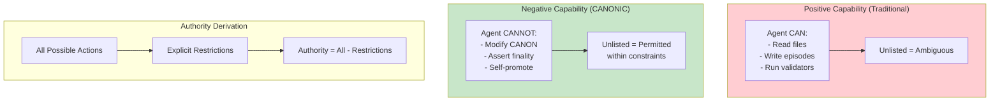

# INVENTION DISCLOSURE FORM

**IDF-028**

---

## ADMINISTRATIVE

**Title:** Negative Capability Framework for AI Authority Definition

**Inventor(s):** Dexter Hadley

**Disclosure Date:** 2026-01-14

**Related Disclosure:** IDF-001-canonic-governance.md, IDF-014-bidirectional-scope-boundaries.md

**Freeze Reference:** Post stack-freeze-2026-01-12 (v0.2 scope)

**Status:** Internal disclosure — not for publication

**Confidentiality:** PRIVILEGED AND CONFIDENTIAL — Prepared for patent counsel

---

## 1. PROBLEM STATEMENT

In AI governance systems:

1. Authority is typically defined by enumeration (agent CAN do X, Y, Z)
2. Enumerated capabilities expand over time (scope creep)
3. Undefined actions are ambiguous (permitted or forbidden?)
4. Positive capability lists require constant maintenance
5. No structural mechanism defines authority by what is EXCLUDED

**The core problem:** No structural mechanism exists to define AI authority through exclusion rather than inclusion—where an agent's authority is the COMPLEMENT of explicit restrictions, creating bounded autonomy without enumeration.

---

## 2. CORE INVENTIVE INSIGHT



The invention establishes **negative capability** where:

1. Authority is defined by explicit EXCLUSIONS, not inclusions
2. Everything not excluded is permitted (within governance constraints)
3. Exclusions are finite and enumerable
4. Authority is the complement of restrictions

### 2.1 Inversion Principle

| Positive Capability | Negative Capability |
|--------------------|---------------------|
| Lists what agent CAN do | Lists what agent CANNOT do |
| Unlisted = uncertain | Unlisted = permitted |
| Authority = enumerated set | Authority = universal set minus exclusions |
| Grows by addition | Grows by restriction removal |

### 2.2 Exclusion Categories

CANONIC agents have explicit exclusions:

| Exclusion | Meaning |
|-----------|---------|
| **Cannot modify CANON** | Governance rules are human-only |
| **Cannot assert finality** | Only humans fix outcomes |
| **Cannot self-promote** | Cannot elevate own authority |
| **Cannot create primary episodes** | Narrative authority is human |
| **Cannot override human decisions** | Human authority is supreme |

Everything else (reading, drafting, validating, computing) is PERMITTED.

### 2.3 Authority Computation

```
AUTHORITY(agent) = ACTIONS_ALL - EXCLUSIONS(agent)
```

This is computable:
1. Start with universal action space
2. Subtract explicit exclusions
3. Result is agent's authority

### 2.4 Bounded Autonomy

Negative capability creates **bounded autonomy**:
- Agent has broad freedom within constraints
- Constraints are explicit and finite
- No need to enumerate every permitted action
- New capabilities don't require list updates

---

## 3. TECHNICAL APPROACH

### 3.1 Exclusion Declaration

1. Each scope declares agent exclusions in CANON
2. Exclusions are explicit prohibitions (MUST NOT, CANNOT)
3. Exclusions are inherited downward (child scope adds restrictions)
4. Exclusions cannot be removed by child scopes

### 3.2 Authority Verification

1. For action A requested by agent:
   - Check if A matches any exclusion
   - If match: DENIED
   - If no match: PERMITTED (under governance constraints)
2. Verification is O(exclusions), not O(capabilities)

### 3.3 Exclusion Composition

Multiple scopes compose exclusions:
```
EXCLUSIONS(child) = EXCLUSIONS(parent) ∪ EXCLUSIONS(child_local)
```

Child scopes can only ADD exclusions, never remove.

### 3.4 Implicit Permission

If action A is:
- Not explicitly excluded, AND
- Does not violate governance constraints (CANON axioms)

Then A is PERMITTED.

---

## 4. ADVANTAGES

### 4.1 Finite Specification

Exclusions are finite; capabilities are infinite. Easier to specify.

### 4.2 Default Permissive

New actions are permitted unless excluded, enabling innovation.

### 4.3 Clear Boundaries

Exclusions are explicit and unambiguous.

### 4.4 Composition Safety

Exclusions only accumulate (downward); authority only narrows.

### 4.5 Audit Simplicity

To verify agent compliance, check exclusions only.

---

## 5. EXPLICIT EXCLUSIONS (NOT CLAIMED)

1. **Specific exclusion lists** — What is excluded is implementation detail
2. **Specific verification algorithms** — How exclusions are checked is not claimed
3. **Specific action ontologies** — What constitutes an "action" is not claimed
4. **Access control mechanisms** — Permissions systems are not claimed
5. **Capability-based security** — Security models are not claimed

---

## 6. EVIDENCE SUMMARY

### 6.1 Axiom Evidence

AGENTS/CANON.md Axiom 2 states:
> "Agents **MUST NOT** modify CANON."

This is negative capability—defining by exclusion.

Multiple axioms use MUST NOT (exclusion) rather than MAY (inclusion).

### 6.2 Pattern Evidence

Throughout CANONIC:
- CANON defines what agents CANNOT do
- SPEC defines what agents SHOULD do (guidance, not restriction)
- Authority emerges from restriction complement

### 6.3 Implementation Evidence

Agent operations demonstrate negative capability:
- Agents do many things not explicitly listed
- Agents are blocked from few things explicitly listed
- Authority boundary is the exclusion list

---

## 7. RELATIONSHIP TO OTHER DISCLOSURES

### 7.1 Relationship to IDF-001

IDF-001 establishes separation of powers. IDF-028 specifies the mechanism:

| IDF-001 | IDF-028 |
|---------|---------|
| AI cannot modify CANON | Exclusion: modify CANON |
| Human authority is exclusive | Exclusion: override human |
| Separation is structural | Separation via negative capability |

### 7.2 Relationship to IDF-014

IDF-014 establishes bidirectional scope boundaries. IDF-028 explains how:

- AI governance is self-referential (IDF-014)
- AI authority defined by exclusions from self-governance
- Human work is outside AI governance = not in exclusion list for AI

### 7.3 Relationship to IDF-007

IDF-007 establishes hierarchical authority. IDF-028 adds:

- Authority boundaries are exclusion boundaries
- Inheritance adds exclusions (never removes)
- Downward authority narrowing = downward exclusion accumulation

---

## 8. PRIOR ART DISTINCTION

### 8.1 Access Control Lists (ACLs)

ACLs specify who can access what resources.

**Distinction:** IDF-028 defines **authority by exclusion**, not access:
- ACLs list permissions (positive); IDF-028 lists restrictions (negative)
- ACLs are resource-centric; IDF-028 is action-centric
- The inversion (authority = complement of restrictions) is unique

### 8.2 Capability-Based Security

Capability systems grant tokens for specific actions.

**Distinction:** IDF-028 uses **universal minus exclusions**, not tokens:
- Capabilities are positive grants; IDF-028 is negative restrictions
- Capabilities require explicit grant; IDF-028 defaults to permitted
- The bounded autonomy model is distinct from capability tokens

### 8.3 Role-Based Access Control (RBAC)

RBAC assigns permissions to roles, users to roles.

**Distinction:** IDF-028 is **role-independent**:
- RBAC defines role permissions; IDF-028 defines agent exclusions
- RBAC roles can have any permissions; IDF-028 agents have complement of exclusions
- The negative capability inversion has no RBAC equivalent

### 8.4 Blacklisting vs Whitelisting

Security systems use blacklists (block specific) or whitelists (allow specific).

**Distinction:** IDF-028 is **ontological**, not just filtering:
- Blacklists filter; IDF-028 defines authority
- Whitelists enumerate; IDF-028 excludes
- The governance authority model (not just filtering) is unique

---

## 9. INVENTOR DECLARATION

I, **Dexter Hadley**, declare that:

1. I am the sole human inventor of this framework
2. The framework is implicit in AGENTS/CANON.md axiom structure
3. AI systems contributed execution under governance but are not inventors
4. This disclosure is post-freeze IP (v0.2 scope)

---

**END OF DISCLOSURE**

---
