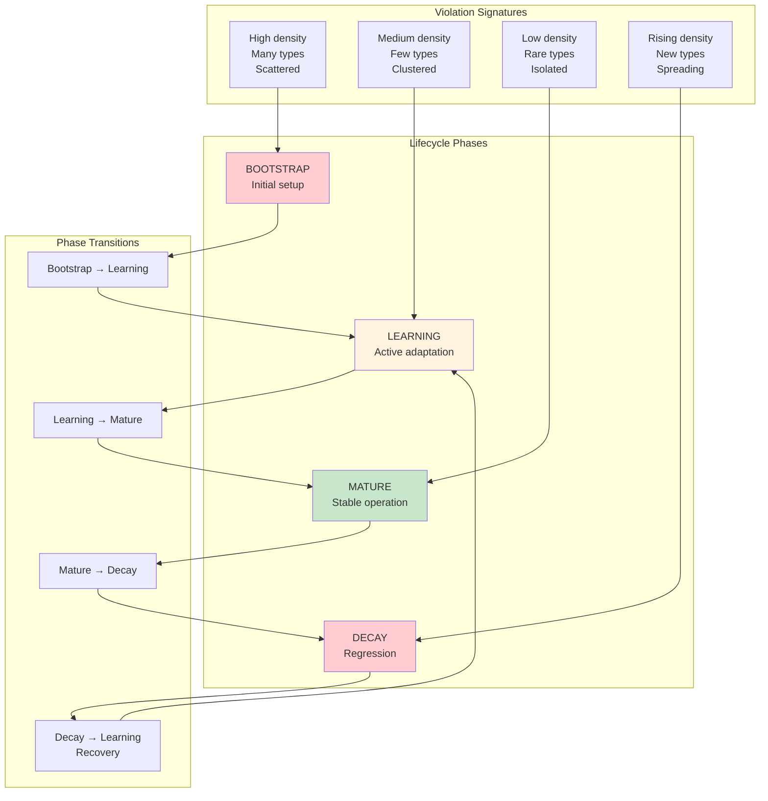

# INVENTION DISCLOSURE FORM

**IDF-029**

---

## ADMINISTRATIVE

**Title:** Governance Phase Diagram for System Lifecycle Detection

**Inventor(s):** Dexter Hadley

**Disclosure Date:** 2026-01-14

**Related Disclosure:** IDF-005-episodic-drift-detection.md, IDF-010-violation-pattern-taxonomy.md, IDF-022-violation-rate-maturity-signal.md

**Freeze Reference:** Post stack-freeze-2026-01-12 (v0.2 scope)

**Status:** Internal disclosure — not for publication

**Confidentiality:** PRIVILEGED AND CONFIDENTIAL — Prepared for patent counsel

---

## 1. PROBLEM STATEMENT

In governed AI collaboration systems:

1. Systems evolve through lifecycle phases (bootstrap, learning, mature)
2. Current phase is determined retrospectively or by intuition
3. No predictive mechanism identifies phase from observable signals
4. Violation patterns are analyzed individually, not as phase signatures
5. Phase transitions are not detected until well after they occur

**The core problem:** No structural mechanism exists to map violation signatures to governance lifecycle phases, enabling real-time phase detection and predictive phase transition warnings.

---

## 2. CORE INVENTIVE INSIGHT



The invention establishes a **governance phase diagram** where:

1. Violation signatures (density, type distribution, clustering) map to lifecycle phases
2. Phase transitions are detectable from signature changes
3. Current phase is determinable from observable signals
4. Future phase is predictable from trajectory

### 2.1 Phase Definitions

| Phase | Violation Signature | System Behavior |
|-------|--------------------| ----------------|
| **BOOTSTRAP** | High density, many types, scattered | Initial setup, everything is new |
| **LEARNING** | Medium density, few types, clustered | Adapting to constraints, finding patterns |
| **MATURE** | Low density, rare types, isolated | Stable operation, few surprises |
| **DECAY** | Rising density, new types, spreading | Regression, losing learned patterns |

### 2.2 Signature Components

A violation signature comprises:

| Component | Measurement | Phase Signal |
|-----------|-------------|--------------|
| **Density** | Violations per episode | High = unstable, Low = stable |
| **Type diversity** | Unique violation types | High = exploring, Low = focused |
| **Clustering** | Types per episode | Scattered = systemic, Clustered = local |
| **Trajectory** | Density change over time | Falling = improving, Rising = degrading |

### 2.3 Phase Space Mapping

The four components create a 4-dimensional phase space:

```
PHASE(system, time) = f(density, diversity, clustering, trajectory)
```

Each phase occupies a distinct region in this space.

### 2.4 Transition Detection

Phase transitions are detected when:
- Signature crosses phase boundary
- Multiple components shift simultaneously
- Trajectory inflection point occurs

Early warning: Signature approaching phase boundary triggers alert.

---

## 3. TECHNICAL APPROACH

### 3.1 Signature Computation

1. Define time window W (e.g., last 20 episodes)
2. For all violations in W:
   - Count total violations → density
   - Count unique types → diversity
   - Measure spread across episodes → clustering
3. Compare to previous window → trajectory

### 3.2 Phase Classification

1. Compute signature vector: [density, diversity, clustering, trajectory]
2. Compare to phase region definitions:
   - BOOTSTRAP: [high, high, scattered, any]
   - LEARNING: [medium, low, clustered, falling]
   - MATURE: [low, low, isolated, stable]
   - DECAY: [any, rising, spreading, rising]
3. Assign phase with best match

### 3.3 Transition Prediction

1. Track signature trajectory over multiple windows
2. Project trajectory into future
3. If projection crosses phase boundary:
   - Calculate time-to-transition
   - Flag transition warning
4. Report predicted phase and confidence

### 3.4 Phase Diagram Visualization

1. Map system history to phase space
2. Show trajectory through phases
3. Highlight current position and direction
4. Mark phase boundaries and transitions

---

## 4. ADVANTAGES

### 4.1 Real-Time Phase Detection

Current lifecycle phase determinable from observable signals.

### 4.2 Predictive Warnings

Phase transitions predicted before they complete.

### 4.3 Objective Lifecycle Assessment

Phase determined by data, not intuition.

### 4.4 Recovery Detection

Decay-to-Learning transitions (recovery) detectable.

### 4.5 Cross-System Comparison

Systems can be compared by phase (see IDF-021).

---

## 5. EXPLICIT EXCLUSIONS (NOT CLAIMED)

1. **Specific phase boundaries** — Boundary values are tuning parameters
2. **Specific signature algorithms** — Computation method is not claimed
3. **Specific visualization methods** — Display approach is not claimed
4. **Machine learning classifiers** — ML phase detection is not claimed
5. **Specific window sizes** — Time window is implementation detail

---

## 6. EVIDENCE SUMMARY

### 6.1 Episode Evidence

- 160+ episodes provide phase trajectory data
- Early episodes (1-30): high density, many types (BOOTSTRAP)
- Middle episodes (30-100): medium density, VOCAB/layer violations (LEARNING)
- Late episodes (100-160): low density, isolated incidents (MATURE)

### 6.2 Signature Evidence

Observable signature evolution:
- ep001-030: scattered violations, many types
- ep031-100: clustered violations, few types (VOCAB, layer)
- ep101-160: isolated violations, rare occurrence

### 6.3 Transition Evidence

Phase transitions observable:
- BOOTSTRAP → LEARNING: ~ep030 (violation types stabilize)
- LEARNING → MATURE: ~ep100 (density drops significantly)

---

## 7. RELATIONSHIP TO OTHER DISCLOSURES

### 7.1 Relationship to IDF-005

IDF-005 establishes drift detection. IDF-029 adds phase context:

| IDF-005 | IDF-029 |
|---------|---------|
| Detects compliance drift | Maps drift to phase |
| Single dimension (rate) | Multi-dimensional (signature) |
| Reactive (drift occurred) | Predictive (phase transition coming) |

### 7.2 Relationship to IDF-010

IDF-010 establishes violation taxonomy. IDF-029 uses taxonomy for phase mapping:

- IDF-010: classifies individual violations
- IDF-029: aggregates classifications into signatures
- Together: violation → type → signature → phase

### 7.3 Relationship to IDF-022

IDF-022 establishes violation rate as maturity signal. IDF-029 extends:

| IDF-022 | IDF-029 |
|---------|---------|
| Rate = maturity | Signature = phase |
| Binary (mature/not) | Multi-phase (bootstrap/learning/mature/decay) |
| Single metric | Multi-dimensional signature |

---

## 8. PRIOR ART DISTINCTION

### 8.1 Software Development Maturity Models (CMMI)

CMMI defines organizational maturity levels.

**Distinction:** IDF-029 is **observable and automatic**, not assessed:
- CMMI requires assessment; IDF-029 computes from data
- CMMI is organizational; IDF-029 is system-specific
- The violation signature mapping is unique

### 8.2 Statistical Process Control (SPC)

SPC monitors process variation and detects out-of-control states.

**Distinction:** IDF-029 maps to **lifecycle phases**, not just control:
- SPC detects anomalies; IDF-029 classifies phases
- SPC is binary (in/out of control); IDF-029 is multi-phase
- The phase diagram with transitions is unique

### 8.3 Machine Learning Model Lifecycle (MLOps)

MLOps tracks model performance through deployment stages.

**Distinction:** IDF-029 tracks **governance lifecycle**, not model performance:
- MLOps monitors prediction accuracy; IDF-029 monitors compliance
- MLOps stages are deployment-based; IDF-029 phases are violation-based
- The governance-specific phase diagram is unique

### 8.4 Software Reliability Growth Models

Reliability models predict defect discovery rates.

**Distinction:** IDF-029 uses **multi-dimensional signatures**, not just rates:
- Reliability models use defect count; IDF-029 uses signature
- Reliability assumes monotonic growth; IDF-029 allows decay
- Phase prediction with transition warnings is unique

---

## 9. INVENTOR DECLARATION

I, **Dexter Hadley**, declare that:

1. I am the sole human inventor of this framework
2. The framework emerges from episode corpus analysis
3. AI systems contributed execution under governance but are not inventors
4. This disclosure is post-freeze IP (v0.2 scope)

---

**END OF DISCLOSURE**

---
