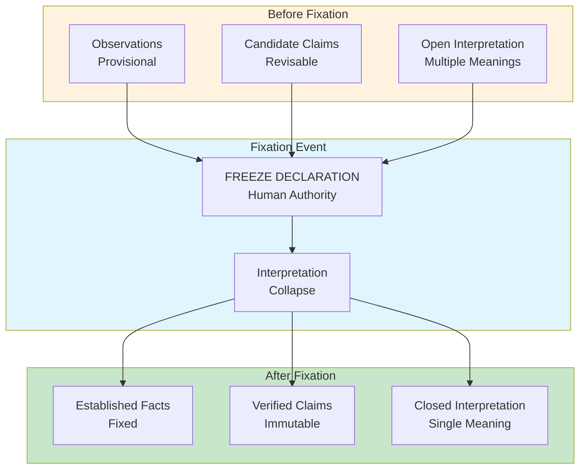

# INVENTION DISCLOSURE FORM

**IDF-030**

---

## ADMINISTRATIVE

**Title:** Temporal Fixation as Epistemological Closure Mechanism

**Inventor(s):** Dexter Hadley

**Disclosure Date:** 2026-01-14

**Related Disclosure:** IDF-001-canonic-governance.md, IDF-011-evidence-based-epistemic-writing.md, IDF-023-freeze-boundary-ip-protection.md

**Freeze Reference:** Post stack-freeze-2026-01-12 (v0.2 scope)

**Status:** Internal disclosure — not for publication

**Confidentiality:** PRIVILEGED AND CONFIDENTIAL — Prepared for patent counsel

---

## 1. PROBLEM STATEMENT

In knowledge systems:

1. Claims exist in states of provisional or established
2. The transition from provisional to established is implicit
3. Evidence windows are practical boundaries, not epistemic ones
4. No mechanism transforms the epistemic status of claims
5. What can be "known" versus "observed" is undefined

**The core problem:** No structural mechanism exists to treat temporal fixation as an epistemological act that transforms claims from provisional observations to established knowledge within a defined evidence window.

---

## 2. CORE INVENTIVE INSIGHT



The invention establishes **fixation as epistemological closure** where:

1. Declaring a freeze is an epistemological act, not just versioning
2. Fixation transforms provisional claims into established facts
3. The evidence window becomes epistemically closed (no new evidence)
4. Claims within the window can be definitively evaluated

### 2.1 Epistemic State Transition

| Before Fixation | After Fixation |
|-----------------|----------------|
| Observations (provisional) | Facts (established) |
| Multiple interpretations | Single interpretation |
| Evidence collection open | Evidence collection closed |
| Claims revisable | Claims immutable |
| Knowledge in progress | Knowledge complete (for window) |

### 2.2 Interpretation Collapse

Analogous to quantum measurement, fixation collapses interpretation:

- **Pre-fixation:** Claims exist in superposition of interpretations
- **Fixation:** Observer (human) declares freeze
- **Post-fixation:** Single interpretation established

The act of declaring a freeze is the "measurement" that collapses possibilities.

### 2.3 Evidence Window Closure

Fixation creates a closed evidence window:

```
∀ claim C in frozen_window:
  EVIDENCE(C) = {e | e ∈ ledger AND timestamp(e) ≤ freeze_time}

  C is VERIFIABLE ⟺ ∃ e ∈ EVIDENCE(C) supporting C
  C is FALSIFIABLE ⟺ ∄ e ∈ EVIDENCE(C) supporting C
```

No future evidence can modify claims within the frozen window.

### 2.4 Retroactive Authority

Fixation grants retroactive authority to prior work:

- Before freeze: Work is "in progress" (provisional authority)
- After freeze: Work is "established" (full authority for that window)
- The freeze retroactively assigns epistemic status

---

## 3. TECHNICAL APPROACH

### 3.1 Fixation Declaration

1. Human operator declares freeze tag with timestamp
2. Declaration is itself a ledger entry
3. All prior entries gain "fixed" status
4. Fixation is irreversible within the system

### 3.2 Claim Evaluation

For claims within frozen window:

1. Identify claim's evidence references
2. Verify all references within frozen window
3. Evaluate claim against evidence
4. Assign definitive status (verified/falsified)

### 3.3 Epistemological Boundaries

1. Claims referencing only frozen evidence: CLOSED (definitively evaluable)
2. Claims referencing post-freeze evidence: OPEN (still provisional)
3. Mixed claims: INVALID (freeze boundary violated)

### 3.4 Knowledge State Management

1. Track claim status: provisional → fixed
2. Track evidence window: open → closed
3. Track interpretation: multiple → single
4. Report epistemic state of system

---

## 4. ADVANTAGES

### 4.1 Definitive Evaluation

Claims become definitively verifiable/falsifiable within closed window.

### 4.2 Clear Epistemic Boundaries

What can be known is precisely defined by fixation boundary.

### 4.3 Interpretation Stability

Fixed claims have stable meaning (no interpretation drift).

### 4.4 Authority Clarity

Retroactive authority assignment eliminates ambiguity.

### 4.5 Reproducible Knowledge

Anyone can evaluate claims within frozen window with same result.

---

## 5. EXPLICIT EXCLUSIONS (NOT CLAIMED)

1. **Quantum mechanical claims** — Analogy only, no physics claimed
2. **Specific fixation procedures** — How to declare freeze is not claimed
3. **Specific claim evaluation algorithms** — Evaluation method is not claimed
4. **Philosophical epistemology** — Metaphysical positions not claimed
5. **Specific evidence formats** — Evidence structure is not claimed

---

## 6. EVIDENCE SUMMARY

### 6.1 Freeze Evidence

- `stack-freeze-2026-01-12` established evidence window
- 129 episodes fixed within window
- All claims evaluated against frozen evidence

### 6.2 Claim Status Evidence

Post-freeze claims in manuscript:
- "129 episode artifacts" — verified against frozen count
- "33 violation-labeled episodes" — verified against frozen labels
- Claims become definitively true/false post-freeze

### 6.3 Interpretation Evidence

Pre-freeze: Multiple interpretations of CANONIC possible
Post-freeze: Single interpretation established (the frozen one)

---

## 7. RELATIONSHIP TO OTHER DISCLOSURES

### 7.1 Relationship to IDF-011

IDF-011 requires evidence-based claims. IDF-030 specifies when claims become knowledge:

| IDF-011 | IDF-030 |
|---------|---------|
| Claims need evidence | Claims become knowledge at freeze |
| Evidence traceability | Epistemic closure |
| Claim types defined | Claim status transformation |

### 7.2 Relationship to IDF-023

IDF-023 establishes freeze as IP boundary. IDF-030 adds epistemic boundary:

| IDF-023 | IDF-030 |
|---------|---------|
| IP boundary | Knowledge boundary |
| Public/private separation | Provisional/established separation |
| Legal protection | Epistemic status |

### 7.3 Relationship to IDF-027

IDF-027 establishes ledger-defined ontology. IDF-030 adds epistemic layer:

- IDF-027: Ledger defines what EXISTS
- IDF-030: Freeze defines what is KNOWN
- Together: Ledger + Freeze = Ontology + Epistemology

---

## 8. PRIOR ART DISTINCTION

### 8.1 Version Control Tags

Version control tags mark release points.

**Distinction:** IDF-030 assigns **epistemic status**, not just version:
- Tags mark versions; IDF-030 closes knowledge windows
- Tags are organizational; IDF-030 is epistemological
- The claim status transformation is unique

### 8.2 Scientific Publication (Peer Review)

Scientific publication establishes claims through peer review.

**Distinction:** IDF-030 uses **temporal fixation**, not review:
- Peer review validates claims; IDF-030 fixes claims by boundary
- Publication is external validation; IDF-030 is internal closure
- The evidence window mechanism is unique

### 8.3 Legal Discovery Cutoff

Legal proceedings have discovery cutoff dates.

**Distinction:** IDF-030 creates **epistemic closure**, not just procedural cutoff:
- Discovery cutoff is procedural; IDF-030 is epistemological
- Cutoff limits evidence gathering; IDF-030 transforms claim status
- The interpretation collapse mechanism is unique

### 8.4 Database Snapshot Isolation

Database isolation provides consistent reads at snapshot time.

**Distinction:** IDF-030 assigns **knowledge status**, not just consistency:
- Snapshot isolation is data consistency; IDF-030 is epistemic status
- Snapshots are transient; IDF-030 fixation is permanent
- The claim-to-knowledge transformation is unique

---

## 9. INVENTOR DECLARATION

I, **Dexter Hadley**, declare that:

1. I am the sole human inventor of this framework
2. The framework is implicit in the freeze mechanism's epistemic role
3. AI systems contributed execution under governance but are not inventors
4. This disclosure is post-freeze IP (v0.2 scope)

---

**END OF DISCLOSURE**

---
