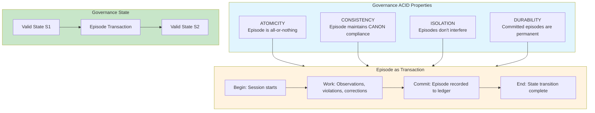

# INVENTION DISCLOSURE FORM

**IDF-031**

---

## ADMINISTRATIVE

**Title:** ACID Transaction Properties for Governance Episode Recording

**Inventor(s):** Dexter Hadley

**Disclosure Date:** 2026-01-14

**Related Disclosure:** IDF-001-canonic-governance.md, IDF-005-episodic-drift-detection.md

**Freeze Reference:** Post stack-freeze-2026-01-12 (v0.2 scope)

**Status:** Internal disclosure — not for publication

**Confidentiality:** PRIVILEGED AND CONFIDENTIAL — Prepared for patent counsel

---

## 1. PROBLEM STATEMENT

In governance recording systems:

1. Episodes are recorded but transaction properties are implicit
2. Partial episodes could corrupt governance state
3. Concurrent episode recording could create conflicts
4. Episode immutability is stated but not formally guaranteed
5. Governance state consistency between episodes is unverified

**The core problem:** No structural mechanism exists to treat governance episodes as formal transactions with ACID properties (Atomicity, Consistency, Isolation, Durability), ensuring governance state integrity across all operations.

---

## 2. CORE INVENTIVE INSIGHT



The invention establishes **Governance ACID** where:

1. **Atomicity:** Episodes are all-or-nothing; partial episodes are invalid
2. **Consistency:** Episodes must maintain CANON compliance; violations documented but not committed without correction
3. **Isolation:** Concurrent episodes don't interfere; each is independent state transition
4. **Durability:** Committed episodes are permanent and immutable

### 2.1 Atomicity

An episode either exists completely or not at all:

```
VALID(episode) ⟺
  HAS(metadata) ∧ HAS(context) ∧ HAS(narrative) ∧
  HAS(violations_section) ∧ HAS(corrections_section) ∧
  COMMITTED_TO_LEDGER(episode)
```

Partial episodes (missing sections, uncommitted) are atomically invalid.

### 2.2 Consistency

Episodes preserve governance invariants:

| Invariant | Consistency Check |
|-----------|------------------|
| VOCAB closure | Terms used in episode are defined |
| Model identity | Agent field contains valid model ID |
| Episode numbering | Episode ID follows sequence |
| Section completeness | All required sections present |

An episode that violates invariants is not committable.

### 2.3 Isolation

Episodes are independent:

- Episode A's content doesn't affect Episode B's content
- Concurrent session recording doesn't create conflicts
- Each episode is a complete state transition

Isolation level: SERIALIZABLE (episodes form total order in ledger)

### 2.4 Durability

Once committed, episodes are permanent:

- Committed episodes cannot be deleted
- Committed episodes cannot be modified
- Corrections create new episodes (redo pattern)
- Ledger is append-only

---

## 3. TECHNICAL APPROACH

### 3.1 Transaction Boundaries

Episode transaction:
1. **BEGIN:** Session initiation (metadata recorded)
2. **WORK:** Session content (narrative, observations)
3. **PREPARE:** Pre-commit validation (consistency checks)
4. **COMMIT:** Ledger recording (atomicity + durability)
5. **END:** Transaction complete

### 3.2 Atomicity Implementation

1. Episode is constructed in working memory
2. All sections must be present before commit
3. Commit is single atomic operation (git commit)
4. Failure before commit = episode doesn't exist
5. Success at commit = episode fully exists

### 3.3 Consistency Validation

Pre-commit checks:
1. All required fields present (metadata, sections)
2. Model identity valid (known model ID)
3. Episode number sequential (no gaps)
4. VOCAB terms defined (introspection)
5. Violations have corrections (no orphan violations)

### 3.4 Isolation Mechanism

1. Each session operates on local state
2. No shared mutable state between sessions
3. Commit serializes episodes (ledger ordering)
4. Conflict = two episodes with same number (rejected)

### 3.5 Durability Guarantee

1. Commit writes to append-only ledger (git)
2. Ledger is cryptographically chained
3. No delete operation exists
4. Modification creates new entry (redo)

---

## 4. ADVANTAGES

### 4.1 State Integrity

Governance state is always valid between episodes.

### 4.2 Failure Recovery

Partial failures don't corrupt state (atomicity).

### 4.3 Concurrent Safety

Multiple sessions can operate without interference.

### 4.4 Audit Completeness

Every state transition is recorded (durability).

### 4.5 Rollback via Redo

Corrections are forward-only (new episodes), preserving history.

---

## 5. EXPLICIT EXCLUSIONS (NOT CLAIMED)

1. **Specific database systems** — ACID is principle, not implementation
2. **Specific git operations** — Git is example implementation
3. **Specific locking mechanisms** — Isolation method is not claimed
4. **Specific validation algorithms** — Consistency checks are not claimed
5. **Distributed transaction protocols** — Two-phase commit etc. not claimed

---

## 6. EVIDENCE SUMMARY

### 6.1 Axiom Evidence

WRITING/EPISODES/CANON.md Axiom 1 states:
> "Episodes are atomic artifacts."

This establishes atomicity requirement.

### 6.2 Implementation Evidence

Episode creation demonstrates ACID:
- Incomplete episodes are not committed (atomicity)
- Episodes with violations include corrections (consistency)
- Episodes are numbered sequentially (isolation via ordering)
- Episodes cannot be deleted (durability)

### 6.3 Redo Pattern Evidence

Multiple redo episodes demonstrate correction without deletion:
- ep110, ep115, ep126: correction episodes
- Original episodes preserved
- Redo creates new transaction, not modification

---

## 7. RELATIONSHIP TO OTHER DISCLOSURES

### 7.1 Relationship to IDF-001

IDF-001 requires ledger recording. IDF-031 specifies transaction properties:

| IDF-001 | IDF-031 |
|---------|---------|
| Record to ledger | Record as ACID transaction |
| Append-only | Durability guarantee |
| Corrections via new entries | Consistency preservation |

### 7.2 Relationship to IDF-005

IDF-005 requires episode immutability. IDF-031 provides the mechanism:

- Immutability = Durability (no modification after commit)
- Redo pattern = Forward-only correction (preserves atomicity)

### 7.3 Relationship to IDF-027

IDF-027 establishes ledger-defined ontology. IDF-031 ensures ontological consistency:

- If ledger IS reality, ACID ensures reality is consistent
- Atomicity: reality has no partial states
- Consistency: reality maintains invariants
- Isolation: reality transitions are ordered
- Durability: reality doesn't lose states

---

## 8. PRIOR ART DISTINCTION

### 8.1 Database ACID (SQL Transactions)

Databases implement ACID for data transactions.

**Distinction:** IDF-031 applies ACID to **governance episodes**, not data:
- Database ACID is for data integrity; IDF-031 is for governance integrity
- Episodes have semantic structure (metadata, narrative, corrections)
- The governance-specific consistency invariants are unique

### 8.2 Git Atomic Commits

Git commits are atomic operations.

**Distinction:** IDF-031 adds **governance semantics** to atomicity:
- Git atomicity is file-level; IDF-031 atomicity is episode-level
- Episode consistency requires governance validation, not just file presence
- The ACID framework for governance is unique

### 8.3 Event Sourcing

Event sourcing records all state changes as immutable events.

**Distinction:** IDF-031 adds **transactional properties** to events:
- Event sourcing focuses on immutability; IDF-031 adds ACID
- Episodes are structured transactions, not raw events
- Consistency validation before commit is unique

### 8.4 Blockchain Consensus

Blockchain ensures transaction integrity through consensus.

**Distinction:** IDF-031 uses **single-writer authority**, not consensus:
- Blockchain is multi-party; IDF-031 is single-authority (human)
- Consensus provides agreement; IDF-031 provides governance ACID
- No mining or distributed validation required

---

## 9. INVENTOR DECLARATION

I, **Dexter Hadley**, declare that:

1. I am the sole human inventor of this framework
2. The framework is implicit in episode atomicity axiom
3. AI systems contributed execution under governance but are not inventors
4. This disclosure is post-freeze IP (v0.2 scope)

---

**END OF DISCLOSURE**

---
