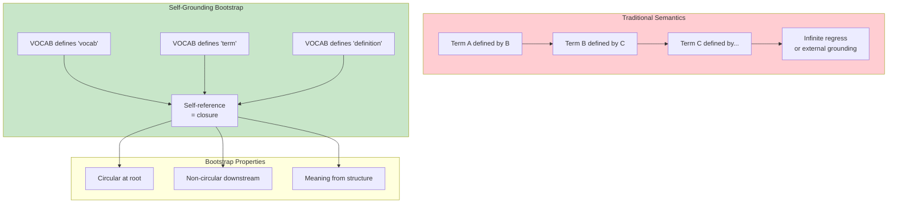

# INVENTION DISCLOSURE FORM

**IDF-032**

---

## ADMINISTRATIVE

**Title:** Self-Grounding Semantic Bootstrap for Constitutional Vocabulary Systems

**Inventor(s):** Dexter Hadley

**Disclosure Date:** 2026-01-14

**Related Disclosure:** IDF-006-literal-introspection.md, IDF-001-canonic-governance.md

**Freeze Reference:** Post stack-freeze-2026-01-12 (v0.2 scope)

**Status:** Internal disclosure — not for publication

**Confidentiality:** PRIVILEGED AND CONFIDENTIAL — Prepared for patent counsel

---

## 1. PROBLEM STATEMENT

In definitional systems:

1. Definitions require prior definitions (infinite regress)
2. Grounding definitions in external referents creates dependency
3. Circular definitions are typically forbidden as invalid
4. No mechanism establishes self-grounding without paradox
5. Root vocabularies have no parent to inherit from

**The core problem:** No structural mechanism exists to establish self-grounding vocabularies where circular definitions at the root level are not defects but necessary bootstrap conditions for semantic closure.

---

## 2. CORE INVENTIVE INSIGHT



The invention establishes **self-grounding semantic bootstrap** where:

1. Root VOCAB defines itself (VOCAB defines "vocab")
2. Circular definitions at root are structurally necessary
3. Meaning emerges from structural role, not external referent
4. Downstream VOCABs inherit and specialize without circularity

### 2.1 Bootstrap Paradox Resolution

Traditional view: Circular definitions are invalid
CANONIC view: Circular definitions at root are the **stopping condition**

```
ROOT:
  vocab := "The vocabulary artifact of a scope"
  term := "A word defined in a vocabulary"
  definition := "The meaning assigned to a term"
```

These are circular (vocab uses "vocabulary" to define "vocab") but this is necessary:
- Without self-definition, who defines the definer?
- Self-reference creates closure
- The circularity IS the foundation

### 2.2 Structural Semantics

Root terms get meaning from structure:

| Term | Structural Role | Meaning Source |
|------|-----------------|----------------|
| VOCAB | Required triad element | Position in triad |
| CANON | Required triad element | Position in triad |
| term | Building block of VOCAB | Relationship to VOCAB |
| axiom | Building block of CANON | Relationship to CANON |

Meaning is relational (what role does X play?) not referential (what does X point to?).

### 2.3 Inheritance Resolution

Downstream VOCABs escape circularity:

```
ROOT VOCAB:
  scope := "A directory governed by a triad" [CIRCULAR - uses 'triad']

CHILD VOCAB (inherits from root):
  session := "A governed human-AI interaction" [NON-CIRCULAR - uses inherited terms]
```

Root provides the circular foundation; children build non-circular extensions.

### 2.4 Axiom 6 Justification

CANONIC/CANON.md Axiom 6 states:
> "Root VOCAB definitions **MAY** be circular and minimal."

This axiom is not permitting a defect—it's acknowledging the bootstrap requirement.

---

## 3. TECHNICAL APPROACH

### 3.1 Root VOCAB Construction

1. Identify essential concepts (vocab, term, definition, scope, triad, etc.)
2. Define each concept using only essential concepts
3. Accept circularity as necessary (these terms define themselves)
4. Verify closure (all terms used are defined)

### 3.2 Minimal Root

Root VOCAB should be minimal:
- Only concepts required for governance structure
- No domain-specific terms
- No implementation details
- Just enough for closure

### 3.3 Downstream Inheritance

1. Child VOCAB inherits root definitions
2. Child VOCAB adds domain-specific terms
3. Child definitions use inherited terms (non-circular)
4. Child cannot redefine root terms (inheritance is immutable)

### 3.4 Closure Verification

1. For root VOCAB:
   - Extract all terms used in definitions
   - Verify each term is defined in root VOCAB
   - Circularity is expected and valid
2. For child VOCAB:
   - Extract all terms used in definitions
   - Verify each term is defined locally OR inherited
   - Circularity should not occur

---

## 4. ADVANTAGES

### 4.1 No External Dependencies

Semantic grounding is internal, not dependent on external referents.

### 4.2 Finite Closure

Self-reference creates finite definitional closure.

### 4.3 Structural Meaning

Meaning is determinable from structure, not interpretation.

### 4.4 Clear Inheritance

Downstream terms have clear derivation from root.

### 4.5 Paradox Prevention

Controlled circularity at root prevents paradox downstream.

---

## 5. EXPLICIT EXCLUSIONS (NOT CLAIMED)

1. **Specific root terms** — Which terms are root is implementation choice
2. **Specific definition formats** — How definitions are written is not claimed
3. **Linguistic semantics** — Natural language meaning is not claimed
4. **Philosophical foundations** — Metaphysical grounding not claimed
5. **Specific verification algorithms** — Closure check method is not claimed

---

## 6. EVIDENCE SUMMARY

### 6.1 Axiom Evidence

CANONIC/CANON.md Axiom 6 explicitly permits circular root definitions:
> "Root VOCAB definitions **MAY** be circular and minimal."

### 6.2 Root VOCAB Evidence

canonic/VOCAB.md contains self-referential definitions:
- "VOCAB: The vocabulary artifact of a scope"
- "scope: A directory governed by a triad"
- "triad: The set of artifacts (CANON.md, VOCAB.md, README.md)"

These are circular by design.

### 6.3 Inheritance Evidence

Downstream VOCABs (os/VOCAB.md, machine/VOCAB.md) add terms without circularity:
- Use inherited root terms
- Define domain-specific terms
- No self-reference required

---

## 7. RELATIONSHIP TO OTHER DISCLOSURES

### 7.1 Relationship to IDF-006

IDF-006 establishes literal introspection. IDF-032 explains how introspection terminates:

| IDF-006 | IDF-032 |
|---------|---------|
| All terms must be defined | Root defines itself |
| Introspection verifies closure | Self-reference achieves closure |
| Undefined terms = violation | Circular root terms = valid |

### 7.2 Relationship to IDF-001

IDF-001 requires definitional closure. IDF-032 provides the bootstrap:

- IDF-001 claims: undefined terms are inadmissible
- IDF-032 explains: root self-definition enables this
- Without bootstrap, closure is impossible

### 7.3 Relationship to IDF-007

IDF-007 establishes hierarchical inheritance. IDF-032 anchors the hierarchy:

- IDF-007: inheritance terminates at root
- IDF-032: root is self-grounded (no infinite regress)
- Together: finite, closed hierarchy

---

## 8. PRIOR ART DISTINCTION

### 8.1 Mathematical Foundations (Set Theory, ZFC)

Set theory uses axioms to ground mathematics, some self-referential.

**Distinction:** IDF-032 applies to **governance vocabularies**, not mathematics:
- ZFC grounds sets; IDF-032 grounds terms
- ZFC axioms are logical; IDF-032 definitions are semantic
- The governance vocabulary context is unique

### 8.2 Ontology Languages (OWL, RDF)

Ontology languages define concepts and relationships.

**Distinction:** IDF-032 uses **self-grounding**, not external grounding:
- OWL typically grounds to URIs; IDF-032 is self-contained
- RDF references external resources; IDF-032 is closed
- The self-referential bootstrap is unique

### 8.3 Compiler Bootstrapping

Compilers can be written in their own language (self-hosting).

**Distinction:** IDF-032 bootstraps **semantics**, not execution:
- Compiler bootstrap is about execution; IDF-032 is about meaning
- Self-hosting compiles itself; IDF-032 defines itself
- The semantic closure application is unique

### 8.4 Dictionary Definitions

Dictionaries define words using other words (ultimately circular).

**Distinction:** IDF-032 is **structurally intentional**, not incidental:
- Dictionary circularity is unavoidable; IDF-032 circularity is designed
- Dictionaries don't formalize closure; IDF-032 requires it
- The verification mechanism for closure is unique

---

## 9. INVENTOR DECLARATION

I, **Dexter Hadley**, declare that:

1. I am the sole human inventor of this framework
2. The framework is formalized in CANONIC/CANON.md Axiom 6
3. AI systems contributed execution under governance but are not inventors
4. This disclosure is post-freeze IP (v0.2 scope)

---

**END OF DISCLOSURE**

---
